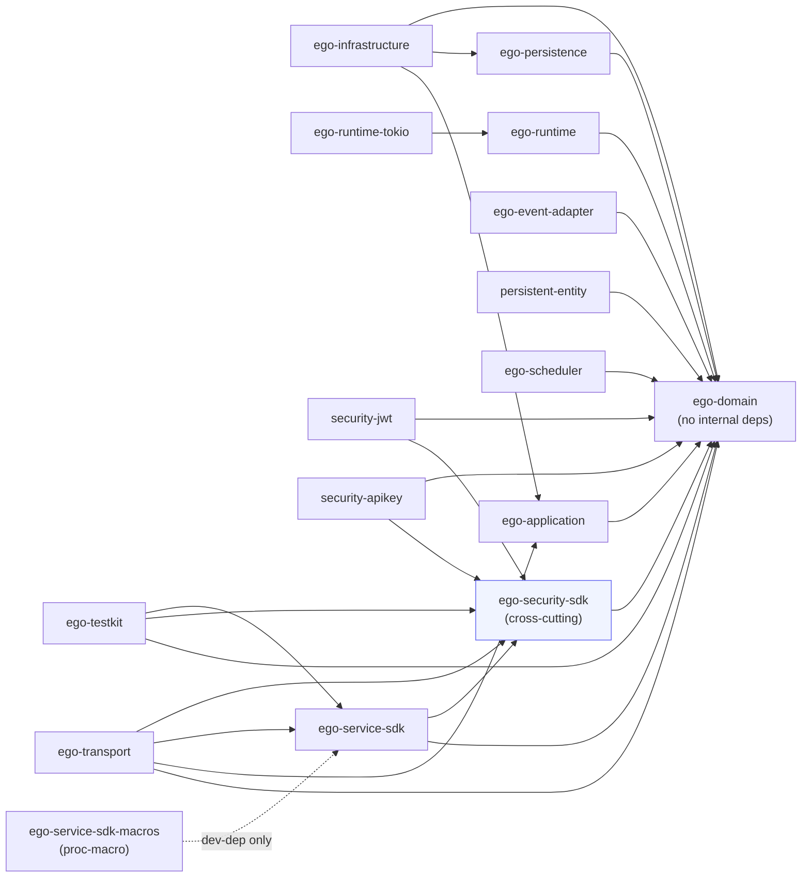
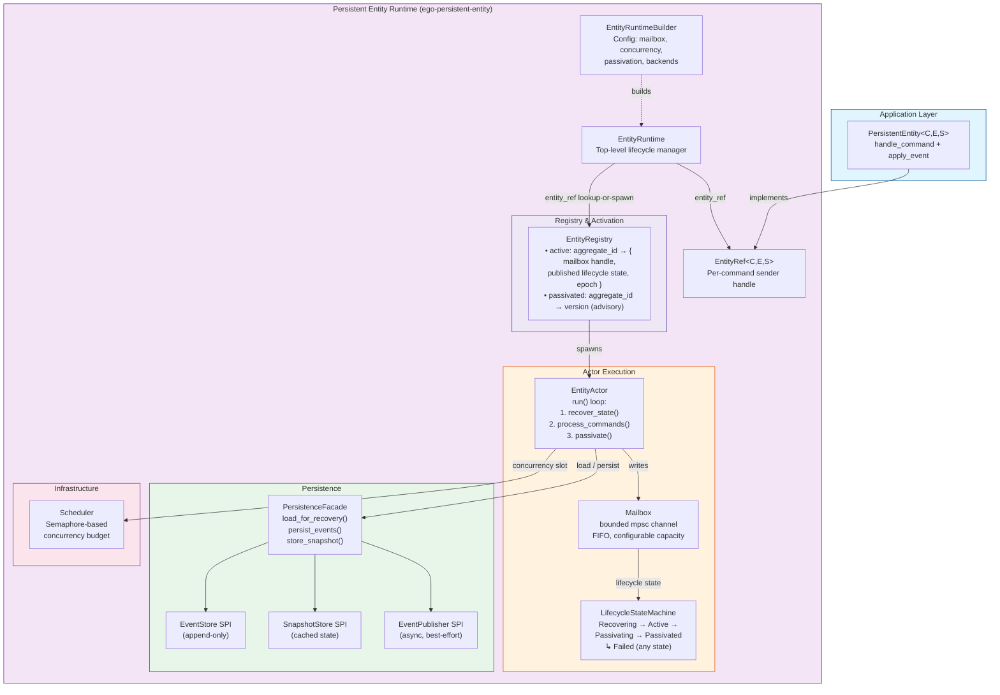
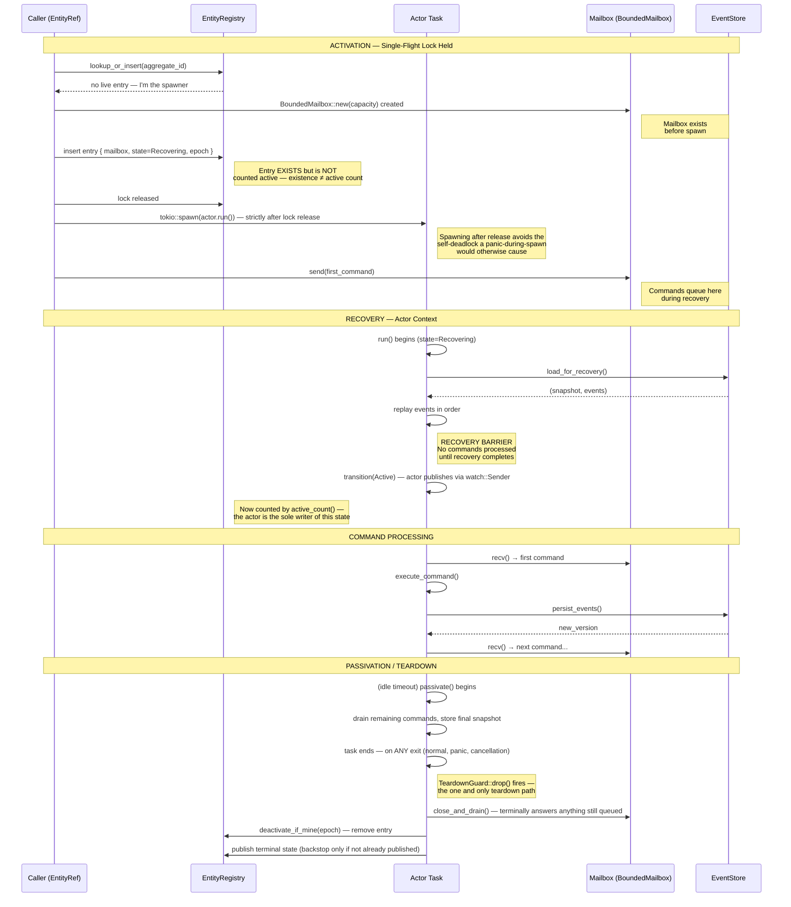
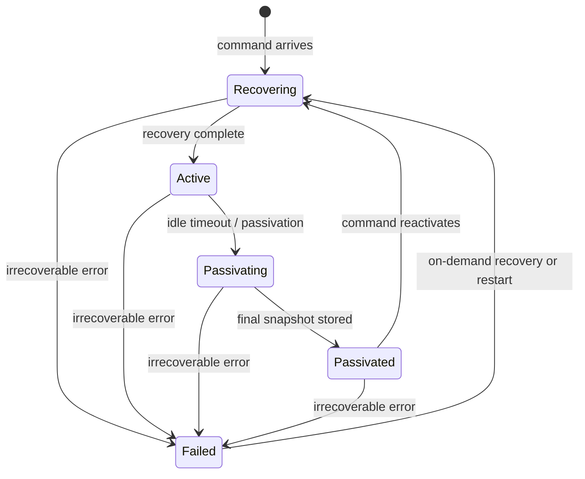
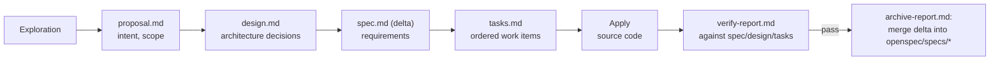

# ego-rs Architecture

ego-rs is a **hexagonal, actor-oriented, deterministic** backend framework written in Rust. It provides the primitives to build distributed, event-sourced, replayable backend systems: domain contracts own behavior, infrastructure owns adapters, and everything above domain composes through explicit ports — no ambient state, no implicit I/O.

This is the single architecture reference for the workspace. It replaces the former split between a runtime-focused `ARCHITECTURE.md` and an engineering-focused `docs/architecture.md` — the two overlapped and had each drifted from the code in different ways; this version is verified against the current `Cargo.toml` files, `layers.toml`, and `openspec/` directory structure.

## Principles

- **Hexagonal** — domain owns contracts; infrastructure owns adapters; application orchestrates use cases; transport owns protocol handlers.
- **Actor-oriented** — the actor (`Actor` trait) and the entity (`PersistentEntity`) are the central behavioral abstractions; each processes one message/command at a time.
- **CQRS + Event Sourcing** — commands mutate state, events record transitions (append-only), queries read without mutating.
- **Deterministic** — given identical inputs, runtime state, logical time, and context, the observable outcome MUST be identical. Randomness, wall-clock time, and external I/O are injected through explicit ports, never implicit behavior.
- **Immutable by default** — domain data structures are immutable values; changes produce new commands/events/state instances, never in-place mutation.
- **Fail-closed** — ambiguous states produce rejection, never silent continuation.

---

## Layer & Crate Map

The workspace has **16 crates + 1 example app** (root `Cargo.toml`, `[workspace] members`):

```
domain, application, infrastructure, persistence, transport, runtime, runtime-tokio,
event-adapter, persistent-entity, ego-scheduler, service-sdk, service-sdk-macros,
security-sdk, security-jwt, security-apikey, testkit
+ examples/reference-app
```

There is **no `runtime-slice` crate** anywhere in the workspace — an old `layers.toml` entry references it, but it is a dead config line, not a crate that ever existed here.

### Dependency graph (verified against each crate's `[dependencies]`)



Dev-only edges not drawn as solid lines above (real, but excluded from the production dependency graph — Cargo keeps `[dev-dependencies]` out of the normal build graph, so these are not layering violations): `ego-service-sdk` and `ego-testkit` both pull in `ego-service-sdk-macros` as a dev-dependency for their own test/example builds; `ego-transport` pulls in `security-jwt` and `ego-service-sdk-macros` as dev-dependencies for its own tests only. `examples/reference-app` depends normally on all of `ego-domain`, `ego-infrastructure`, `ego-runtime`, `persistent-entity`, `security-jwt`, `ego-security-sdk`, `ego-scheduler`, `ego-persistence`, `ego-service-sdk`, `ego-service-sdk-macros`, `ego-transport` (plus `ego-testkit` as a dev-dependency for its own tests) — it is the one place all layers legitimately compose together.

### Crate boundaries & responsibilities

Directory names and package names differ for several crates — always check `[package] name`, not the directory:

| Directory | Package | Depends on (production) | Responsibility |
|---|---|---|---|
| `crates/domain` | `ego-domain` | nothing internal | Core contracts: `Actor`, `Command`, `DomainEvent`, `Query`, `Effect`, identity types, persistence SPIs, CQRS read-side traits |
| `crates/application` | `ego-application` | `ego-domain` | Use-case orchestration (command/query handlers) |
| `crates/persistence` | `ego-persistence` | `ego-domain` | Persistence-layer support types |
| `crates/infrastructure` | `ego-infrastructure` | `ego-application`, `ego-persistence`, `ego-domain` | Concrete adapters over application + persistence |
| `crates/transport` | `ego-transport` | `ego-domain`, `ego-application`, `ego-service-sdk`, `ego-security-sdk` | HTTP transport: `AppState`, JWT extraction, error mapping, `serve()` |
| `crates/runtime` | `ego-runtime` | `ego-domain` | Platform-agnostic `Runtime` trait, `EffectInterpreter`, CQRS read-side engine |
| `crates/runtime-tokio` | `ego-runtime-tokio` | `ego-runtime` | The real Tokio-backed `Runtime` implementation |
| `crates/event-adapter` | `ego-event-adapter` | `ego-domain` | Event adapter support over domain |
| `crates/persistent-entity` | `persistent-entity` (no `ego-` prefix) | `ego-domain` | Event-sourced actor-per-entity execution — see [Persistent Entity Runtime](#persistent-entity-runtime-core-006) below |
| `crates/ego-scheduler` | `ego-scheduler` | `ego-domain` | Pure 6-stage actor-activation scheduling pipeline |
| `crates/service-sdk` | `ego-service-sdk` | `ego-domain`, `ego-security-sdk` | Service contracts, registry, DI, interceptors, `ServiceContext` — the primary framework for building services |
| `crates/service-sdk-macros` | `ego-service-sdk-macros` | external only (`syn`, `quote`, `proc-macro2`) | `#[service]`, `#[operation]`, `#[authorize]`, `#[tenant_scoped]` proc-macros |
| `crates/security-sdk` | `ego-security-sdk` | `ego-domain` | **Cross-cutting.** `SecurityContext`, `AuthenticationProvider`, `AuthorizationProvider`, `BearerExtractor` |
| `crates/security-jwt` | `security-jwt` (no `ego-` prefix) | `ego-domain`, `ego-security-sdk` | JWT authentication providers (HS256/RS256/ES256, OIDC, multi-issuer, introspection) |
| `crates/security-apikey` | `security-apikey` (no `ego-` prefix) | `ego-domain`, `ego-security-sdk` | API-key authentication provider |
| `crates/testkit` | `ego-testkit` | `ego-domain`, `ego-security-sdk`, `ego-service-sdk` | Shared, reusable test doubles/fixtures for building services against the SDK |
| `examples/reference-app` | `reference-app` | all of the above | CORE-018 production-shaped reference service — the fullest real illustration of how everything composes |

### Cross-cutting SDKs

A cross-cutting SDK is a leaf in the dependency graph: other crates depend on it, and it depends on nothing but `ego-domain` and third-party crates — never on `ego-application`, `ego-infrastructure`, or `ego-transport`.

Checked each candidate against its real `Cargo.toml`:

- **`ego-security-sdk`** — depends only on `ego-domain` + third-party (`async-trait`, `thiserror`, `serde`); consumed by `security-jwt`, `security-apikey`, `ego-service-sdk`, `ego-testkit`, `ego-transport`, and `reference-app`. Genuinely cross-cutting — the only crate that qualifies.
- **`security-jwt` / `security-apikey`** — not cross-cutting. Each depends on `ego-security-sdk` itself and is classified as `infrastructure` in `layers.toml` (concrete auth-provider adapters, not shared leaf capabilities).
- **`ego-testkit`** — not cross-cutting. It depends *upward* on `ego-service-sdk`, and every consumer pulls it in only as a `[dev-dependencies]` test-support crate, not a production dependency.
- **`ego-service-sdk`** — not cross-cutting despite being widely depended on. It is a framework layer in its own right (registry, DI, interceptors) that other crates build services on top of, not a leaf utility.

### Layer enforcement reality

`layers.toml` exists at the repo root and documents intended layer assignments, but it is a **documented-but-unenforced convention**:

- It covers only 9 of the 16 crates (missing `ego-persistence`, `ego-event-adapter`, `persistent-entity`, `ego-service-sdk`, `ego-service-sdk-macros`, `ego-security-sdk`, `security-apikey`, `ego-testkit`).
- It contains a dead entry, `"runtime-slice" = "domain"`, for a crate that does not exist in the workspace.
- Its own header comment says rules are "enforced by `scripts/verify-layers.sh`" — that script **does not exist** anywhere in the repo (confirmed: `scripts/` holds `detect-integration-tests.sh`, `detect-missing-docs.sh`, `detect-mock-only-tests.sh`, `detect-test-smells.sh`, `detect-violations.sh`, `validate-constitution.sh`, `verify-constitution-mapping.sh`, `verify-coverage.sh` — no `verify-layers.sh`).
- Neither `.github/workflows/claude-code-review.yml` nor `.github/workflows/claude.yml` (the only two CI workflows in the repo) reference `layers.toml` or layer verification in any form.

Treat `layers.toml` as a design intent, not a build gate. The dependency graph above is the current, real source of truth; nothing today would stop a new crate from violating it.

---

## Design Preferences

- **Concrete first** — prefer a concrete implementation over an abstraction. Extract abstractions only when a second use case emerges.
- **Abstractions require evidence** — every abstraction cites which specific requirement or constraint justifies it.
- **Patch over rewrite** — extend existing modules; create new ones only when existing structure cannot accommodate the change without violating layering.
- **Avoid duplication (Rule of Two)** — don't generalize from a single example; extract shared code only once a second, verified use case exists.
- **Explicit file ownership** — each crate module has a documented responsibility; new code goes in the crate/module that owns that concern.
- **No infrastructure in domain** — database types, network types, runtime types, and serialization frameworks never appear in domain contracts (verified: `ego-domain`'s only dependencies are `serde`, `serde_json`, `thiserror`, `chrono`, `async-trait`).

---

## Runtime & Dependency Rules

- `ego-domain`'s core write-side contracts (`Actor`, `Command`, `DomainEvent`, `Query`) are synchronous — no `async fn`, no Tokio.
- `ego-domain`'s `read_side/` module (the CQRS read-side engine, 17 traits) *does* use `async fn` via the `async-trait` crate, for I/O-shaped read-store SPIs (`ProjectionHandler`, `ReadModelStore`, dedup/offset stores, etc.). This is an async **trait signature**, not a runtime dependency: `tokio` itself appears only in `ego-domain`'s `[dev-dependencies]`, for its own test suite. No concrete async executor is required to implement or call these traits.
- `ego-infrastructure` and `ego-runtime-tokio` own the concrete async runtime integration (Tokio).
- `ego-service-sdk` MUST NOT depend on any transport framework (HTTP, gRPC, WebSocket) — verified: no `axum`/`tonic`/similar in its `Cargo.toml`.
- `ego-service-sdk-macros` depends only on `syn`, `quote`, `proc-macro2` — verified, no runtime dependencies.
- `ServiceContext` is propagated explicitly between components — no ambient/`TaskLocal` read. This was an explicit invariant of the `2026-06-22-remove-ambient-service-context` change: "there is exactly one mechanism for a component to access a `ServiceContext` — it was given one explicitly."
- Cross-cutting SDKs (`ego-security-sdk`) MUST NOT appear as dependencies of `ego-domain` — verified true today.
- Dependency direction is documented by `layers.toml` and the graph above; it is **not** enforced by CI (see [Layer enforcement reality](#layer-enforcement-reality)).

---

## Core Concepts

### Actor Model (CORE-002)

The actor is the central behavioral abstraction. An actor:
- Declares its message type (`type Message`)
- Has a location-transparent `ActorId`
- Processes one message at a time (enforced by runtime)
- Participates in a supervision hierarchy

```rust
pub trait Actor {
    type Message;
}
```

### Runtime Execution (CORE-003)

The runtime layer owns:
- `ActorSystem` — spawn/stop actors, route messages
- `Mailbox<M>` — bounded, FIFO, non-blocking
- `ActorRef<M>` — sendable handle
- `RuntimeSupervisor` — restart/stop/escalate

### CQRS + Event Sourcing

- **Commands** (`Command` trait) — mutate state
- **Events** (`DomainEvent` trait) — record state transitions (append-only)
- **Queries** (`Query` trait) — read state without mutation

### Determinism Axiom

> Given identical inputs, runtime state, logical time, and context, the observable outcome MUST be identical.

All framework primitives are deterministic by default. Randomness, wall-clock time, and external I/O are injected through explicit ports — never implicit behavior.

### Immutability By Default

All domain data structures are immutable values. Changes produce new commands, events, or state instances — never in-place mutation. Event stores are append-only. Read-side projections derive from immutable event streams.

### Fail-Closed

Ambiguous states produce rejection, never silent continuation. Unknown inputs, undefined transitions, and partial failures are explicit errors.

---

## Persistent Entity Runtime (CORE-006)

The Persistent Entity Runtime provides an event-sourced, actor-per-entity execution model inspired by Lagom Framework. Each entity is a dedicated Tokio task with exclusive mailbox ownership, deterministic recovery, and single-flight activation.

### Runtime Architecture



### Activation Ordering Model (Formal)

The activation ordering model defines the precise timing of mutex scope, mailbox creation, registry visibility, and recovery barrier — resolving all ambiguity between existence and readiness.



### Five-State Lifecycle Machine



| State | In Registry (map entry)? | Counted by `active_count()`? | Commands |
|-------|---------------------------|-------------------------------|----------|
| `Recovering` | Yes | No | Buffered in mailbox, not executed |
| `Active` | Yes | Yes | Executed FIFO |
| `Passivating` | Yes (draining) | Yes | Existing drained, new rejected |
| `Passivated` | No (removed by `TeardownGuard`) | No | Triggers activation → Recovering |
| `Failed` | No (removed by `TeardownGuard`) | No | Retry triggers new activation |

### Key Design Invariants

| Invariant | Enforced By |
|-----------|-------------|
| Exactly one actor per entity triple | Registry-map single-flight — `lookup_or_insert()`'s one lock acquisition, not a separate activation mutex (FR-001) |
| Single source of truth for "active" | The actor is the sole writer of its lifecycle state; the registry only observes it via `watch::Receiver` |
| No command processed before recovery | `recover_state().await` completes before `process_commands()` (FR-002) |
| Mailbox exists before spawn | `BoundedMailbox::new()` created before `tokio::spawn` (FR-003) |
| Lock held only for map mutation, NOT spawn/recovery | Lock released before `tokio::spawn`; the erased mailbox's downcast also happens after release (FR-004) |
| FIFO command ordering per entity | Bounded mailbox, ordered delivery (FR-005) |
| Observable state is always consistent | Recovery barrier prevents partial-state observation (FR-006) |
| Passivation is irreversible | PASSIVATING → ACTIVE forbidden (FR-008) |
| Events never rolled back | Append-only event store (FR-026) |
| Snapshots are pure optimization | Event stream always authoritative (FR-012) |
| CAS forbidden | `parking_lot::Mutex` for the registry map, not atomic CAS loops |

**Reference**: Full activation ordering specification at `openspec/changes/archive/2026-06-22-persistent-entity-runtime/activation-ordering/`.

### Crate Layout — `persistent-entity`

```
crates/persistent-entity/
├── Cargo.toml
└── src/
    ├── lib.rs                # Crate root, re-exports
    ├── runtime.rs            # EntityRuntime<E>
    ├── builder.rs            # EntityRuntimeBuilder<E>
    ├── entity_ref.rs         # EntityRef<C,E,S>
    ├── actor.rs              # EntityActor (recover → process → passivate)
    ├── registry.rs           # EntityRegistry (single-flight routing map + advisory passivated map)
    ├── mailbox.rs            # BoundedMailbox<T>, CommandEnvelope<C>
    ├── persistent_entity.rs  # PersistentEntity trait
    ├── lifecycle.rs          # LifecycleStateMachine
    ├── recovery.rs           # StateRecovery trait
    ├── persistence.rs        # PersistenceFacade<E>
    ├── publisher.rs          # EventPublisher<E>
    ├── snapshot.rs           # SnapshotStrategy
    ├── command_context.rs    # CommandContext
    ├── scheduler.rs          # Scheduler (semaphore)
    ├── error.rs              # EntityError
    └── testing.rs            # In-memory backends
```

---

## Repository Layout

```
ego-rs/
├── crates/
│   ├── domain/                # ego-domain
│   ├── application/           # ego-application
│   ├── persistence/           # ego-persistence
│   ├── infrastructure/        # ego-infrastructure
│   ├── transport/             # ego-transport
│   ├── runtime/               # ego-runtime
│   ├── runtime-tokio/         # ego-runtime-tokio
│   ├── event-adapter/         # ego-event-adapter
│   ├── persistent-entity/     # persistent-entity
│   ├── ego-scheduler/         # ego-scheduler
│   ├── service-sdk/           # ego-service-sdk
│   ├── service-sdk-macros/    # ego-service-sdk-macros
│   ├── security-sdk/          # ego-security-sdk (cross-cutting)
│   ├── security-jwt/          # security-jwt
│   ├── security-apikey/       # security-apikey
│   └── testkit/               # ego-testkit
├── examples/
│   └── reference-app/         # reference-app (CORE-018)
├── contracts/                  # Protobuf/Buf scaffolding — exists, not yet active:
│                                #   buf.yaml / buf.work.yaml / buf.gen.yaml plus
│                                #   core/v1, user/v1 module dirs with only a buf.yaml
│                                #   each (no .proto files yet); the `ego-rs-contracts`
│                                #   crate its README describes is not a workspace member
├── openspec/
│   ├── changes/                # in-flight and archived change folders (see Governance below)
│   └── specs/                  # living, per-domain specs — the current source of truth
├── scripts/                    # detect-*.sh / validate-constitution.sh / verify-*.sh (no verify-layers.sh)
├── docs/                       # remaining docs (constitution-mapping.md, etc.)
└── layers.toml                 # documented, unenforced layer intent (see above)
```

---

## Governance & Spec Workflow

The former Spec Kit workflow (`spec → clarify → design → review → tasks → implement → review → archive`, with `.speckit/constitution.md` as its cited authority) is defunct. `.speckit/constitution.md` does not exist anywhere in the repo except inside one archived change folder's historical text. The real, current governance sources are **this file** and **`openspec/specs/`** (living per-domain specs, kept up to date by the change lifecycle below).

Real change folders (e.g. `openspec/changes/archive/2026-07-11-core-025-service-sdk-ergonomics/`) show the actual artifact set — `explore.md`, `proposal.md`, `design.md`, `tasks.md`, a per-domain `specs/` delta, `verify-report.md`, `archive-report.md`, `state.yaml` — not the old `spec.md`/`plan.md`/`tasks.md`/`research.md`/`quickstart.md` naming.



- A change proposal MUST NOT prescribe implementation details before design.
- `design.md` cites the relevant spec/proposal section for each decision.
- `tasks.md` items reference the design decisions they implement.
- On archive, the change's delta spec is merged into the living `openspec/specs/{domain}/spec.md`, and the change folder moves under `openspec/changes/archive/`.

---

## Key Principles

1. **Framework-first** — build the framework before modeling runtime governance
2. **Minimal primitives** — one concept, one trait, one responsibility
3. **Implementation-driven** — every spec ends in runnable code
4. **Archiveable specs** — implement → archive → next
5. **No bureaucracy** — no governance engines, no policy DSLs, no enterprise abstractions
6. **Domain owns contracts, runtime owns execution** — clean hexagonal boundary
7. **Tokio-first, never Tokio-bound** — contracts are runtime-neutral
