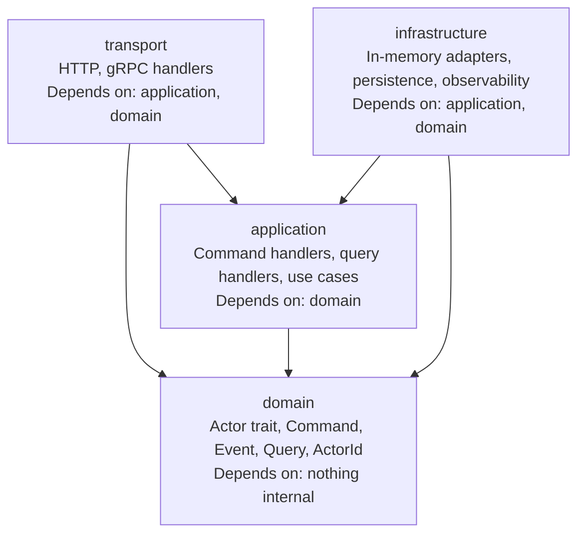
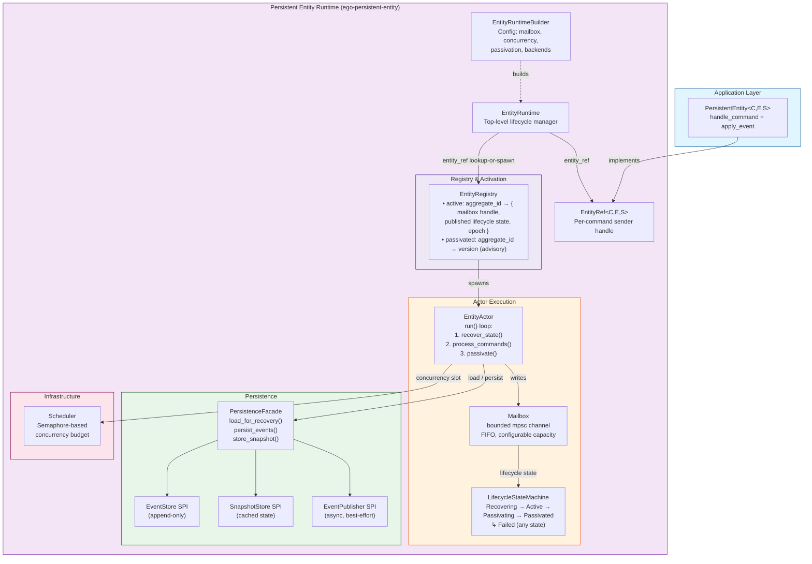
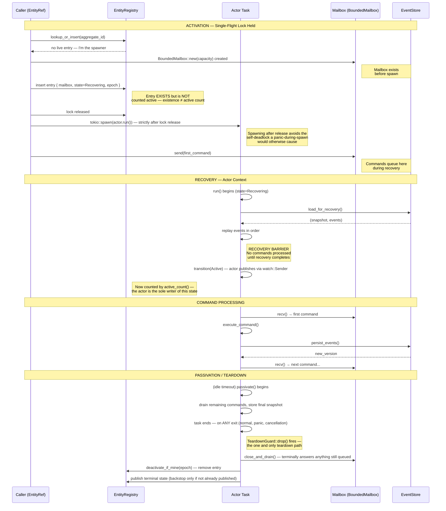
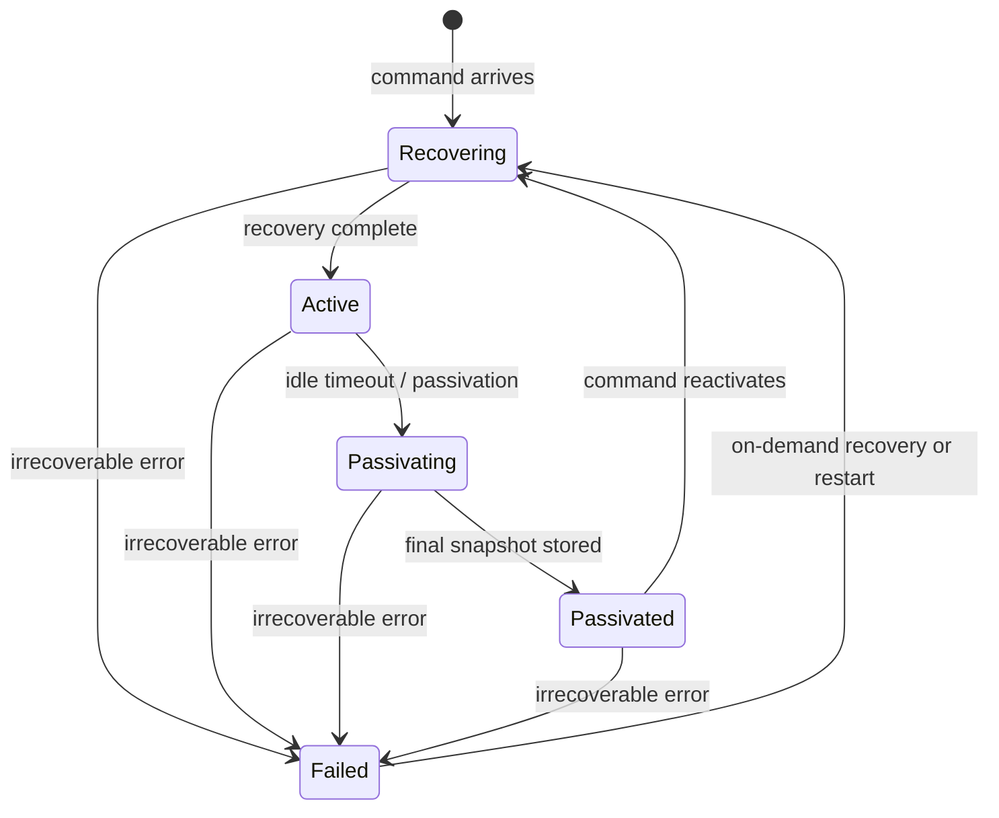

# ego-rs Architecture

## Overview

ego-rs is a **hexagonal, actor-oriented, deterministic** backend framework written in Rust. It provides the primitives to build distributed, event-sourced, and replayable backend systems.

## Layer Architecture



## Dependency Rules (enforced by `layers.toml` + `scripts/verify-layers.sh`)

| Layer | May depend on |
|-------|--------------|
| `ego-domain` | nothing internal |
| `ego-application` | `ego-domain` |
| `ego-infrastructure` | `ego-application`, `ego-domain` |
| `ego-transport` | `ego-application`, `ego-domain` |

Forbidden:
- `domain → application|infrastructure|transport`
- `application → infrastructure|transport`
- `infrastructure → transport`
- `transport → infrastructure`

## Core Concepts

### Actor Model (CORE-002)

The actor is the central behavioral abstraction. An actor:
- Declares its message type (`type Message`)
- Has a location-transparent `ActorId`
- Processes one message at a time (enforced by runtime)
- Participates in a supervision hierarchy

```rust
pub trait Actor {
    type Message;
}
```

### Runtime Execution (CORE-003)

The runtime layer owns:
- `ActorSystem` — spawn/stop actors, route messages
- `Mailbox<M>` — bounded, FIFO, non-blocking
- `ActorRef<M>` — sendable handle
- `RuntimeSupervisor` — restart/stop/escalate

### CQRS + Event Sourcing

- **Commands** (`Command` trait) — mutate state
- **Events** (`DomainEvent` trait) — record state transitions (append-only)
- **Queries** (`Query` trait) — read state without mutation

### Determinism Axiom

> Given identical inputs, runtime state, logical time, and context, the observable outcome MUST be identical.

All framework primitives are deterministic by default. Randomness, wall-clock time, and external I/O are injected through explicit ports — never implicit behavior.

### Immutability By Default

All domain data structures are immutable values. Changes produce new commands, events, or state instances — never in-place mutation. Event stores are append-only. Read-side projections derive from immutable event streams.

**Authority:** `.speckit/constitution.md` §8 — "Immutability By Default" and "Functional Programming". These rules are defined and enforced by the Constitution, not duplicated here.

### Fail-Closed

Ambiguous states produce rejection, never silent continuation. Unknown inputs, undefined transitions, and partial failures are explicit errors.

## Crate Layout

```
ego-rs/
├── crates/
│   ├── domain/        # ego-domain: core contracts
│   ├── application/   # ego-application: handlers
│   ├── infrastructure/ # ego-infrastructure: adapters
│   ├── transport/     # ego-transport: HTTP/gRPC
│   └── runtime/       # ego-runtime: actor execution (CORE-003, not yet created)
├── core/
│   └── runtime-slice/ # runtime-slice: deterministic execution types
├── contracts/         # Protobuf contracts (Buf)
├── openspec/          # Specs, changes, proposals
└── scripts/           # Verification scripts
```

## Persistent Entity Runtime (CORE-006)

The Persistent Entity Runtime provides an event-sourced, actor-per-entity execution model inspired by Lagom Framework. Each entity is a dedicated Tokio task with exclusive mailbox ownership, deterministic recovery, and single-flight activation.

### Runtime Architecture



### Activation Ordering Model (Formal)

The activation ordering model defines the precise timing of mutex scope, mailbox creation, registry visibility, and recovery barrier — resolving all ambiguity between existence and readiness.



### Five-State Lifecycle Machine



| State | In Registry (map entry)? | Counted by `active_count()`? | Commands |
|-------|---------------------------|-------------------------------|----------|
| `Recovering` | Yes | No | Buffered in mailbox, not executed |
| `Active` | Yes | Yes | Executed FIFO |
| `Passivating` | Yes (draining) | Yes | Existing drained, new rejected |
| `Passivated` | No (removed by `TeardownGuard`) | No | Triggers activation → Recovering |
| `Failed` | No (removed by `TeardownGuard`) | No | Retry triggers new activation |

### Key Design Invariants

| Invariant | Enforced By |
|-----------|-------------|
| Exactly one actor per entity triple | Registry-map single-flight — `lookup_or_insert()`'s one lock acquisition, not a separate activation mutex (FR-001) |
| Single source of truth for "active" | The actor is the sole writer of its lifecycle state; the registry only observes it via `watch::Receiver` |
| No command processed before recovery | `recover_state().await` completes before `process_commands()` (FR-002) |
| Mailbox exists before spawn | `BoundedMailbox::new()` created before `tokio::spawn` (FR-003) |
| Lock held only for map mutation, NOT spawn/recovery | Lock released before `tokio::spawn`; the erased mailbox's downcast also happens after release (FR-004) |
| FIFO command ordering per entity | Bounded mailbox, ordered delivery (FR-005) |
| Observable state is always consistent | Recovery barrier prevents partial-state observation (FR-006) |
| Passivation is irreversible | PASSIVATING → ACTIVE forbidden (FR-008) |
| Events never rolled back | Append-only event store (FR-026) |
| Snapshots are pure optimization | Event stream always authoritative (FR-012) |
| CAS forbidden | `parking_lot::Mutex` for the registry map, not atomic CAS loops (§5 constitution) |

**Reference**: Full activation ordering specification at `openspec/changes/archive/2026-06-22-persistent-entity-runtime/activation-ordering/`.

### Crate Layout

```
crates/persistent-entity/
├── Cargo.toml
└── src/
    ├── lib.rs                # Crate root, re-exports
    ├── runtime.rs            # EntityRuntime<E>
    ├── builder.rs            # EntityRuntimeBuilder<E>
    ├── entity_ref.rs         # EntityRef<C,E,S>
    ├── actor.rs              # EntityActor (recover → process → passivate)
    ├── registry.rs           # EntityRegistry (single-flight routing map + advisory passivated map)
    ├── mailbox.rs            # BoundedMailbox<T>, CommandEnvelope<C>
    ├── persistent_entity.rs  # PersistentEntity trait
    ├── lifecycle.rs          # LifecycleStateMachine
    ├── recovery.rs           # StateRecovery trait
    ├── persistence.rs        # PersistenceFacade<E>
    ├── publisher.rs          # EventPublisher<E>
    ├── snapshot.rs           # SnapshotStrategy
    ├── command_context.rs    # CommandContext
    ├── scheduler.rs          # Scheduler (semaphore)
    ├── error.rs              # EntityError
    └── testing.rs            # In-memory backends
```

## Implementation Roadmap

| ID | Name | Status |
|----|------|--------|
| CORE-001 | Deterministic Runtime Slice | In progress |
| CORE-002 | Actor Primitive (domain) | Spec complete, not implemented |
| CORE-003 | Runtime Actor Execution | Pending |
| CORE-004 | Persistence SPI | Pending |
| CORE-005 | Observability SPI | Pending |
| CORE-006 | Persistent Entity Runtime | **Design complete** (spec + activation ordering) |
| CORE-007 | Cluster Model | Archived (deferred, post-MVP) |
| CORE-010 | SDK + Developer API | Deferred |
| CORE-011 | Examples | Deferred |

## Key Principles

1. **Framework-first** — build the framework before modeling runtime governance
2. **Minimal primitives** — one concept, one trait, one responsibility
3. **Implementation-driven** — every spec ends in runnable code
4. **Archiveable specs** — implement → archive → next
5. **No bureaucracy** — no governance engines, no policy DSLs, no enterprise abstractions
6. **Domain owns contracts, runtime owns execution** — clean hexagonal boundary
7. **Tokio-first, never Tokio-bound** — contracts are runtime-neutral