# 🥘 ego-rs Cookbook

> **Entry point for agent programmers.** Everything you need to understand, navigate, and extend the ego-rs framework.

---

## 📋 Table of Contents

| # | Section | For |
|---|---------|-----|
| 1 | [Framework Overview](#-framework-overview) | Understanding what ego-rs is |
| 2 | [Architecture Map](#-architecture-map) | Crate layout + dependency flow |
| 3 | [Quick Start](#-quick-start) | Minimal working example |
| 4 | [Core Domain Contracts](#-core-domain-contracts) | Actor, Command, Event, Query, Effect |
| 5 | [Service SDK](#-service-sdk) | Service contracts, macros, context, `RuntimeBuilder` |
| 6 | [Persistent Entity Runtime](#-persistent-entity-runtime) | Event-sourced entity lifecycle |
| 7 | [Scheduler Pipeline](#-scheduler-pipeline) | Three different "schedulers" — do not conflate them |
| 8 | [Security & Tenant Enforcement](#-security--tenant-enforcement) | Authn/authz providers, `#[authorize]`, `#[tenant_scoped]` |
| 9 | [HTTP Transport](#-http-transport) | `ego-transport`'s `AppState`, JWT extractor, `serve()` |
| 10 | [CQRS Read-Side Engine](#-cqrs-read-side-engine) | Tag-based, batched, idempotent projections |
| 11 | [Testing Guide](#-testing-guide) | `ego-testkit`, in-memory stores, deterministic tests |
| 12 | [Conventions & Rules](#-conventions--rules) | Real, current governance sources |
| 13 | [File Navigation Map](#-file-navigation-map) | Where to find every important file |
| 14 | [Quick Command Reference](#-quick-command-reference) | Verified working commands |

---

## 🏗 Framework Overview

ego-rs is a **hexagonal, actor-oriented, deterministic** backend framework in Rust. It provides primitives for building distributed, event-sourced, replayable systems.

```mermaid
flowchart TB
    subgraph Design_Principles["Design Principles"]
        direction LR
        A1["Hexagonal<br/>Architecture"] --- A2["Actor<br/>Model"]
        A2 --- A3["CQRS +<br/>Event Sourcing"]
        A3 --- A4["Deterministic<br/>Execution"]
        A4 --- A5["Immutable<br/>By Default"]
    end

    subgraph Read_Side_Pipeline["CQRS Read-Side Pipeline (ego-domain::read_side + ego-runtime::read_side)"]
        P1["TagSchedulerImpl<br/>start_projection / run_until_stopped"] --> P2["BatchExecutor<br/>acquire backpressure permit"]
        P2 --> P3["ReadSideSession<br/>fetch via ReadSideStore"]
        P3 --> P4["Handler::handle<br/>apply batch"]
        P4 --> P5["DedupStore + OffsetStore<br/>commit progress"]
    end

    subgraph Runtime_Model["Runtime Model"]
        R1["EntityActor<br/>one command at a time"] --- R2["PersistentEntity<br/>event-sourced lifecycle"]
        R2 --- R3["Service<br/>contract-based dispatch"]
        R3 --- R4["Interceptor Chain<br/>cross-cutting concerns"]
    end
```

> **Key principle:** The system is split into **decision → execution → commit**. No component crosses these boundaries.

Verified against `crates/domain/src/effect.rs`, `crates/runtime/src/lib.rs`, `crates/runtime/src/read_side/*`, and `crates/persistent-entity/src/actor.rs`. The old "6-stage Execution Pipeline" diagram (ingest/route/reduce/detect/evaluate/emit) actually describes the **`ego-scheduler` crate's** actor-activation pipeline, not a generic execution pipeline — see [Scheduler Pipeline](#-scheduler-pipeline) for why this distinction matters.

---

## 🗺 Architecture Map

The workspace has **16 crates + 1 example app** (root `Cargo.toml`, `[workspace] members`):

```
domain, application, infrastructure, persistence, transport, runtime, runtime-tokio,
event-adapter, persistent-entity, ego-scheduler, service-sdk, service-sdk-macros,
security-sdk, security-jwt, security-apikey, testkit
+ examples/reference-app
```

Directory names and package names **differ** for several crates — always check `[package] name` in the crate's own `Cargo.toml`, not the directory:

| Directory | Package name |
|---|---|
| `crates/domain` | `ego-domain` |
| `crates/application` | `ego-application` |
| `crates/infrastructure` | `ego-infrastructure` |
| `crates/persistence` | `ego-persistence` |
| `crates/transport` | `ego-transport` |
| `crates/runtime` | `ego-runtime` |
| `crates/runtime-tokio` | `ego-runtime-tokio` |
| `crates/event-adapter` | `ego-event-adapter` |
| `crates/persistent-entity` | `persistent-entity` (no `ego-` prefix) |
| `crates/ego-scheduler` | `ego-scheduler` |
| `crates/service-sdk` | `ego-service-sdk` |
| `crates/service-sdk-macros` | `ego-service-sdk-macros` |
| `crates/security-sdk` | `ego-security-sdk` |
| `crates/security-jwt` | `security-jwt` (no `ego-` prefix) |
| `crates/security-apikey` | `security-apikey` (no `ego-` prefix) |
| `crates/testkit` | `ego-testkit` |
| `examples/reference-app` | `reference-app` |

There is **no `runtime-slice` crate** — an old `layers.toml` entry references it, but it does not exist anywhere in the workspace (dead config, not dead code).

### Crate Dependency Flow

Built from each crate's real `[dependencies]` (`path = ...` entries), not from memory:

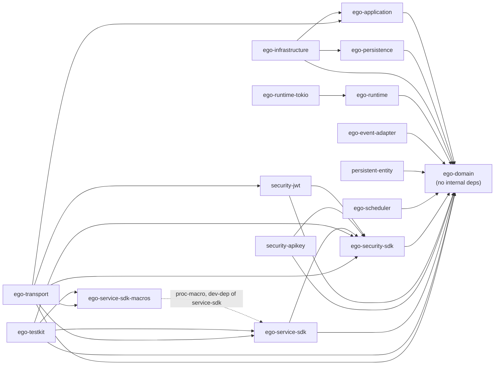

Note the `ego-service-sdk` ↔ `ego-testkit` relationship is **not a real cycle**: `ego-service-sdk`'s `Cargo.toml` pulls in `ego-testkit` only under `[dev-dependencies]` (for its own test suite), while `ego-testkit`'s normal `[dependencies]` depend on `ego-service-sdk`. See `crates/service-sdk/Cargo.toml:19-26` for the explanatory comment.

### Layer Rules (`layers.toml`)

`layers.toml` exists at the repo root and is a **documented-but-unenforced convention** — `scripts/verify-layers.sh` (referenced in its own header comment, and in `ARCHITECTURE.md` and `PRD.md`) **does not exist**, and no test/CI/xtask reads `layers.toml` at all. Treat it as a design intent, not a build gate.

It also only covers 9 of the 16 crates:

```toml
[layers]
"ego-domain" = "domain"
"ego-application" = "application"
"ego-infrastructure" = "infrastructure"
"ego-transport" = "transport"
"runtime-slice" = "domain"        # dead entry — crate does not exist
"ego-runtime" = "foundation"
"ego-runtime-tokio" = "infrastructure"
"ego-scheduler" = "foundation"
"security-jwt" = "infrastructure"
```

Missing from `layers.toml` entirely: `ego-persistence`, `ego-event-adapter`, `persistent-entity`, `ego-service-sdk`, `ego-service-sdk-macros`, `ego-security-sdk`, `security-apikey`, `ego-testkit`.

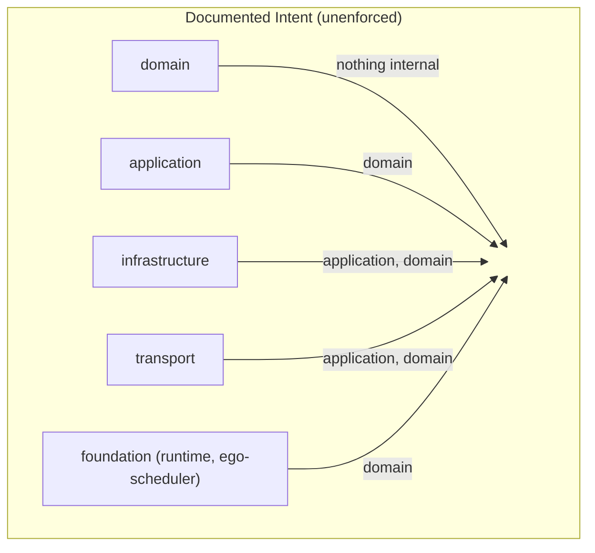

`ARCHITECTURE.md`'s "Crate Boundaries" section is the more current/complete crate-boundary reference — it documents `ego-security-sdk` as a **cross-cutting** crate that other layers may depend on, consistent with the real dependency graph above (e.g. `ego-transport` depends directly on it).

### Crate Responsibilities

| Crate | Package name | Responsibility |
|-------|--------------|-----------------|
| `crates/domain` | `ego-domain` | Core contracts: `Actor`, `Command`, `DomainEvent`, `Query`, `Effect`, identity types, persistence SPIs, CQRS read-side traits |
| `crates/application` | `ego-application` | Use-case orchestration (command/query handlers) |
| `crates/persistence` | `ego-persistence` | Persistence-layer support types |
| `crates/infrastructure` | `ego-infrastructure` | Concrete adapters over application + persistence |
| `crates/transport` | `ego-transport` | HTTP transport: `AppState`, JWT extraction, error mapping, `serve()` |
| `crates/runtime` | `ego-runtime` | Platform-agnostic `Runtime` trait, `EffectInterpreter`, CQRS read-side engine (`TagSchedulerImpl`, `BatchExecutor`, `Backpressure`) |
| `crates/runtime-tokio` | `ego-runtime-tokio` | The real Tokio-backed `Runtime` implementation (`TokioRuntime`, `TokioRuntimeBuilder`, `DefaultRuntime`) |
| `crates/event-adapter` | `ego-event-adapter` | Event adapter support over domain |
| `crates/persistent-entity` | `persistent-entity` | Event-sourced actor-per-entity execution (`PersistentEntity`, `EntityRef`, `EntityActor`) |
| `crates/ego-scheduler` | `ego-scheduler` | Pure 6-stage actor-activation scheduling pipeline (ingest→detect→route→reduce→evaluate→emit) |
| `crates/service-sdk` | `ego-service-sdk` | Service contracts, registry, DI (`RuntimeBuilder`/`Runtime`), interceptors, `ServiceContext` |
| `crates/service-sdk-macros` | `ego-service-sdk-macros` | `#[service]`, `#[operation]`, `#[authorize]`, `#[tenant_scoped]` proc-macros |
| `crates/security-sdk` | `ego-security-sdk` | `SecurityContext`, `AuthenticationProvider`, `AuthorizationProvider`, `BearerExtractor` |
| `crates/security-jwt` | `security-jwt` | JWT authentication providers (HS256/RS256/ES256, OIDC, multi-issuer, introspection) |
| `crates/security-apikey` | `security-apikey` | API-key authentication provider |
| `crates/testkit` | `ego-testkit` | Shared, reusable test doubles/fixtures for building services against the SDK |
| `examples/reference-app` | `reference-app` | CORE-018 production-shaped reference service — the best real illustration of how everything composes |

---

## 🚀 Quick Start

The canonical, currently-working minimal example is `crates/service-sdk/examples/hello_service.rs` (verified to compile and run: `cargo run --example hello_service -p ego-service-sdk`). It uses the real `#[service]`/`#[operation]` macros plus the `RuntimeBuilder::with_service` / `Runtime::resolve` path — this is the CORE-025 canonical developer journey, **not** the old `ServiceDescriptor`/`Service::descriptor()`/`initialize()`/`shutdown()` pattern (that trait shape no longer exists — see [Service SDK](#-service-sdk)).

```rust
use std::sync::Arc;

use async_trait::async_trait;
use ego_service_sdk::context::ServiceContext;
use ego_service_sdk::error::ServiceError;
use ego_service_sdk::runtime::RuntimeBuilder;
use ego_service_sdk_macros::{operation, service};

/// The service contract — defined with the real `#[service]`/`#[operation]`
/// macros, not a manual equivalent.
#[service(version = "1.0.0")]
pub trait HelloService {
    #[operation]
    async fn greet(&self, ctx: ServiceContext, name: String) -> Result<String, ServiceError>;
}

/// The concrete implementation.
pub struct HelloServiceImpl;

#[async_trait]
impl HelloService for HelloServiceImpl {
    async fn greet(&self, _ctx: ServiceContext, name: String) -> Result<String, ServiceError> {
        Ok(format!("hello, {name}"))
    }
}

#[tokio::main]
async fn main() {
    // 1. Register the implementation under its generated tag — one call,
    //    reusing the existing ServiceRegistry/Resolvable machinery.
    let rt = RuntimeBuilder::new()
        .with_service::<HelloServiceTag>(Arc::new(HelloServiceImpl) as Arc<dyn HelloService>)
        .expect("registration succeeds")
        .build();

    // 2. Resolve the tag to its concrete, macro-generated, fully-guarded proxy.
    let hello = rt.resolve::<HelloServiceTag>().expect("registered tag resolves");

    // 3. Invoke it with an explicit ServiceContext — no hidden/ambient state.
    let out = hello
        .greet(ServiceContext::new(), "world".into())
        .await
        .expect("invocation succeeds");

    println!("{out}"); // "hello, world"
}
```

Note the trait itself declares `ctx: ServiceContext` as an explicit first parameter on every operation — this is a formal, intentional part of the generated signature (see [Service SDK](#-service-sdk)). `HelloServiceTag` is generated by `#[service]` — it doesn't need to be defined by hand.

### A Full Production-Shaped Example

`crates/service-sdk/examples/hello_service.rs` is deliberately minimal. For a real, end-to-end illustration of the whole framework composed together — HTTP transport, JWT auth, `#[authorize]`/`#[tenant_scoped]`, a real CQRS read-side projection, and `ego-testkit`-based tests — see **`examples/reference-app`** (package `reference-app`, the CORE-018 "Production Reference Service"). Run it with:

```bash
cargo run -p reference-app   # listens on 127.0.0.1:3000
cargo test -p reference-app  # guard chain, projection, live e2e HTTP round trip
```

It exposes `POST /register` and `GET /tenants/:tenant_id/users`, plus Swagger UI at `/swagger-ui` and the raw OpenAPI spec at `/api-docs/openapi.json`. See `examples/reference-app/README.md` for a walkthrough and its non-goals (no saga/compensation, no gRPC, no multi-region clustering).

---

## 📦 Core Domain Contracts

All in `crates/domain/src/`. These are **runtime-neutral** — no `async`, no Tokio.

### Actor (`actor.rs`)

```rust
pub trait Actor {
    type Message;
}

pub struct ActorId(String); // via ActorId::new(name) -> Result<Self, ActorIdError>

// Compile-time deterministic identity
use ego_domain::actor_id;
let id: &'static ActorId = actor_id!(my_actor);
```

Also defines `ActorLifecycleState` (`Created`/`Starting`/`Running`/`Stopping`/`Stopped`/`Failed`, with `is_terminal()`) and `SupervisionStrategy` (`Restart`/`Stop`/`Escalate`).

### Command (`command.rs`)

```rust
pub trait Command: Send + Sync {} // marker trait, no methods
```

### DomainEvent (`event.rs`)

```rust
pub trait DomainEvent: Send + Sync {
    fn aggregate_id(&self) -> &str;
    fn event_type(&self) -> &str;
    fn payload(&self) -> &serde_json::Value;
    fn occurred_at(&self) -> &DateTime<Utc>;
}
```

### Query (`query.rs`)

```rust
pub trait Query: Send + Sync {
    type Output: Serialize + Send + Sync;
}
```

### Effect (`effect.rs`)

The **Effect** enum is the return type for all handlers. It describes what should happen — the runtime executes it. Verified unchanged from the previous doc revision:

```rust
pub enum Effect<E, R, S> {
    NoEffect,
    StateMutation(S),           // new state
    EventEmission(Vec<E>),      // events to persist
    Reply(R),                   // response to caller
    ExternalEffects(Vec<ExternalEffectDescription>), // after-commit side effects
    Composed(Vec<Effect<E, R, S>>),
}
```

`ExternalEffectDescription { idempotency_key, effect_type, payload, destination }`. Constructors: `Effect::no()`, `state()`, `emit()`, `reply()`, `external()`, `compose()`, `and_then()`. Type alias: `HandlerResult<E,R,S> = Effect<E,R,S>`.

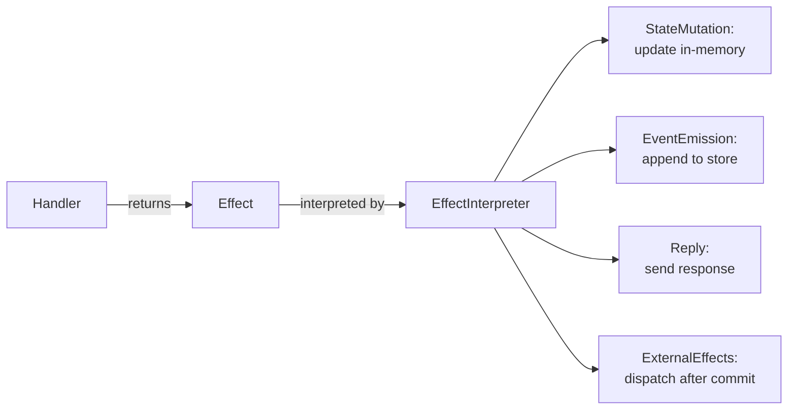

### Identity Types (`context.rs`)

```rust
pub struct AggregateId(String);    // AggregateId::new(..) -> Result<Self, AggregateIdError>
pub struct EntityId(String);
pub struct TenantId(String);
pub struct CorrelationId(String);
pub struct CausationId(String);
pub struct RequestId(String);
pub type Metadata = HashMap<String, String>;
```

Each is a newtype generated by an internal `id_type!` macro that rejects empty strings.

### Persistence SPIs (`persistence/`)

```rust
pub trait EventStore<E: DomainEvent> {
    fn append(&mut self, aggregate_id: &str, tenant_id: Option<&str>, expected_version: i64, events: Vec<StoredEvent<E>>) -> Result<i64, PersistenceError>;
    fn load(&self, aggregate_id: &str, tenant_id: Option<&str>) -> Result<Vec<StoredEvent<E>>, PersistenceError>;
    fn list_aggregate_ids(&self, tenant_id: Option<&str>) -> Result<Vec<String>, PersistenceError>;
    fn stream_version_offset(&self, aggregate_id: &str, tenant_id: Option<&str>) -> u64 { 0 }
}

pub trait Repository<A> {
    fn save(&mut self, aggregate_id: &str, aggregate: A, tenant_id: Option<&str>, expected_version: i64) -> Result<i64, PersistenceError>;
    fn load(&self, aggregate_id: &str, tenant_id: Option<&str>) -> Result<A, PersistenceError>;
    fn delete(&mut self, aggregate_id: &str, tenant_id: Option<&str>) -> Result<(), PersistenceError>;
}

pub trait Snapshot {
    fn save_snapshot(&mut self, aggregate_id: &str, tenant_id: Option<&str>, version: i64, payload: Value) -> Result<(), PersistenceError>;
    fn load_snapshot(&self, aggregate_id: &str, tenant_id: Option<&str>) -> Result<Option<(i64, Value)>, PersistenceError>;
}
```

`PersistenceError`: `NotFound{aggregate_id}` / `Conflict{aggregate_id,expected,actual}` / `MissingTenant` / `Internal(String)`. `StoredEvent<E>` wraps an event plus an optional correlation id.

### Idempotency (`idempotency.rs`)

```rust
pub struct IdempotencyKey(String); // rejects empty strings, via id_type!
```

### CQRS Read-Side Traits (`read_side/`)

17 modules under `crates/domain/src/read_side/` — covered in full in [CQRS Read-Side Engine](#-cqrs-read-side-engine) below.

---

## 🛠 Service SDK

The SDK (`crates/service-sdk/`) is the **primary framework for building services**.

### Architecture

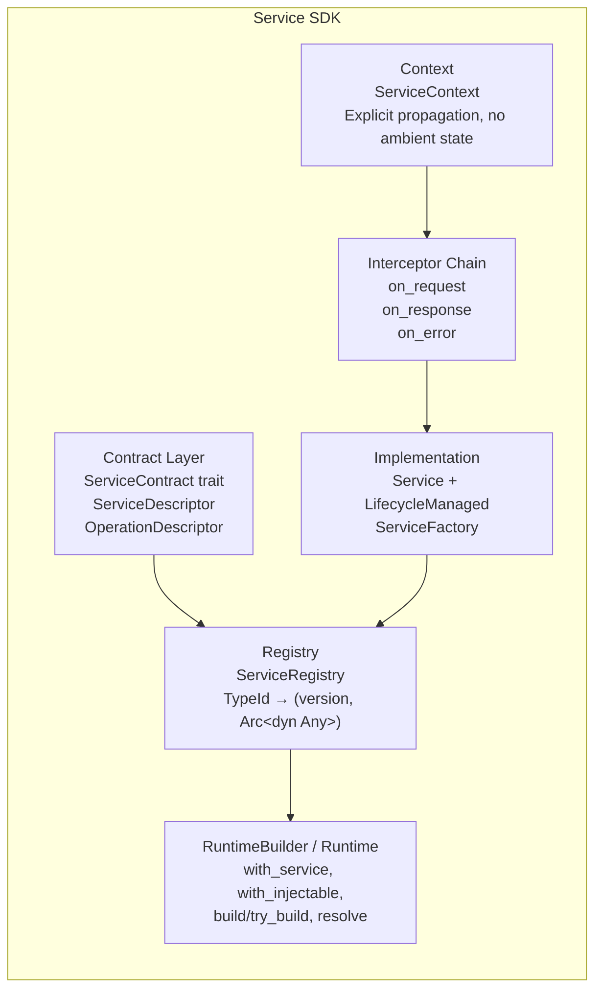

### ServiceContext — Explicit Propagation, No Ambient State

`ServiceContext` (`crates/service-sdk/src/context/mod.rs`) is a value type carried explicitly through every call — **there is no `ServiceContext::current()` or thread-local fallback**. Confirmed fields: `tenant_id` (private), `correlation_id`, `trace_id`, `deadline`, `timeout`, `additional_context`, `allow_cross_tenant` (private), `cancellation_token`, `security: Option<Arc<SecurityContext>>`, `logger: Option<Arc<KITLogger>>`, `resolved_tenant` (private).

Key methods: `new()`, `with_tenant_id(..)`, `with_correlation_id(..)`, `with_trace_id(..)`, `with_deadline(..)`, `with_timeout(..)`, `with_security(..)`, `security()`, `with_logger(..)`, `logger()`, `is_cancelled()`, `is_deadline_expired()`, `tenant_hint()`, `has_tenant_hint()`, `canonical_tenant()`, `with_cross_tenant_access(&CrossTenantPermit)`, `is_cross_tenant_allowed_for(&TenantId)`, `require_security()`. (`is_cross_tenant_allowed()` still exists but is **deprecated** in favor of `is_cross_tenant_allowed_for`.)

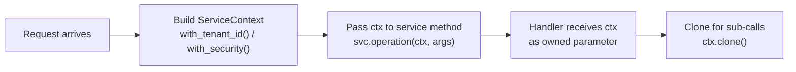

### API Contract: ServiceContext in Operation Signatures

As of CORE-010A, `ServiceContext` is a formal part of every generated operation signature — an intentional contract, not an implementation detail. Every operation declared in a service trait receives `ctx: ServiceContext` as its first parameter:

```rust
#[async_trait]
pub trait OrderService: Send + Sync {
    async fn place_order(&self, ctx: ServiceContext, cmd: CreateOrder) -> Result<OrderId, ServiceError>;
}
```

Callers must construct and pass context explicitly:

```rust
let ctx = ServiceContext::new()
    .with_tenant_id("tenant-123")
    .with_correlation_id("req-456");

service.place_order(ctx, cmd).await?;
```

### Interceptor Chain

```rust
#[async_trait]
pub trait Interceptor: Send + Sync {
    async fn on_request(&self, context: &ServiceContext) -> Result<(), ServiceError>;
    async fn on_response(&self, context: &ServiceContext) -> Result<(), ServiceError>;
    async fn on_error(&self, context: &ServiceContext, error: &dyn ServiceErrorTrait) -> Result<(), ServiceError>;
}

pub struct InterceptorChain { /* Vec<Arc<dyn Interceptor>> */ }
impl InterceptorChain {
    pub fn new() -> Self;
    pub fn add_interceptor(&mut self, interceptor: Arc<dyn Interceptor>);
    pub async fn on_request(&self, context: &ServiceContext) -> Result<(), ServiceError>;
    pub async fn on_response(&self, context: &ServiceContext) -> Result<(), ServiceError>;
    pub async fn on_error(&self, context: &ServiceContext, error: &dyn ServiceErrorTrait) -> Result<(), ServiceError>;
}
```

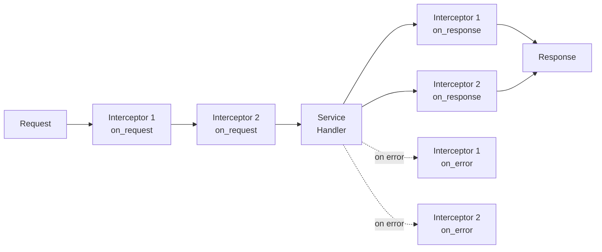

### ServiceError — Typed Error Enum

Verified against `crates/service-sdk/src/error/mod.rs` — unchanged from the previous revision, all 10 variants shaped `{ message: String }`:

```rust
pub enum ServiceError {
    Validation { message: String },
    Authorization { message: String },
    Internal { message: String },
    NotFound { message: String },
    Conflict { message: String },
    Timeout { message: String },
    RateLimit { message: String },
    ServiceUnavailable { message: String },
    BusinessLogic { message: String },
    Custom { message: String },
}

// Constructors available (each takes impl Into<String>):
ServiceError::validation("name is required");
ServiceError::not_found("user not found");
ServiceError::business_logic("insufficient funds");
```

`pub type Result<T> = std::result::Result<T, ServiceError>`. Implements `ServiceErrorTrait` (`code()`, `category()`, `message()`). See [HTTP Transport](#-http-transport) for how each variant maps to an HTTP status.

### Key Traits

```rust
// Service contract — static metadata about a service
pub trait ServiceContract {
    fn type_id() -> &'static str;
    fn name() -> &'static str;
    fn version() -> ContractVersion;
    fn descriptor() -> ServiceDescriptor;
    fn operations() -> Vec<OperationDescriptor>;
}

// Service runtime — descriptor access only (NOT initialize/shutdown — see below)
#[async_trait]
pub trait Service: Send + Sync {
    fn descriptor(&self) -> &ServiceDescriptor;
    fn name(&self) -> &str { &self.descriptor().name }
    fn version(&self) -> &ContractVersion { &self.descriptor().version }
    fn metadata(&self) -> HashMap<String, String> { HashMap::new() }
}
```

> **Correction:** the previous doc revision claimed `Service` has `async fn initialize()` / `async fn shutdown()`. That is **wrong** — `crates/service-sdk/src/implementation.rs` explicitly documents that lifecycle hooks are intentionally absent from `Service`; they live on a separate `LifecycleManaged` trait instead (`implementation.rs:42-54`).

### RuntimeBuilder & Runtime (`runtime/builder.rs`)

The real DI/registration entry point lives at `crates/service-sdk/src/runtime/builder.rs` — **not** `src/builder.rs` (that file does not exist).

```rust
impl RuntimeBuilder {
    pub fn new() -> Self;
    pub fn with_security(self, authn: Arc<dyn AuthenticationProvider>, authz: Arc<dyn AuthorizationProvider>) -> Self;
    pub fn with_logger(self, logger: Arc<KITLogger>) -> Self;
    pub fn with_adapter<A: Send + Sync + 'static>(self, adapter: Arc<A>) -> Self;
    pub fn with_config<C: Send + Sync + 'static>(self, value: Arc<C>) -> Self;
    pub fn with_service<Tag: Resolvable + 'static>(self, svc: Arc<Tag::Service>) -> Result<Self, RegistryError>;
    pub fn with_injectable<S: Injectable>(self) -> Self;
    pub fn with_tenant_enforcement_mode(self, mode: TenantEnforcementMode) -> Self;
    pub fn with_observability(self, obs: Arc<dyn Observability>) -> Self;
    pub fn build(self) -> Runtime;
    pub fn try_build(self) -> Result<Runtime, RuntimeError>;
}

impl Runtime {
    pub fn resolve<Tag: Resolvable + 'static>(&self) -> Result<Tag::Proxy, RuntimeError>;
    pub fn shutdown(&self);
    pub async fn shutdown_async(&self);
    pub fn register_async_teardown(&self, ..);
}
```

`Runtime::resolve` resolves `Tag` to its macro-generated proxy type by looking it up in the internal `ServiceRegistry`; it is not cached — each call constructs a fresh proxy wrapping the same `Arc`-backed instance.

### Service SDK Macro Generated Output

`#[service]` (`crates/service-sdk-macros/src/lib.rs`) dispatches on what it's attached to:

- On a **trait**, it generates: a zero-sized `{Trait}Tag` struct, a `{Trait}Ref` proxy struct (`inner: Arc<dyn Trait>`, `chain: Arc<InterceptorChain>`, `runtime: Weak<RuntimeInner>`), a forwarding `impl Trait for {Trait}Ref` (each method runs the `#[authorize]`/`#[tenant_scoped]` guards, then `chain.on_request` → inner call → `chain.on_response`/`chain.on_error`), `impl Resolvable for {Trait}Tag` (`type Proxy = {Trait}Ref`, `type Service = dyn Trait`), and `impl ServiceContract for {Trait}Tag`.
- On a **struct**, it generates `impl Injectable for Struct` (`dependencies()`/`build()`), mapping fields like `ProjectionRef<T>`/`AdapterRef<T>`/`ConfigValue<T>` to DI resolver calls.

`#[operation]` is a pure marker consumed by `#[service]` — used standalone it just passes the function through unchanged.

```rust
// Input:
#[service(version = "1.2.3")]
trait MyService {
    #[operation]
    async fn do_something(&self, ctx: ServiceContext, input: String) -> Result<String, ServiceError>;
}

// Output (conceptual — the real generated names):
struct MyServiceTag; // zero-sized, implements Resolvable + ServiceContract
struct MyServiceRef { inner: Arc<dyn MyService>, chain: Arc<InterceptorChain>, runtime: Weak<RuntimeInner> }
impl MyService for MyServiceRef { /* guarded, interceptor-wrapped forwarding methods */ }
```

### `#[authorize]` and `#[tenant_scoped]`

Both are proc-macro attributes applied to an operation method **inside** a `#[service]` trait — used standalone (outside `#[service]`) they emit a compile error. Implementation: argument parsing in `crates/service-sdk-macros/src/authorize.rs`; guard codegen is inlined into `expand_service_trait` in `lib.rs`.

```rust
// crates/service-sdk/tests/authorization_integration.rs
#[authorize(context = ctx, permission = "orders:read")]
async fn get_order(&self, ctx: ServiceContext, id: OrderId) -> Result<Order, ServiceError>;

// crates/service-sdk/tests/security_denial_observability.rs — combined
#[authorize(context = ctx, permission = "orders:read")]
#[tenant_scoped]
async fn get_order(&self, ctx: ServiceContext, id: OrderId) -> Result<Order, ServiceError>;
```

`#[authorize(context = <ident>, permission = "<resource>:<action>")]` — both arguments required; `permission` must be exactly one `:`-separated non-empty pair. `#[tenant_scoped]` takes no arguments — it adds a tenant-resolution guard before the handler runs.

### TenantEnforcementMode

`crates/service-sdk/src/runtime/tenant.rs`:

```rust
pub enum TenantEnforcementMode {
    /// Default. Only authenticated principals resolve a tenant.
    /// Unauthenticated tenant-scoped calls fail closed with MissingContext.
    AuthenticatedOnly,
    /// Additionally permit an explicit system/internal caller-supplied tenant.
    AllowSystemInternal,
}
```

Fail-closed behavior (default `AuthenticatedOnly`, set via `RuntimeBuilder::with_tenant_enforcement_mode`):
- Unauthenticated + `#[tenant_scoped]` call → `SecurityError::MissingContext`.
- Authenticated principal with no tenant claim → `MissingContext`, even if a hint is present.
- Authenticated hint disagreeing with the principal's tenant, with no matching cross-tenant grant → `SecurityError::TenantMismatch { expected, actual }` (hard error — never silently picks one side).
- `AllowSystemInternal` additionally lets an *unauthenticated* caller-supplied hint resolve a tenant, but still fails closed if no hint is given at all.

---

## 🔄 Persistent Entity Runtime

The persistent entity runtime (`crates/persistent-entity/`) implements the **event-sourced actor-per-entity** pattern.

### Entity Lifecycle

Confirmed against `crates/persistent-entity/src/lifecycle.rs` — the 5-state machine is unchanged:

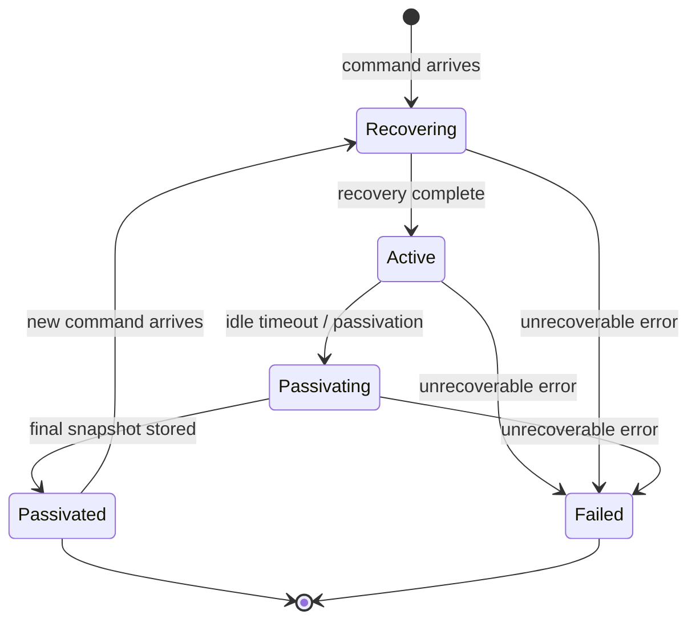

### PersistentEntity Trait

**Corrected**: the trait now has an additional `apply_events` (plural, batch) method alongside `apply_event`, and there is a `CommandResult<E, S>` enum used internally:

```rust
pub enum CommandResult<E, S> {
    Events { new_state: S, events: Vec<E> },
    NoEvents { state: S },
}

#[async_trait]
pub trait PersistentEntity: Send + Sync + Debug {
    type Command: Serialize + Send + Sync + 'static;
    type Event: Serialize + Send + Sync + 'static;
    type State: Serialize + for<'de> Deserialize<'de> + Send + Sync + 'static;

    fn initial_state(&self) -> Self::State;

    async fn handle_command(
        &self,
        command: &Self::Command,
        state: &Self::State,
        context: &CommandContext,
    ) -> Result<Vec<Self::Event>, EntityError>;

    async fn apply_event(&self, state: &Self::State, event: &Self::Event) -> Result<Self::State, EntityError>;

    async fn apply_events(&self, state: &Self::State, events: &[Self::Event]) -> Result<Self::State, EntityError>;
}
```

### EntityRef Trait — Primary Interaction API

**Corrected**: the command type is an associated type on the trait, not a generic parameter on the method:

```rust
#[async_trait]
pub trait EntityRef: Clone + Send + Sync + Debug {
    type Command: Serialize + Send + 'static;

    async fn send_command<T>(&self, command: Self::Command, context: CommandContext) -> Result<T, EntityError>
    where
        T: Send + 'static;
}
```

### Command Processing Flow

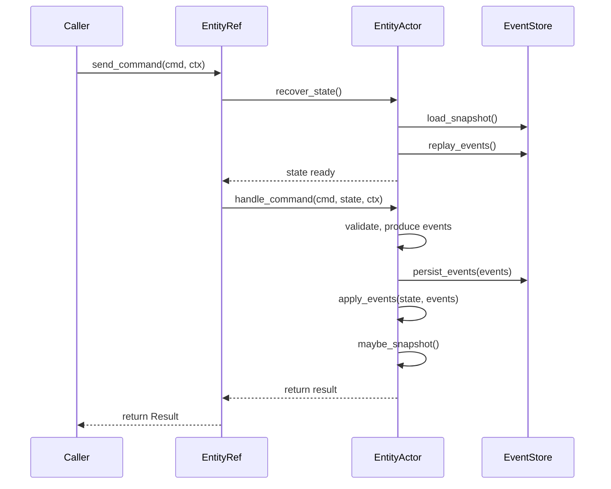

`EntityActor::run()` (`crates/persistent-entity/src/actor.rs`) drives this: `recover_state()` → (if `Failed`, drain mailbox and return) → `process_commands()` loop (`mailbox.recv()` → `execute_command()`, breaking on non-active state or a passivation signal) → `passivate()` (drains remaining mailbox, snapshots, marks passivated via the registry). Registry-entry removal happens exclusively through `TeardownGuard::drop()` (ADR-005), not inline in the actor loop.

### Testing Support

**Corrected import paths** — several items are re-exports or live in a sibling module, not defined directly in `testing.rs`:

```rust
use persistent_entity::testing::{
    InMemoryEventStore,    // re-exported from persistence.rs, not defined in testing.rs
    InMemorySnapshotStore, // re-exported from persistence.rs
    NoopPublisher,         // no-op event publisher, defined here
    TestEntityRef,         // simplified EntityRef for testing, defined here
    create_test_context,   // standard test CommandContext factory, defined here
};
use persistent_entity::test_entity::TestEntity; // NOTE: lives in its own module, not `testing`,
                                                 // and is not re-exported from the crate root
```

`persistent_entity::lib.rs` re-exports only `TestCommand`, `TestEvent`, `TestState` at the crate root — reach the rest via their module paths as shown above.

---

## ⚙️ Scheduler Pipeline

**There are THREE different types named `Scheduler` (and, confusingly, `EntityTriple`/`SchedulerState`) in this workspace. They do not share code and must not be conflated:**

| # | Location | What it actually is |
|---|----------|----------------------|
| 1 | `crates/ego-scheduler/src/scheduler.rs` | Standalone, pure, synchronous **actor-activation** scheduling pipeline |
| 2 | `crates/persistent-entity/src/scheduler.rs` | `persistent-entity`'s own internal reactive scheduling policy — a *separate* `Scheduler`/`EntityTriple`/`SchedulerState`, despite identical names |
| 3 | `crates/runtime/src/read_side/scheduler.rs` | `TagSchedulerImpl` — the **CQRS read-side projection** scheduler (a completely different domain: projections, not actor activation). See [CQRS Read-Side Engine](#-cqrs-read-side-engine) |

### 1. `ego-scheduler` — the 6-Stage Actor-Activation Pipeline

Verified against `crates/ego-scheduler/src/scheduler.rs`: it really is a fixed orchestration shell composing 6 pure pipeline stages (`ingest`, `route`, `reduce`, `detect`, `evaluate`, `emit` — one submodule each). The crate's own module doc-comment states the order as "ingest → route → reduce → detect → evaluate → emit", but `Scheduler::run_cycle`'s actual execution order is **ingest → detect → route → reduce → evaluate → emit** (the doc comment and the code disagree on where `detect`/`route` fall — the code is authoritative).

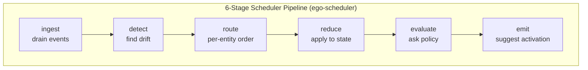

**Invariants:**
- **Determinism:** `SchedulerState = f(observed_stream)` — same events → same state
- **Per-entity ordering:** entity-switch detection in `route`
- **Advisory output:** the suggestion is never a command — just a hint to the runtime

```rust
pub trait SchedulingPolicy: Send + Sync {
    fn suggest_activation(&self, state: &SchedulerState, pending: &BTreeSet<EntityTriple>) -> Option<EntityTriple>;
}
```

`SchedulerState { total_events_consumed, last_sequence_id, detected_gaps, last_suggestion, state_hash, replay_buffer }`. Built-in policy: `RoundRobin`.

### 2. `persistent-entity`'s internal scheduler

`crates/persistent-entity/src/scheduler.rs` defines its own `EntityTriple` (tenant/type/id), `Scheduler`, and `SchedulerState` used purely to decide which entity `persistent-entity` should activate next from its own pending set — `suggest_activation(&self, pending: &HashSet<EntityTriple>) -> Option<EntityTriple>`. Same names as #1, unrelated types.

---

## 🔐 Security & Tenant Enforcement

`crates/security-sdk/` (package `ego-security-sdk`) defines the transport-neutral security contracts; `security-jwt` and `security-apikey` provide concrete `AuthenticationProvider` implementations.

### SecurityContext, AuthenticationProvider, AuthorizationProvider

```rust
// crates/security-sdk/src/context/mod.rs
pub struct SecurityContext { pub principal: Principal, pub claims: Claims }
impl SecurityContext {
    pub fn new(principal: Principal, claims: Claims) -> Self;
    pub fn empty(principal: Principal) -> Self;
    pub fn principal(&self) -> &Principal;
    pub fn claims(&self) -> &Claims;
}

// crates/security-sdk/src/authentication/mod.rs
pub trait AuthenticationProvider: Send + Sync {
    fn authenticate(&self, credential: &Credential) -> Result<SecurityContext, AuthenticationError>;
}

// crates/security-sdk/src/authorization/mod.rs
#[async_trait]
pub trait AuthorizationProvider: Send + Sync {
    async fn authorize(&self, principal: &Principal, request: &AccessRequest, ctx: &SecurityContext) -> Result<AuthorizationDecision, SecurityError>;
}

pub async fn authorize_in_context(
    security: Option<&SecurityContext>,
    resource: Resource,
    action: Action,
    provider: &dyn AuthorizationProvider,
) -> Result<(), SecurityError>;
```

`security-sdk` also exposes `BearerExtractor`/`CredentialExtractor`/`RequestContext` — a transport-neutral credential-extraction seam reused by `ego-transport` (see [HTTP Transport](#-http-transport)).

### JWT Providers (`security-jwt`)

Generated via an internal `define_provider!` macro (`crates/security-jwt/src/authenticator.rs`): `Hs256AuthenticationProvider`, `Rs256AuthenticationProvider`, `Es256AuthenticationProvider`, each `{ config, resolver: Arc<dyn KeyResolver>, clock: Arc<dyn Clock>, mapper: Arc<dyn PrincipalMapper> }`, constructed with `new(config, resolver, clock)` and `with_mapper(mapper)`, each implementing `AuthenticationProvider`. Also `OidcAuthenticationProvider`, `MultiIssuerAuthenticationProvider`, `IntrospectionAuthenticationProvider` — same trait, different discovery/validation strategy.

### API-Key Provider (`security-apikey`)

```rust
pub struct ApiKeyAuthenticationProvider {
    resolver: Arc<dyn LocalApiKeyResolver>,
    parser: Arc<dyn ApiKeyParser>,
    clock: Arc<dyn Clock>,
}
impl ApiKeyAuthenticationProvider {
    pub fn new(resolver: Arc<dyn LocalApiKeyResolver>, clock: Arc<dyn Clock>) -> Self;
    pub fn with_parser(self, parser: Arc<dyn ApiKeyParser>) -> Self;
}
```

### `#[authorize]` / `#[tenant_scoped]` and `TenantEnforcementMode`

Covered in full in [Service SDK](#-service-sdk) — these macros and the enforcement mode live in `ego-service-sdk`/`ego-service-sdk-macros`, but they exist specifically to enforce the security/tenant model described here. In short: `#[authorize(context = ctx, permission = "resource:action")]` calls `authorize_in_context` before the handler runs; `#[tenant_scoped]` requires a resolved tenant per `TenantEnforcementMode`; both fail closed (deny/reject) on any ambiguity — never silent continuation.

---

## 🌐 HTTP Transport

`crates/transport/` (package `ego-transport`) provides the HTTP layer. Its own file tree: `config.rs`, `error.rs`, `lib.rs`, `security.rs`, `server.rs`, `state.rs`.

### AppState

```rust
// crates/transport/src/state.rs
#[derive(Clone)]
pub struct AppState {
    /// The DI runtime handlers resolve services through.
    pub runtime: Arc<Runtime>,
    /// The authentication provider used to authenticate incoming credentials.
    pub authn: Arc<dyn AuthenticationProvider>,
}
impl AppState {
    pub fn new(runtime: Arc<Runtime>, authn: Arc<dyn AuthenticationProvider>) -> Self;
}
```

### JWT Security Extractor — Reuses `security-sdk`'s `BearerExtractor`

`ego-transport` does **not** reimplement bearer/JWT parsing — it wraps axum's `HeaderMap` in a local adapter implementing `security-sdk`'s transport-neutral `RequestContext`, then delegates:

```rust
// crates/transport/src/security.rs
#[async_trait]
impl<S> FromRequestParts<S> for AuthenticatedContext
where
    AppState: FromRef<S>,
    S: Send + Sync,
{
    type Rejection = TransportError;

    async fn from_request_parts(parts: &mut Parts, state: &S) -> Result<Self, Self::Rejection> {
        let state = AppState::from_ref(state);
        let ctx = AxumRequestContext(&parts.headers);
        let credential = BearerExtractor
            .extract(&ctx)
            .map_err(|_| TransportError::Unauthorized)?
            .ok_or(TransportError::Unauthorized)?;
        let security_context = state.authn.authenticate(&credential).map_err(|_| TransportError::Unauthorized)?;
        Ok(AuthenticatedContext(security_context))
    }
}
```

### Error Mapper

`TransportError` (`crates/transport/src/error.rs`) maps both `ServiceError` and `SecurityError` to HTTP status codes:

```rust
impl From<ServiceError> for TransportError {
    fn from(err: ServiceError) -> Self {
        match err {
            ServiceError::Validation { .. } => TransportError::BadRequest,
            ServiceError::Authorization { .. } => TransportError::Forbidden,
            ServiceError::Internal { .. } => TransportError::Internal,
            ServiceError::NotFound { .. } => TransportError::NotFound,
            ServiceError::Conflict { .. } => TransportError::Conflict,
            ServiceError::Timeout { .. } => TransportError::GatewayTimeout,
            ServiceError::RateLimit { .. } => TransportError::TooManyRequests,
            ServiceError::ServiceUnavailable { .. } => TransportError::ServiceUnavailable,
            ServiceError::BusinessLogic { .. } => TransportError::Conflict,
            ServiceError::Custom { .. } => TransportError::Internal,
        }
    }
}
```

`SecurityError` variants map similarly: `AuthenticationFailed`/`InvalidCredential`/`InvalidSubjectId`/`MissingContext` → `Unauthorized`; `AuthorizationDenied`/`TenantMismatch`/`CrossTenantDenied` → `Forbidden`; `CapabilityNotEnabled`/`ProviderError` → `Internal`; `InvalidAccessRequest` → `BadRequest`.

### `serve()`

```rust
// crates/transport/src/server.rs
pub async fn serve(
    listener: TcpListener,
    router: Router,
    shutdown: impl std::future::Future<Output = ()> + Send + 'static,
) -> std::io::Result<()> {
    axum::serve(listener, router.into_make_service())
        .with_graceful_shutdown(shutdown)
        .await
}
```

Callers must call `.with_state(app_state)` on the `Router` **before** passing it to `serve()` — a `Router<AppState>` doesn't satisfy axum's `Service<Request>` bound directly.

### Where Concrete Routes Live

`ego-transport` intentionally has **no concrete routes of its own** — only the reusable primitives above. Real routes live in the application: see `examples/reference-app/src/ports/http/{router.rs, handlers.rs}` for the pattern.

---

## 📊 CQRS Read-Side Engine

The real, tag-based, batched, idempotent, resumable projection engine — traits in `ego-domain`, implementation in `ego-runtime`.

### Domain Traits (`crates/domain/src/read_side/`)

```rust
#[async_trait]
pub trait Handler<E>: Send + Sync {
    async fn handle(&self, events: &[EventStreamElement<E>]) -> Result<(), ProjectionError>;
}

#[async_trait]
pub trait ReadSideStore<E> {
    async fn fetch(&self, tag: &EventTag, offset: Option<&Offset>, batch_size: usize) -> Result<Vec<EventStreamElement<E>>, ReadSideStoreError>;
}

#[async_trait]
pub trait DedupStore {
    async fn seen(&self, projection_id: &str, tag: &EventTag, event_id: &str) -> Result<bool, DedupStoreError>;
    async fn mark_seen(&self, projection_id: &str, tag: &EventTag, event_id: &str) -> Result<(), DedupStoreError>;
}

#[async_trait]
pub trait OffsetStore {
    async fn read_offset(&self, projection_id: &str, tag: &EventTag, tenant: &str) -> Result<Option<Offset>, OffsetStoreError>;
    async fn write_offset(&self, projection_id: &str, tag: &EventTag, tenant: &str, offset: &Offset) -> Result<(), OffsetStoreError>;
}

#[async_trait]
pub trait ProgressReporter: Send + Sync {
    fn on_batch_completed(&self, projection_id: &str, tag: &EventTag, count: usize, offset: &Offset) { /* no-op default */ }
    fn on_error(&self, projection_id: &str, error: &str) { /* no-op default */ }
    fn on_state_transition(&self, projection_id: &str, from: ProjectionState, to: ProjectionState) { /* no-op default */ }
}
```

`NoopProgressReporter` is a zero-sized default implementation. There is also a domain-side `TagScheduler<E>` trait that `ego-runtime`'s `TagSchedulerImpl` implements.

### Runtime Engine (`crates/runtime/src/read_side/`)

```rust
// scheduler.rs
pub struct TagSchedulerImpl<E> where E: Clone + Send + Sync { /* config, backpressure, batch_executor, active_projections */ }

impl<E> TagSchedulerImpl<E> {
    pub fn new(config: ReadSideConfig) -> Self;
}

// implements ego_domain::read_side::TagScheduler<E>
async fn start_projection(&mut self, projection_id: String, tags: Vec<EventTag>, tenant: String,
    handler: impl Handler<E> + Clone, read_store: impl ReadSideStore<E> + Clone, ..) -> Result<(), Box<dyn std::error::Error>>;

// convenience wrapper — spawns a tokio task that loops start_projection on an interval
// until a watch::Receiver<bool> stop signal fires, draining any in-flight batch first
pub fn run_until_stopped<F, H, S, D, O, R>(
    self, tag_provider: F, interval: Duration, stop_signal: watch::Receiver<bool>,
    projection_id: String, tenant: String, handler: H, read_store: S, dedup_store: D,
    offset_store: O, reporter: R, on_error: impl Fn(Box<dyn std::error::Error>) + Send + Sync + 'static,
) -> tokio::task::JoinHandle<()>;
```

`BatchExecutor<E>::execute_session` acquires a `Backpressure` permit (an `Arc<Semaphore>` wrapper with `acquire()`/`can_process()`) before running a `ReadSideSession`'s fetch → handle → dedup/offset-commit cycle.

### Real Usage Example

See `examples/reference-app/src/read_side/{mod.rs, projection.rs, store.rs}` — a real `UsersByTenant` CQRS projection wired onto this engine, including tenant-isolation tests.

---

## 🧪 Testing Guide

### `ego-testkit` — Shared Test Doubles (`crates/testkit/src/`)

`ego-testkit` is a real, actively-used crate (`#![deny(missing_docs)]`) — the previous doc revision didn't mention it at all. Re-exports from `lib.rs`:

```rust
pub use assertions::{assert_authorized, assert_denied};
#[cfg(feature = "dev-providers")]
pub use authz::AllowAllAuthorizationProvider;
pub use authz::{DenyAllAuthorizationProvider, ScriptedAuthorizationProvider};
pub use config::TestConfig;
pub use context::{test_context, TestContextBuilder};
pub use fixtures::{FixtureBuilder, ServiceTestFixture};
pub use identity::{principal, PrincipalBuilder};
pub use logger::{CapturedRecord, CapturingLogger};
pub use security::{authenticated, authenticated_with_claims};
```

Plus `assert_service_error!` (`#[macro_export]`) — matches a `Result<_, ServiceError>` against a variant pattern, ignoring message text.

- **`ScriptedAuthorizationProvider`**: `allow_all()` / `deny_all()` / `.allow(kind, action)` / `.deny(kind, action, reason)` builders over the real `AuthorizationProvider` trait.
- **`TestConfig`**: `.with_value::<C>(value)`, `.set(key, value)`, `.provider()`.
- **`TestContextBuilder`** / **`test_context()`**: builds a `ServiceContext` with `.security()`, `.unauthenticated()`, `.logger()`, `.tenant()`, `.correlation()`.
- **`FixtureBuilder` / `ServiceTestFixture`**: `.with_service::<Tag>(svc)`, `.principal(..)`, `.unauthenticated()`, `.authorization(..)`, `.with_observability(..)`, `.config(..)`, `.build()`; the fixture exposes `.context()`, `.service::<S: Injectable>()`, `.runtime()`, `.resolve::<Tag: Resolvable>()`, `.captured_records()`.
- **`PrincipalBuilder` / `principal()`**: `.kind()`, `.subject()`, `.tenant()`, `.role()`, `.attribute()`, `.build() -> Principal`.
- **`CapturingLogger`**: `.logger() -> Arc<KITLogger>`, `.records() -> Vec<CapturedRecord>`.
- **`authenticated(principal) -> SecurityContext`** / **`authenticated_with_claims(principal, claims) -> SecurityContext`**.

```rust
use ego_testkit::{FixtureBuilder, principal, assert_authorized};

let fixture = FixtureBuilder::default()
    .with_service::<HelloServiceTag>(Arc::new(HelloServiceImpl))
    .principal(principal())
    .build();

let hello = fixture.resolve::<HelloServiceTag>().unwrap();
```

### Persistent Entity Testing

```rust
use persistent_entity::testing::{InMemoryEventStore, InMemorySnapshotStore, NoopPublisher, create_test_context};
use persistent_entity::test_entity::TestEntity; // NOT re-exported from testing.rs or the crate root

let store = InMemoryEventStore::<TestEvent>::new();
// Use with EntityRuntimeBuilder for integration testing
```

### Domain Contract Unit Tests

```bash
cargo test --workspace
cargo test -p ego-domain
```

> **Caveat, verified by running it:** `cargo test -p ego-service-sdk --doc` currently reports `test result: ok. 0 passed; 0 failed; 1 ignored` — it exercises **zero** actual doctests (the crate's one doctest, in `runtime/resolvable.rs`, is marked `ignore`). The "ok" result does not mean documentation examples are being verified.

---

## 📐 Conventions & Rules

`.speckit/constitution.md` **does not exist** (confirmed absent everywhere except one archived change folder) — despite still being cited as living authority in some historical text. That's a dead reference; the real, current governance sources are **`ARCHITECTURE.md`** (root — engineering conventions and runtime architecture, unified into a single doc; `docs/architecture.md` no longer exists, its content was merged in) and **`openspec/specs/`** (living per-domain specs, updated by the change lifecycle below). `CONTRIBUTING.md` also exists at the repo root.

### Architecture Rules (`ARCHITECTURE.md`)

| Rule | Description |
|------|-------------|
| Domain-neutral (nuanced) | `ego-domain`'s core write-side contracts (`Actor`/`Command`/`DomainEvent`/`Query`) are synchronous; its `read_side/` module uses `async fn` via `async-trait` for I/O-shaped SPIs, but has zero runtime (`tokio`) dependency in production |
| Cross-cutting SDKs | Only `ego-security-sdk` genuinely qualifies (a dependency leaf other layers may depend on directly) |
| Layer enforcement (documented, not enforced) | `layers.toml` states intended dependency direction for 9 of 16 crates; `scripts/verify-layers.sh` does not exist, so nothing currently checks it in CI |
| Patch over rewrite | Extend existing modules before creating new ones |
| Concrete first | Prefer concrete over abstraction; extract only when a 2nd use case emerges — "abstractions require evidence" |
| Avoid duplication | "Rule of Two" — don't generalize from a single example |
| No infrastructure in domain | Domain crates never depend on infrastructure |

### Code Rules

| Rule | Description |
|------|-------------|
| No `anyhow` | Error types are always explicit |
| No `Box<dyn Error>` | Typed errors only |
| Determinism | No `rand`, `SystemTime::now()`, `HashMap` iteration in domain logic |
| Serialization | `serde` + `serde_json` for contracts |
| Immutability | Domain data is immutable — changes produce new instances |
| Event stores | Append-only — no modification or deletion |
| Fail-closed | Ambiguous states produce rejection, never silent continuation |

### Testing Rules

| Rule | Description |
|------|-------------|
| TDD required | Test before implementation |
| Mock-only | No databases, networks, filesystems |
| Deterministic | Identical results every run |
| Offline | No network access required |
| Mock verification alone is insufficient | At least one behavioral assertion required |
| Happy path alone is insufficient | Every failure path must have a test |

### Governance: The OpenSpec Change Lifecycle

Replaces the old (defunct) Spec Kit `/speckit.*` workflow — evidenced by real change folders under `openspec/changes/` (proposal/design/spec/tasks/archive-report) and commit history (e.g. `docs(core-012a): archive change, merge delta spec into living service-sdk spec`):

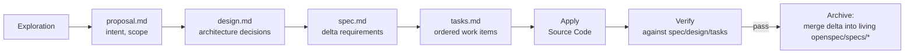

---

## 🗺 File Navigation Map

### Domain Contracts

| File | Contents |
|------|----------|
| `crates/domain/src/actor.rs` | `Actor` trait, `ActorId`, `actor_id!` macro, `ActorLifecycleState`, `SupervisionStrategy` |
| `crates/domain/src/command.rs` | `Command` marker trait |
| `crates/domain/src/event.rs` | `DomainEvent` trait |
| `crates/domain/src/query.rs` | `Query` trait with `Output` |
| `crates/domain/src/effect.rs` | `Effect<E,R,S>` enum, `ExternalEffectDescription` |
| `crates/domain/src/context.rs` | Identity types (`AggregateId`, `EntityId`, `TenantId`, `CorrelationId`, `CausationId`, `RequestId`, `Metadata`) |
| `crates/domain/src/persistence/` | `EventStore`, `Repository`, `Snapshot` SPIs, `StoredEvent<E>`, `PersistenceError` |
| `crates/domain/src/read_side/` | CQRS projection traits (17 modules): `handler.rs`, `store.rs`, `dedup.rs`, `offset.rs`, `progress.rs`, `scheduler.rs`, `state.rs`, `runner.rs`, `session.rs`, `event_stream.rs`, `event_tag.rs`, `tagger.rs`, `projection_state_store.rs`, `processor.rs`, `config.rs`, `error.rs` |
| `crates/domain/src/idempotency.rs` | `IdempotencyKey` |

### Service SDK

| File | Contents |
|------|----------|
| `crates/service-sdk/src/lib.rs` | Crate root — re-exports `context`, `contract`, `di`, `error`, `implementation`, `interceptor`, `registry`, `runtime` |
| `crates/service-sdk/src/contract/mod.rs` | `ServiceContract` trait |
| `crates/service-sdk/src/contract/descriptor.rs` | `ServiceDescriptor`, `OperationDescriptor`, `ContractDescriptor`, `FieldDescriptor` |
| `crates/service-sdk/src/contract/version.rs` | `ContractVersion`, `VersionConstraint` |
| `crates/service-sdk/src/implementation.rs` | `Service` trait, `LifecycleManaged` trait, `ServiceFactory` trait |
| `crates/service-sdk/src/context/mod.rs` | `ServiceContext` (explicit propagation, no ambient state) |
| `crates/service-sdk/src/interceptor/` | `Interceptor` trait, `InterceptorChain` |
| `crates/service-sdk/src/registry/` | `ServiceRegistry`, `RegistryError` |
| `crates/service-sdk/src/error/mod.rs` | `ServiceError` (10 variants), `Result<T>`, `ServiceErrorTrait` |
| `crates/service-sdk/src/error/category.rs` | `ErrorCategory` |
| `crates/service-sdk/src/error/domain_error.rs` | `DomainError`, `IntoServiceError` |
| `crates/service-sdk/src/runtime/builder.rs` | `RuntimeBuilder`, `Runtime` (**not** `src/builder.rs`) |
| `crates/service-sdk/src/runtime/tenant.rs` | `TenantEnforcementMode` |
| `crates/service-sdk/src/runtime/resolvable.rs` | `Resolvable` trait |
| `crates/service-sdk/src/di/` | `Injectable` trait, DI plumbing |
| `crates/service-sdk/src/test_support.rs` | `#[cfg(test)]`-only, crate-internal fixtures — **not** a public/reusable testing module (that's `ego-testkit`) |
| `crates/service-sdk/examples/hello_service.rs` | The canonical Quick Start example |

Note: `crates/service-sdk/src/testing.rs` and `crates/service-sdk/src/reference.rs` **do not exist** — the previous doc revision invented both.

### Service SDK Macros

| File | Contents |
|------|----------|
| `crates/service-sdk-macros/src/lib.rs` | `#[service]`, `#[operation]`, `#[authorize]`, `#[tenant_scoped]` proc-macro impls |
| `crates/service-sdk-macros/src/authorize.rs` | `#[authorize]` argument parsing |
| `crates/service-sdk-macros/src/tests.rs` | Macro codegen unit tests |

### Security

| File | Contents |
|------|----------|
| `crates/security-sdk/src/context/mod.rs` | `SecurityContext` |
| `crates/security-sdk/src/authentication/mod.rs` | `AuthenticationProvider` trait |
| `crates/security-sdk/src/authorization/mod.rs` | `AuthorizationProvider` trait, `authorize_in_context` |
| `crates/security-sdk/src/credential_extractor.rs`, `credential/mod.rs` | `BearerExtractor`, `CredentialExtractor`, `RequestContext`, `Credential` |
| `crates/security-sdk/src/principal/` | `Principal`, `SubjectId` |
| `crates/security-sdk/src/providers/` | `allow_all`, `basic`, `deny_all`, `rbac` reference providers |
| `crates/security-jwt/src/authenticator.rs` | `Hs256/Rs256/Es256AuthenticationProvider` (`define_provider!` macro) |
| `crates/security-jwt/src/oidc_provider.rs`, `multi_issuer.rs`, `introspection.rs` | OIDC / multi-issuer / introspection providers |
| `crates/security-apikey/src/authenticator.rs` | `ApiKeyAuthenticationProvider` |

### HTTP Transport

| File | Contents |
|------|----------|
| `crates/transport/src/state.rs` | `AppState` |
| `crates/transport/src/security.rs` | JWT/bearer extractor (`AuthenticatedContext`, `AxumRequestContext`) |
| `crates/transport/src/error.rs` | `TransportError`, `From<ServiceError>`, `From<SecurityError>` |
| `crates/transport/src/server.rs` | `serve()` |
| `crates/transport/src/config.rs` | Transport configuration |
| `examples/reference-app/src/ports/http/` | Real, concrete routes (`router.rs`, `handlers.rs`) |

### Persistent Entity

| File | Contents |
|------|----------|
| `crates/persistent-entity/src/persistent_entity.rs` | `PersistentEntity` trait, `CommandResult<E,S>` |
| `crates/persistent-entity/src/entity_ref.rs` | `EntityRef` trait (`type Command` associated type) |
| `crates/persistent-entity/src/actor.rs` | `EntityActor` — lifecycle (recover → process → passivate) |
| `crates/persistent-entity/src/runtime.rs` | `EntityRuntime<E>` — top-level orchestrator |
| `crates/persistent-entity/src/builder.rs` | `EntityRuntimeBuilder` |
| `crates/persistent-entity/src/lifecycle.rs` | `LifecycleStateMachine`, `EntityState` |
| `crates/persistent-entity/src/mailbox.rs` | `BoundedMailbox<T>` — bounded FIFO |
| `crates/persistent-entity/src/testing.rs` | `NoopPublisher`, `TestEntityRef`, `create_test_context`, re-exports of `InMemoryEventStore`/`InMemorySnapshotStore` |
| `crates/persistent-entity/src/persistence.rs` | Real definitions of `InMemoryEventStore`, `InMemorySnapshotStore` |
| `crates/persistent-entity/src/test_entity.rs` | `TestEntity` (Counter entity) — separate module from `testing.rs` |
| `crates/persistent-entity/src/snapshot.rs` | `SnapshotStrategy` (`Periodic`, `VersionBased`, `NoSnapshot`) |
| `crates/persistent-entity/src/scheduler.rs` | `persistent-entity`'s own internal `Scheduler`/`EntityTriple` (distinct from `ego-scheduler`'s) |

### Scheduler

| File | Contents |
|------|----------|
| `crates/ego-scheduler/src/scheduler.rs` | `Scheduler` — the 6-stage pipeline orchestrator |
| `crates/ego-scheduler/src/event_bus.rs` | `EntityTriple`, `SchedulerEvent`, event-bus channel |
| `crates/ego-scheduler/src/policy.rs` | `SchedulingPolicy` trait, `RoundRobin` |
| `crates/ego-scheduler/src/state.rs` | `SchedulerState` |

### Runtime & CQRS Read-Side Engine

| File | Contents |
|------|----------|
| `crates/runtime/src/lib.rs` | `Runtime` trait, `EffectInterpreter`, re-exports |
| `crates/runtime/src/interpreter.rs` | `EffectInterpreter` trait, `interpret_composed`, `InterpretationError` |
| `crates/runtime/src/read_side/scheduler.rs` | `TagSchedulerImpl`, `run_until_stopped` |
| `crates/runtime/src/read_side/batch_executor.rs` | `BatchExecutor<E>` |
| `crates/runtime/src/read_side/backpressure.rs` | `Backpressure` |
| `crates/runtime-tokio/src/lib.rs` | `TokioRuntime`, `TokioRuntimeBuilder`, `DefaultRuntime` — the real concrete `Runtime` impl |

### Testkit

| File | Contents |
|------|----------|
| `crates/testkit/src/assertions.rs` | `assert_authorized`, `assert_denied`, `assert_service_error!` |
| `crates/testkit/src/authz.rs` | `ScriptedAuthorizationProvider`, `DenyAllAuthorizationProvider`, `AllowAllAuthorizationProvider` (feature `dev-providers`) |
| `crates/testkit/src/config.rs` | `TestConfig` |
| `crates/testkit/src/context.rs` | `TestContextBuilder`, `test_context()` |
| `crates/testkit/src/fixtures.rs` | `FixtureBuilder`, `ServiceTestFixture` |
| `crates/testkit/src/identity.rs` | `PrincipalBuilder`, `principal()` |
| `crates/testkit/src/logger.rs` | `CapturedRecord`, `CapturingLogger` |
| `crates/testkit/src/security.rs` | `authenticated()`, `authenticated_with_claims()` |

### Reference App (CORE-018)

| File | Contents |
|------|----------|
| `examples/reference-app/src/main.rs` | Entry point |
| `examples/reference-app/src/domain/` | `tenant_org.rs`, `user.rs` aggregates |
| `examples/reference-app/src/application.rs` | Use-case core |
| `examples/reference-app/src/ports/http/` | HTTP adapter: `router.rs`, `handlers.rs` |
| `examples/reference-app/src/read_side/` | `UsersByTenant` projection: `mod.rs`, `projection.rs`, `store.rs` |
| `examples/reference-app/README.md` | Run instructions, curl/JWT flow, non-goals |
| `examples/reference-app/tests/` | Guard-chain, observability, e2e HTTP, projection tests |

### Docs & Config

| File | Contents |
|------|----------|
| `ARCHITECTURE.md` | Unified runtime + engineering architecture reference (root) — `docs/architecture.md` no longer exists, its content was merged in here |
| `layers.toml` | Documented-but-unenforced layer intent (see [Architecture Map](#-architecture-map)) |
| `AGENTS.md` | Skills index — points to `PRD.md` and `ARCHITECTURE.md` as canonical sources |
| `CONTRIBUTING.md` | Contribution guidelines |
| `openspec/specs/` | Living per-domain specs |
| `openspec/changes/` | Change lifecycle folders (proposal/design/spec/tasks/archive-report) |
| `COOKBOOK.md` | **This file** — entry point for agent programmers |

---

## 🔍 Quick Command Reference

All verified to actually run against this workspace:

```bash
# Build & test everything
cargo test --workspace

# Test a specific crate
cargo test -p ego-domain
cargo test -p ego-service-sdk --doc   # NOTE: currently 0 passed, 1 ignored — no live doctests today

# Run the canonical Quick Start example
cargo run --example hello_service -p ego-service-sdk

# Run the full reference app
cargo run -p reference-app
cargo test -p reference-app

# Lint (clean as of this writing: 0 errors, 9 style-only warnings)
cargo clippy --workspace

# Format
cargo fmt --all
```

---

> **Next:** Read [`ARCHITECTURE.md`](./ARCHITECTURE.md) and [`openspec/specs/`](./openspec/specs/) for the current, real governance rules — `.speckit/constitution.md` no longer exists.
