# 🥘 ego-rs Cookbook

> **Entry point for agent programmers.** Everything you need to understand, navigate, and extend the ego-rs framework.

---

## 📋 Table of Contents

| # | Section | For |
|---|---------|-----|
| 1 | [Framework Overview](#-framework-overview) | Understanding what ego-rs is |
| 2 | [Architecture Map](#-architecture-map) | Crate layout + dependency flow |
| 3 | [Quick Start](#-quick-start) | Minimal working example |
| 4 | [Core Domain Contracts](#-core-domain-contracts) | Actor, Command, Event, Query, Effect |
| 5 | [Service SDK](#-service-sdk) | Service contracts, macros, context, interceptors |
| 6 | [Persistent Entity Runtime](#-persistent-entity-runtime) | Event-sourced entity lifecycle |
| 7 | [Scheduler Pipeline](#-scheduler-pipeline) | 6-stage scheduling engine |
| 8 | [Testing Guide](#-testing-guide) | Mocks, in-memory stores, deterministic tests |
| 9 | [Conventions & Rules](#-conventions--rules) | Key rules from the constitution |
| 10 | [File Navigation Map](#-file-navigation-map) | Where to find every important file |

---

## 🏗 Framework Overview

ego-rs is a **hexagonal, actor-oriented, deterministic** backend framework in Rust. It provides primitives for building distributed, event-sourced, replayable systems.

```mermaid
flowchart TB
    subgraph Design_Principles["Design Principles"]
        direction LR
        A1["Hexagonal<br/>Architecture"] --- A2["Actor<br/>Model"]
        A2 --- A3["CQRS +<br/>Event Sourcing"]
        A3 --- A4["Deterministic<br/>Execution"]
        A4 --- A5["Immutable<br/>By Default"]
    end

    subgraph Execution_Pipeline["Execution Pipeline"]
        P1["Scheduler<br/>decides order"] --> P2["Worker<br/>dispatches"]
        P2 --> P3["BatchExecutor<br/>fetches events"]
        P3 --> P4["Session<br/>runs handlers"]
        P4 --> P5["Atomic Commit<br/>offset + dedup"]
    end

    subgraph Runtime_Model["Runtime Model"]
        R1["Actor<br/>one message at a time"] --- R2["Persistent Entity<br/>event-sourced lifecycle"]
        R2 --- R3["Service<br/>contract-based dispatch"]
        R3 --- R4["Interceptor Chain<br/>cross-cutting concerns"]
    end
```

> **Key principle:** The system is split into **decision → execution → commit**. No component crosses these boundaries.

---

## 🗺 Architecture Map

### Crate Dependency Flow

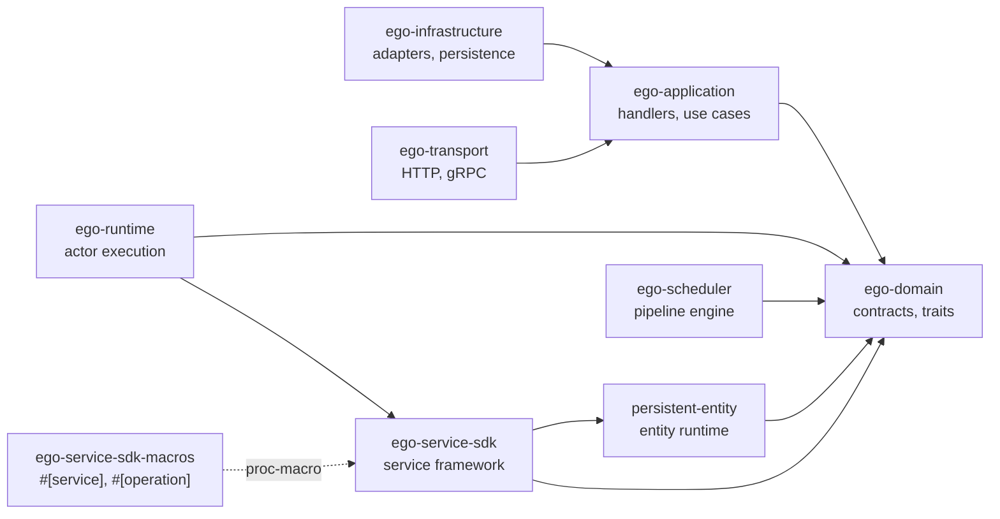

### Layer Rules

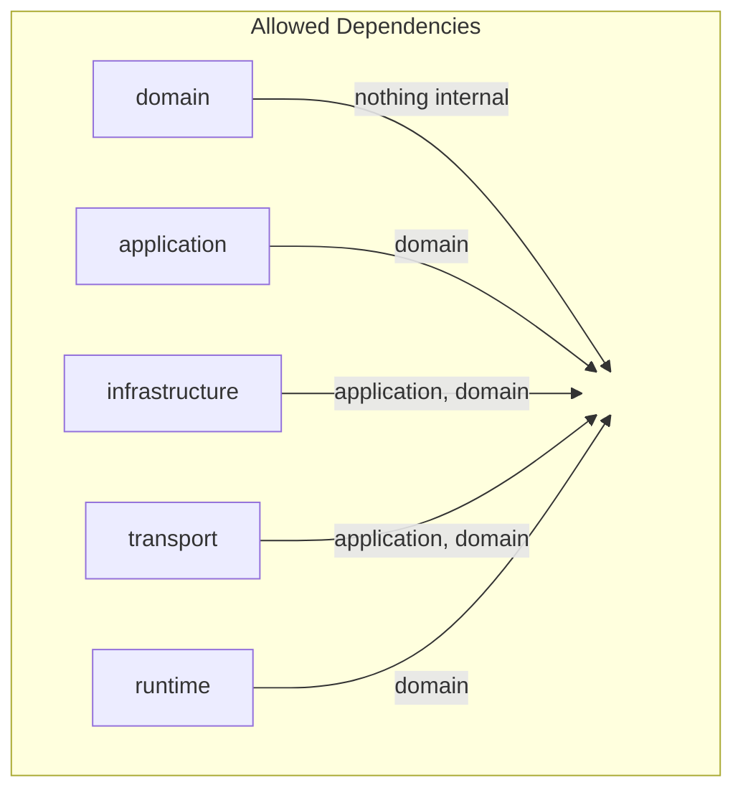

### Crate Responsibilities

| Crate | Layer | Responsibility |
|-------|-------|---------------|
| `ego-domain` | Domain | Core contracts: Actor, Command, Event, Query, Effect, persistence SPIs |
| `ego-application` | Application | Use case orchestration (command/query handlers) |
| `ego-infrastructure` | Infrastructure | Concrete adapters (in-memory, Postgres) |
| `ego-transport` | Transport | HTTP/gRPC protocol handlers |
| `ego-runtime` | Foundation | Actor system: mailbox, supervision, EffectInterpreter |
| `ego-service-sdk` | Application | Service contracts, registry, DI, interceptors, context |
| `ego-service-sdk-macros` | Application | `#[service]`, `#[operation]` proc-macros |
| `persistent-entity` | Runtime | Event-sourced actor-per-entity execution |
| `ego-scheduler` | Runtime | 6-stage scheduling pipeline |
| `runtime-slice` | Domain | Deterministic execution types (zero async) |

---

## 🚀 Quick Start

### Minimal Service

```rust
use ego_service_sdk::contract::{ContractVersion, OperationDescriptor, ServiceDescriptor};
use ego_service_sdk::implementation::Service;
use async_trait::async_trait;

// 1. Define a service struct
struct MyService {
    descriptor: ServiceDescriptor,
}

// 2. Implement the Service trait
#[async_trait]
impl Service for MyService {
    fn descriptor(&self) -> &ServiceDescriptor {
        &self.descriptor
    }
}

// 3. Instantiate
let service = MyService {
    descriptor: ServiceDescriptor {
        name: "greeter".into(),
        version: ContractVersion::new(1, 0, 0),
        operations: vec![],
        description: None,
        metadata: std::collections::HashMap::new(),
    },
};

assert_eq!(service.name(), "greeter");
```

### Using the `#[service]` Macro

```rust
use ego_service_sdk_macros::{service, operation};
use ego_service_sdk::error::ServiceError;

#[service(version = "1.0.0")]
trait Greeter {
    #[operation]
    async fn greet(&self, name: String) -> Result<String, ServiceError>;
}

// The macro generates a ServiceContract impl accessible
// via any concrete type implementing Greeter
```

> **Note:** The `#[service]` macro generates a blanket `impl<T: Greeter> ServiceContract for T`. See `crates/service-sdk-macros/src/lib.rs:355-385`.

---

## 📦 Core Domain Contracts

All in `crates/domain/src/`. These are **runtime-neutral** — no `async`, no Tokio.

### Actor (`actor/`)

```rust
pub trait Actor {
    type Message; // The message type this actor handles
}

// Compile-time deterministic identity
use ego_domain::actor_id;
let id: &'static ActorId = actor_id!(my_actor);
```

### Command (`command/`)

```rust
pub trait Command: Send + Sync {} // marker trait
```

### DomainEvent (`event/`)

```rust
pub trait DomainEvent: Send + Sync {
    fn aggregate_id(&self) -> &str;
    fn event_type(&self) -> &str;
    fn payload(&self) -> &serde_json::Value;
    fn occurred_at(&self) -> &DateTime<Utc>;
}
```

### Query (`query/`)

```rust
pub trait Query: Send + Sync {
    type Output: Serialize + Send + Sync;
}
```

### Effect (`effect/`)

The **Effect** enum is the return type for all handlers. It describes what should happen — the runtime executes it.

```rust
pub enum Effect<E, R, S> {
    NoEffect,
    StateMutation(S),           // new state
    EventEmission(Vec<E>),      // events to persist
    Reply(R),                   // response to caller
    ExternalEffects(Vec<ExternalEffectDescription>), // after-commit side effects
    Composed(Vec<Effect<E, R, S>>),
}
```

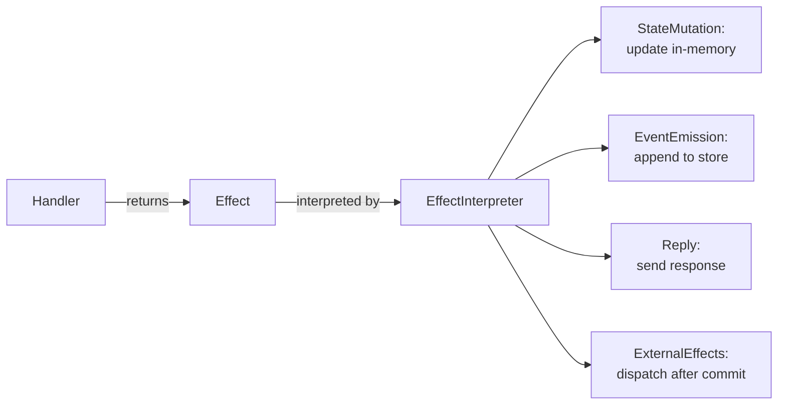

---

## 🛠 Service SDK

The SDK (`crates/service-sdk/`) is the **primary framework for building services**.

### Architecture

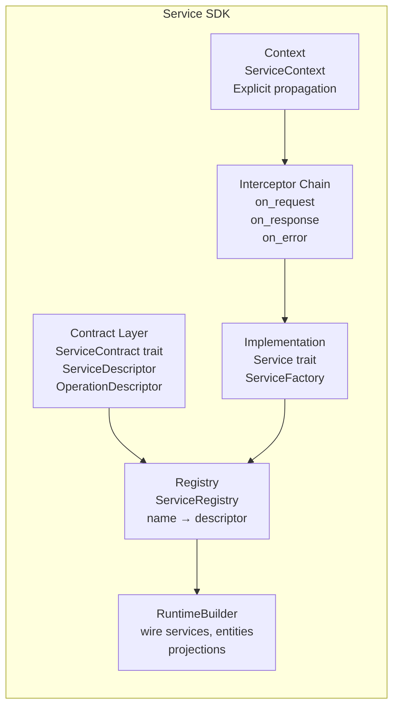

### ServiceContext — Explicit Propagation

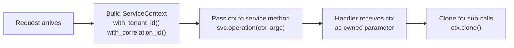

### API Contract: ServiceContext in Operation Signatures

As of CORE-010A, `ServiceContext` is a formal part of every generated operation signature.
This is an intentional contract — not an implementation detail.

Every operation declared in a service trait receives `ctx: ServiceContext` as its first
parameter:

```rust
#[async_trait]
pub trait OrderService: Send + Sync {
    async fn place_order(&self, ctx: ServiceContext, cmd: CreateOrder) -> Result<OrderId, ServiceError>;
}
```

Callers must construct and pass context explicitly:

```rust
let ctx = ServiceContext::new()
    .with_tenant_id("tenant-123")
    .with_correlation_id("req-456");

service.place_order(ctx, cmd).await?;
```

**Migrating from ambient context**: If your service implementation previously called
`ServiceContext::current()`, change the method signature to accept `ctx: ServiceContext`
as its first parameter and remove the ambient call.

### Interceptor Chain

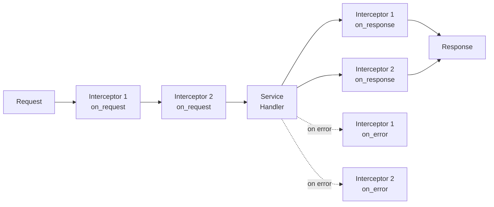

### ServiceError — Typed Error Enum

```rust
pub enum ServiceError {
    Validation { message: String },
    Authorization { message: String },
    Internal { message: String },
    NotFound { message: String },
    Conflict { message: String },
    Timeout { message: String },
    RateLimit { message: String },
    ServiceUnavailable { message: String },
    BusinessLogic { message: String },
    Custom { message: String },
}

// Constructors available:
ServiceError::validation("name is required");
ServiceError::not_found("user not found");
ServiceError::business_logic("insufficient funds");
```

### Key Traits

```rust
// Service contract — static metadata about a service
pub trait ServiceContract {
    fn type_id() -> &'static str;
    fn name() -> &'static str;
    fn version() -> ContractVersion;
    fn descriptor() -> ServiceDescriptor;
    fn operations() -> Vec<OperationDescriptor>;
}

// Service runtime — lifecycle + descriptor access
pub trait Service: Send + Sync {
    fn descriptor(&self) -> &ServiceDescriptor;
    fn name(&self) -> &str;
    fn version(&self) -> &ContractVersion;
    async fn initialize(&self) -> ServiceResult<()>;
    async fn shutdown(&self) -> ServiceResult<()>;
}
```

### Service SDK Macro Generated Output

The `#[service]` macro transforms a trait into this expanded code:

```rust
// Input:
#[service(version = "1.2.3")]
trait MyService {
    #[operation]
    async fn do_something(&self, input: String) -> Result<String, ServiceError>;
}

// Output (conceptual):
trait MyService {
    async fn do_something(&self, input: String) -> Result<String, ServiceError>;
}

impl<T: MyService> ServiceContract for T {
    fn type_id() -> &'static str { std::any::type_name::<Self>() }
    fn name() -> &'static str { "MyService" }
    fn version() -> ContractVersion { ContractVersion::new(1, 2, 3) }
    fn descriptor() -> ServiceDescriptor { /* ... */ }
    fn operations() -> Vec<OperationDescriptor> { /* ... */ }
}
```

---

## 🔄 Persistent Entity Runtime

The persistent entity runtime (`crates/persistent-entity/`) implements the **event-sourced actor-per-entity** pattern.

### Entity Lifecycle

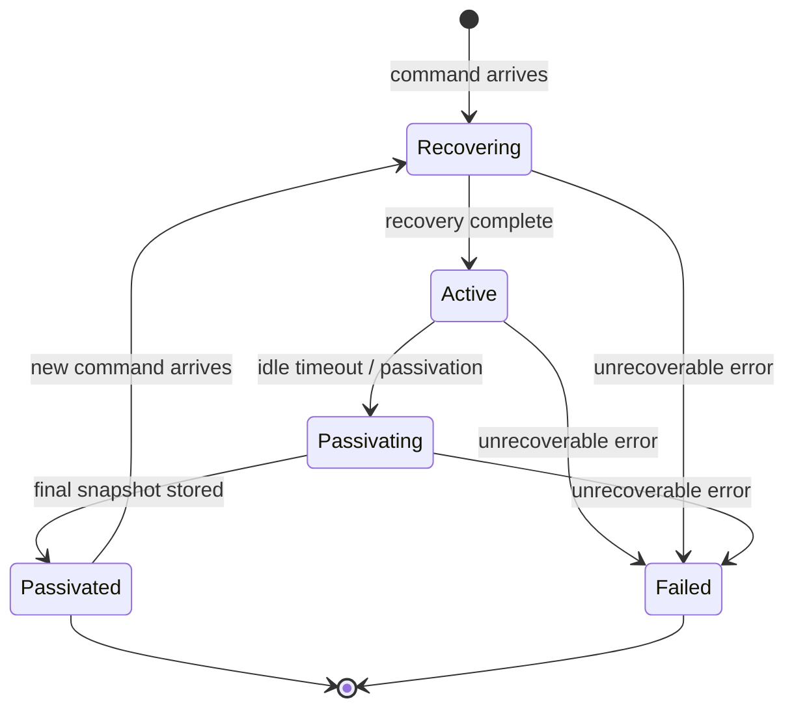

### PersistentEntity Trait

```rust
#[async_trait]
pub trait PersistentEntity: Send + Sync + Debug {
    type Command: Serialize + Send + Sync + 'static;
    type Event: Serialize + Send + Sync + 'static;
    type State: Serialize + Deserialize + Send + Sync + 'static;

    fn initial_state(&self) -> Self::State;

    async fn handle_command(
        &self,
        command: &Self::Command,
        state: &Self::State,
        context: &CommandContext,
    ) -> Result<Vec<Self::Event>, EntityError>;

    async fn apply_event(
        &self,
        state: &Self::State,
        event: &Self::Event,
    ) -> Result<Self::State, EntityError>;
}
```

### EntityRef Trait — Primary Interaction API

```rust
#[async_trait]
pub trait EntityRef: Clone + Send + Sync + Debug {
    async fn send_command<T, C>(
        &self,
        command: C,
        context: CommandContext,
    ) -> Result<T, EntityError>
    where
        T: Send + 'static,
        C: Serialize + Send + 'static;
}
```

### Command Processing Flow

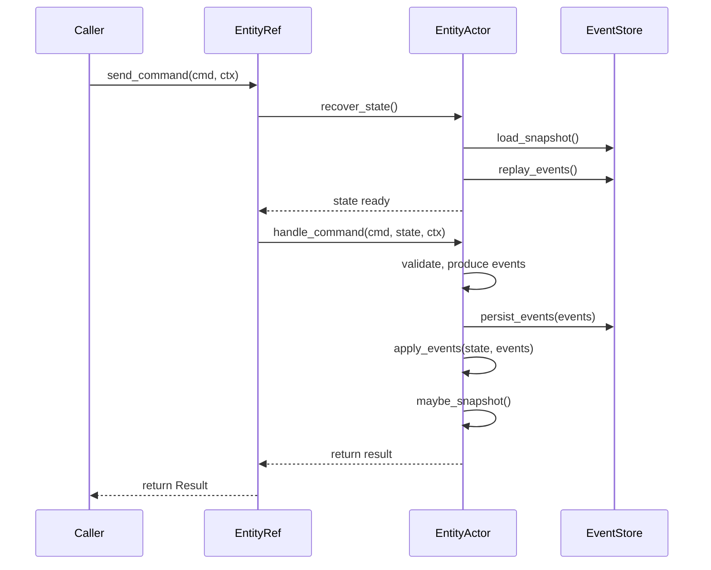

### Testing Support

```rust
// In-memory implementations provided:
use persistent_entity::testing::{
    InMemoryEventStore,    // Mutex<HashMap<String, Vec<StoredEvent<E>>>>
    InMemorySnapshotStore, // Mutex<HashMap<String, (i64, Vec<u8>)>>
    NoopPublisher,         // no-op event publisher
    TestEntityRef,         // simplified EntityRef for testing
    TestEntity,            // Counter entity (increment/decrement/get-state)
    create_test_context,   // standard test CommandContext factory
};
```

---

## ⚙️ Scheduler Pipeline

The scheduler (`crates/ego-scheduler/`) is a **pure orchestration engine** with 6 stages.

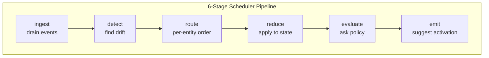

**Invariants:**
- **Determinism:** `SchedulerState = f(observed_stream)` — same events → same state
- **Per-entity ordering:** Entity switch detection in `route`
- **Advisory output:** The suggestion is never a command — just a hint to the runtime

### SchedulingPolicy Trait

```rust
pub trait SchedulingPolicy: Send + Sync {
    fn suggest_activation(
        &self,
        state: &SchedulerState,
    ) -> Vec<EntityTriple>;
}
```

---

## 🧪 Testing Guide

### Constitution-Mandated Testing Rules

> ⚠️ **TDD is required** — write failing test → verify → implement → verify → refactor
>
> ⚠️ **No real infrastructure** — mocks, stubs, fakes only. No databases, no networks, no filesystems.
>
> ⚠️ **Deterministic** — tests must produce identical results on every execution.
>
> ⚠️ **Offline** — the complete test suite must run without network access.
>
> ⚠️ **Coverage >= 85%** for line and branch coverage.

### Service SDK Testing Patterns

```rust
use ego_service_sdk::testing::{TestService, TestServiceFactory, TestInterceptor};
use ego_service_sdk::interceptor::InterceptorChain;

// Test a service
let factory = TestServiceFactory;
let service = factory.create().await.unwrap();
assert_eq!(service.name(), "TestService");

// Test interceptor chain
let chain = InterceptorChain::new();
let counter = Arc::new(CountingInterceptor::new());
chain.add_interceptor(counter.clone());

let ctx = ServiceContext::new();
chain.on_request(&ctx).await.unwrap();
assert_eq!(counter.request_count.load(Ordering::Relaxed), 1);

// Test context explicit carry
let ctx = ServiceContext::new().with_tenant_id("my-tenant");
let ctx2 = ctx.clone();
assert_eq!(ctx2.tenant_hint(), Some("my-tenant"));
```

### Persistent Entity Testing

```rust
use persistent_entity::testing::{
    InMemoryEventStore, InMemorySnapshotStore,
    NoopPublisher, TestEntity,
};

let store = InMemoryEventStore::<TestEvent>::new();
// Use with EntityRuntimeBuilder for integration testing
```

### Domain Contract Unit Tests

Domain module tests are embedded alongside the code. Run with:

```bash
cargo test --workspace
# or
cargo test -p ego-service-sdk --doc
# or
cargo test -p ego-domain
```

### Full Workspace Test

```bash
cargo test --workspace        # all tests
cargo test --workspace --doc   # documentation tests only
cargo clippy --workspace       # lint
```

---

## 📐 Conventions & Rules

### Architecture Rules

| Rule | Description |
|------|-------------|
| Domain-neutral | `ego-domain` has zero async/runtime dependencies |
| Transport-free SDK | `ego-service-sdk` must not depend on HTTP/gRPC |
| Macro isolation | `ego-service-sdk-macros` depends only on `syn`, `quote`, `proc-macro2` |
| Layer enforcement | Dependency direction enforced by `layers.toml` + `scripts/verify-layers.sh` |
| Patch over rewrite | Extend existing modules before creating new ones |
| Concrete first | Prefer concrete over abstraction; extract only when 2nd use case emerges |

### Code Rules

| Rule | Description |
|------|-------------|
| No `anyhow` | Error types are always explicit |
| No `Box<dyn Error>` | Typed errors only |
| Determinism | No `rand`, `SystemTime::now()`, `HashMap` iteration in domain logic |
| Serialization | `serde` + `serde_json` for contracts |
| Immutability | Domain data is immutable — changes produce new instances |
| Event stores | Append-only — no modification or deletion |
| Fail-closed | Ambiguous states produce rejection, never silent continuation |

### Testing Rules

| Rule | Description |
|------|-------------|
| TDD required | Test before implementation |
| Coverage >= 85% | Line + branch |
| Mock-only | No databases, networks, filesystems |
| Deterministic | Identical results every run |
| Offline | No network access required |
| Mock verification alone is insufficient | At least one behavioral assertion required |
| Happy path alone is insufficient | Every failure path must have a test |

### Governance

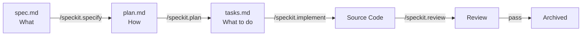

---

## 🗺 File Navigation Map

### Domain Contracts

| File | Contents |
|------|----------|
| `crates/domain/src/actor.rs` | `Actor` trait, `ActorId`, `actor_id!` macro |
| `crates/domain/src/command.rs` | `Command` marker trait |
| `crates/domain/src/event.rs` | `DomainEvent` trait |
| `crates/domain/src/query.rs` | `Query` trait with `Output` |
| `crates/domain/src/effect.rs` | `Effect<E,R,S>` enum, `ExternalEffectDescription` |
| `crates/domain/src/context.rs` | Identity types (`AggregateId`, `EntityId`, `TenantId`, `CorrelationId`, `CausationId`, `RequestId`, `Metadata`) |
| `crates/domain/src/persistence/mod.rs` | `EventStore`, `Repository`, `Snapshot` SPIs |
| `crates/domain/src/read_side/` | Projection engine (17 modules) |
| `crates/domain/src/idempotency.rs` | `IdempotencyKey` |

### Service SDK

| File | Contents |
|------|----------|
| `crates/service-sdk/src/lib.rs` | Crate root — re-exports all modules |
| `crates/service-sdk/src/contract/mod.rs` | `ServiceContract` trait, `ServiceDescriptor`, `OperationDescriptor`, `ContractVersion` |
| `crates/service-sdk/src/implementation.rs` | `Service` trait, `ServiceFactory` trait |
| `crates/service-sdk/src/context/mod.rs` | `ServiceContext` (Explicit propagation), `ContextKey` trait |
| `crates/service-sdk/src/interceptor/chain.rs` | `Interceptor` trait, `InterceptorChain` |
| `crates/service-sdk/src/registry/mod.rs` | `ServiceRegistry` |
| `crates/service-sdk/src/error/mod.rs` | `ServiceError` (9 variants), `Result<T>` |
| `crates/service-sdk/src/builder.rs` | `ServiceBuilder` |
| `crates/service-sdk/src/testing.rs` | `TestService`, `TestInterceptor`, `TestServiceFactory` |
| `crates/service-sdk/src/reference.rs` | `ServiceReference`, `ServiceRef<T>` |
| `crates/service-sdk/src/runtime/runtime_builder.rs` | `RuntimeBuilder` |

### Service SDK Macros

| File | Contents |
|------|----------|
| `crates/service-sdk-macros/src/lib.rs` | `#[service]`, `#[operation]` proc-macro impl |
| `crates/service-sdk-macros/src/tests.rs` | Macro unit tests |

### Persistent Entity

| File | Contents |
|------|----------|
| `crates/persistent-entity/src/persistent_entity.rs` | `PersistentEntity` trait |
| `crates/persistent-entity/src/entity_ref.rs` | `EntityRef` trait, `send_command()` |
| `crates/persistent-entity/src/actor.rs` | `EntityActor` — lifecycle (recover → process → passivate) |
| `crates/persistent-entity/src/runtime.rs` | `EntityRuntime` — top-level orchestrator |
| `crates/persistent-entity/src/builder.rs` | `EntityRuntimeBuilder` |
| `crates/persistent-entity/src/lifecycle.rs` | `LifecycleStateMachine` |
| `crates/persistent-entity/src/mailbox.rs` | `BoundedMailbox<T>` — bounded FIFO |
| `crates/persistent-entity/src/testing.rs` | `InMemoryEventStore`, `TestEntityRef`, `TestEntity` |
| `crates/persistent-entity/src/snapshot.rs` | `SnapshotStrategy` (periodic, version-based, none) |
| `crates/persistent-entity/src/scheduler.rs` | Reactive scheduling policy |

### Scheduler

| File | Contents |
|------|----------|
| `crates/ego-scheduler/src/scheduler.rs` | Pipeline orchestrator (6 stages) |
| `crates/ego-scheduler/src/event_bus.rs` | Event ingestion |
| `crates/ego-scheduler/src/policy.rs` | `SchedulingPolicy` trait |
| `crates/ego-scheduler/src/state.rs` | `SchedulerState` |

### Runtime

| File | Contents |
|------|----------|
| `crates/runtime/src/lib.rs` | `Runtime` trait, `TokioRuntime` |
| `crates/runtime/src/interpreter.rs` | `EffectInterpreter` trait |
| `crates/runtime/src/read_side/` | Batch executor, backpressure, session |

### Tests

| File | Contents |
|------|----------|
| `crates/service-sdk/tests/smoke.rs` | End-to-end: service, interceptors, context, tenant isolation |
| `crates/service-sdk/tests/simple_tests.rs` | Contract types: version, descriptors |
| `crates/service-sdk/src/lib_tests.rs` | Unit tests for all SDK modules |
| `crates/persistent-entity/tests/` | Activation ordering, entity definition, runtime verification |
| `crates/ego-scheduler/tests/` | Backpressure, determinism, gap detection, replay |

### Docs & Config

| File | Contents |
|------|----------|
| `ARCHITECTURE.md` | Runtime architecture (actors, CQRS, layers) |
| `docs/architecture.md` | Engineering structure (crate boundaries, design prefs) |
| `.speckit/constitution.md` | **Single source of truth** — all rules and invariants |
| `AGENTS.md` | Agent execution behavior rules |
| `COOKBOOK.md` | **This file** — entry point for agent programmers |

---

## 🔍 Quick Command Reference

```bash
# Build & test everything
cargo test --workspace

# Test a specific crate
cargo test -p ego-service-sdk
cargo test -p ego-service-sdk-macros --doc

# Lint
cargo clippy --workspace

# Format
cargo fmt --all
```

---

> **Next:** Read [`.speckit/constitution.md`](./.speckit/constitution.md) for the complete rulebook.
