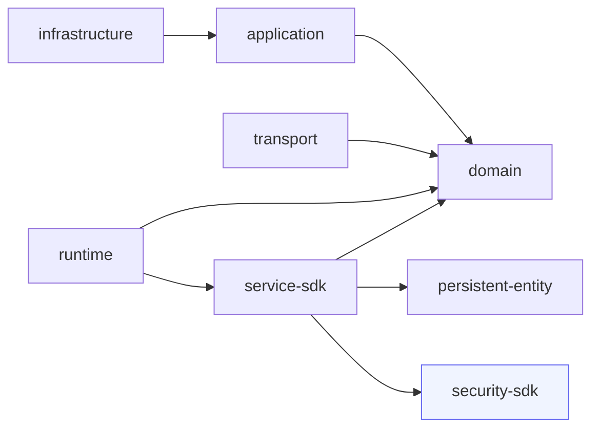

# Engineering Architecture

Describes ego-rs engineering structure, design conventions, and spec integration. Complements `ARCHITECTURE.md` which covers runtime architecture.

---

## A. Architectural Principles

### Hexagonal Architecture

- **Domain** owns contracts (traits, types, invariants)
- **Infrastructure** owns adapters (concrete implementations, persistence, migrations)
- **Application** orchestrates use cases (commands, queries)
- **Transport** owns protocol handlers (HTTP, gRPC)
- **Runtime** owns actor execution (mailbox, supervision, scheduling)

### Dependency Direction



No layer may depend on a layer to its right in this chain. Violations are enforced by `layers.toml` and `scripts/verify-layers.sh`.

Cross-cutting SDKs (highlighted) sit outside the layer chain — any layer may import them, but they import no ego layer.

### Runtime Neutrality

Domain contracts MUST be runtime-neutral — no `async`, no Tokio, no runtime-specific types in trait signatures. Infrastructure owns all async integration.

---

## B. Crate Boundaries

| Crate | Layer | Responsibility | Depends On |
|-------|-------|---------------|------------|
| `ego-domain` | domain | Core contracts, traits, types, invariants | Nothing internal |
| `ego-application` | application | Use case orchestration | `ego-domain` |
| `ego-infrastructure` | infrastructure | Concrete adapters, persistence backends, migrations | `ego-application`, `ego-domain` |
| `ego-transport` | transport | HTTP/gRPC protocol handlers | `ego-application`, `ego-domain` |
| `ego-runtime` | foundation | Actor system, mailbox, supervision | `ego-domain` |
| `ego-runtime-tokio` | infrastructure | Tokio-based runtime execution | `ego-runtime`, `ego-domain` |
| `runtime-slice` | domain | Deterministic execution types | Nothing internal |
| `ego-service-sdk` | application | Service contracts, registry, DI, interceptors, context propagation | `ego-domain`, `persistent-entity`, `ego-security-sdk` |
| `ego-service-sdk-macros` | application | `#[service]`, `#[operation]` proc-macro code generation | `syn`, `quote`, `proc-macro2` |
| `ego-security-sdk` | **cross-cutting** | Canonical security primitives: Principal, Credential, AuthN/AuthZ contracts, RBAC, SecurityContext | Third-party only (`async-trait`, `thiserror`, `serde`) |

### Cross-Cutting SDKs

Cross-cutting SDKs are crates that provide shared capabilities consumed by any layer without belonging to any layer themselves. They are **leaf nodes** in the dependency graph: layers depend on them, they depend on no ego layer.

**Rules:**

- A cross-cutting SDK MUST NOT import any ego layer (`domain`, `application`, `infrastructure`, `transport`).
- Any layer MAY import a cross-cutting SDK without violating the dependency direction rules.
- Cross-cutting SDKs MUST NOT introduce circular dependencies between layers.
- Cross-cutting SDKs SHOULD minimize production dependencies — they are transitively pulled into every consumer.
- Tokio and other async runtimes are `[dev-dependencies]` only unless the SDK has a documented runtime requirement.

**Current cross-cutting SDKs:**

| Crate | Capability | Production Deps |
|-------|-----------|-----------------|
| `ego-security-sdk` | AuthN/AuthZ, Principal, RBAC, SecurityContext | `async-trait`, `thiserror`, `serde` |

Future candidates: `ego-telemetry-sdk`, `ego-config-sdk`, `ego-logging-sdk`.

### Module Ownership

- **ego-domain/persistence/** — persistence SPI traits and types (EventStore, Repository, Snapshot, PersistenceError)
- **ego-domain/actor/** — Actor trait, ActorId, message types
- **ego-domain/event/** — DomainEvent contract
- **ego-infrastructure/persistence/** — concrete backends (in_memory/, postgres/)
- **ego-infrastructure/persistence/in_memory/** — reference/testing implementations
- **ego-infrastructure/persistence/postgres/** — production PostgreSQL adapter
- **ego-service-sdk/contract/** — ServiceContract trait, ServiceDescriptor, OperationDescriptor, ContractVersion
- **ego-service-sdk/registry/** — ServiceRegistry, RegistryEntry, ServiceBundle, registry errors
- **ego-service-sdk/context/** — ServiceContext (explicit propagation), tenant isolation
- **ego-service-sdk/interceptor/** — Interceptor trait, InterceptorChain, built-in interceptors
- **ego-service-sdk/reference/** — ServiceRef<T> typed invocation handles
- **ego-service-sdk/implementation/** — Service trait, ServiceFactory
- **ego-service-sdk/error/** — DomainError trait, ErrorCategory, ServiceError
- **ego-service-sdk/builder/** — RuntimeBuilder extension for service wiring
- **ego-service-sdk-macros/** — `#[service]` (trait/struct), `#[operation]` proc-macro attributes

---

## C. Design Preferences

- **Concrete first** — prefer a concrete implementation over an abstraction. Extract abstractions only when a second use case emerges.
- **Abstractions require evidence** — every abstraction MUST cite which specific requirement or constraint from the spec justifies it.
- **Patch over rewrite** — extend existing modules. Create new modules only when existing structure cannot accommodate the change without violating layering.
- **Avoid duplication** — when similar code appears in two places, extract once verified patterns exist (see Rule of Two in constitution).
- **Explicit file ownership** — each crate module has a documented responsibility. New code goes in the crate that owns that concern.
- **No infrastructure in domain** — database types, network types, runtime types, and serialization frameworks MUST NOT appear in domain contracts.

---

## D. Runtime & Dependency Rules

- `ego-domain` MUST NOT depend on `tokio`, `async`, or any async runtime
- `ego-infrastructure` owns all async integration and runtime-specific behavior
- Traits in `ego-domain` use synchronous signatures; implementations MAY wrap in async behind the SPI boundary
- `ego-application` SHOULD remain runtime-neutral but MAY depend on runtime traits for use case orchestration
- `ego-service-sdk` MUST NOT depend on any transport framework (HTTP, gRPC, WebSocket) — SC-007
- `ego-service-sdk-macros` MUST depend only on `syn`, `quote`, `proc-macro2` — no runtime dependencies
- `ServiceContext` is propagated explicitly between components — no ambient/TaskLocal read, consistent with the `2026-06-22-remove-ambient-service-context` invariant (INV-001: "There is exactly one mechanism for a component to access a `ServiceContext`: it was given one explicitly")
- Dependency direction is enforced by `layers.toml` and verified by `scripts/verify-layers.sh`
- Cross-cutting SDKs MUST NOT appear as dependencies of `ego-domain` — domain contracts stay runtime and capability neutral
- Cross-cutting SDKs MAY be depended on by any layer; this is NOT a layering violation

---

## E. Spec Integration Rules

### Workflow

The project follows the Spec Kit workflow with review gates:

```
spec → clarify → design → review → tasks → implement → review → archive
```

### Mandatory Artifacts

| Artifact | Purpose | Produced By | Contains |
|----------|---------|-------------|----------|
| `spec.md` | What — behavior, requirements, invariants, outcomes | `/speckit.specify` | MUST NOT contain framework names, file paths, crate names, runtime choices, concrete types, serialization frameworks, SQL, migration filenames |
| `plan.md` | How — architecture decisions, module placement, technology choices, rationale | `/speckit.plan` | Design decisions linked to spec sections |
| `tasks.md` | Executable work — file paths, modification type, expected outcome, validation | `/speckit.tasks` | Task items only — no design rationale |
| Source code | Implementation conforming to spec + design | `/speckit.implement` | — |

### Optional Artifacts

| Artifact | When Justified |
|----------|---------------|
| `research.md` | Design choices need documented tradeoff analysis |
| `quickstart.md` | Validation steps are non-trivial |

### Rules

- A specification MUST NOT prescribe implementation file paths, crate names, framework names, runtime choices, or technology choices
- A design document MUST cite the relevant spec section for each design decision
- Tasks MUST reference the design decisions they implement
- Architecture changes MUST be reflected in the design before implementation begins
- Each phase has a review gate; rejected artifacts must be revised before proceeding
- Extra artifacts beyond the mandatory three require justification per `.speckit/constitution.md` §D
