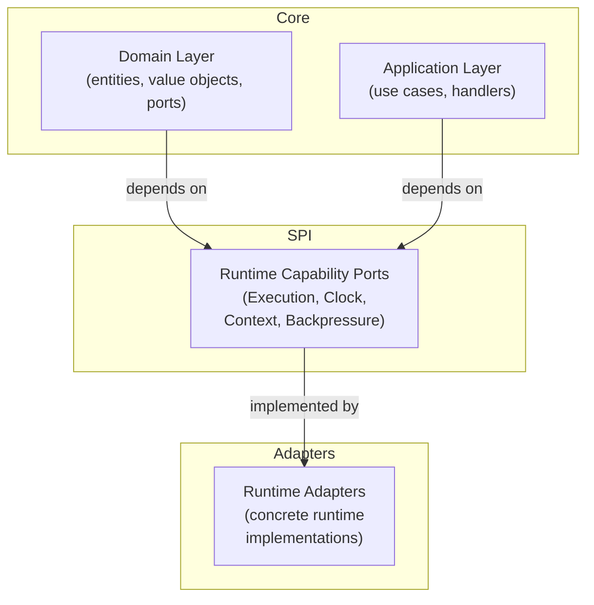
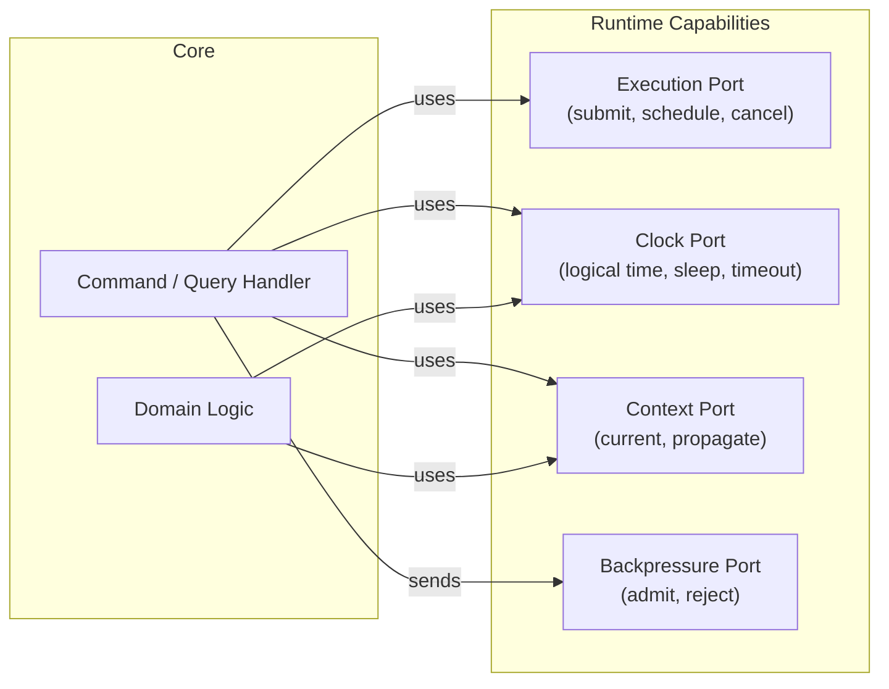
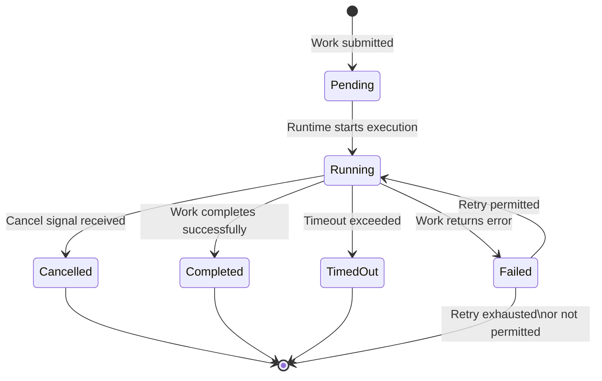

# Design: Runtime Abstraction & Execution Model

## Context

ego-rs core currently has no formal runtime abstraction. Code at every layer may implicitly depend on a specific execution engine, concurrency primitives, or operating-system scheduling. This coupling prevents deterministic testing, precludes embedded or simulation deployments, and makes the execution model a hidden assumption rather than an explicit contract. Prior foundation specs established hexagonal architecture (FOUNDATION-001) and canonical contracts (FOUNDATION-002), but neither defines the runtime boundary. This design fills that gap by introducing a runtime abstraction SPI as a constitutional layer between core domain/application code and any concrete runtime implementation.

## Goals / Non-Goals

**Goals:**
- Define a minimal, deterministic, runtime-agnostic execution model for ego-rs
- Define the Runtime SPI as a stable contract that any runtime implementation must satisfy
- Define execution lifecycle, states, cancellation, failure semantics, and ordering guarantees
- Define time abstraction (clock, timer, timeout) that supports deterministic simulation
- Define context propagation (correlation, metadata, lineage) independent of transport
- Define backpressure and rejection semantics at the runtime boundary
- Define testing contract: mock-based, deterministic, no real runtime dependencies, 95%+ coverage
- Define hexagonal boundaries: core depends on Runtime ports, runtime adapters implement them
- Define constitutional governance: invariants, forbidden patterns, and violation criteria
- Enable multiple future runtime implementations without core changes

**Non-Goals:**
- Concrete runtime implementation (any specific engine)
- Distributed execution or clustering
- Persistence or networking
- Observability implementation
- Scheduling algorithms or concurrency control internals
- Execution engine concurrency primitives
- Transport protocols
- Any concrete runtime adapter implementation

## Decisions

### Decision 1: Runtime defined as an execution contract, not a service

The runtime is not a "thing" that runs — it is a set of capabilities that the execution environment provides. This avoids over-abstraction and keeps the SPI minimal.

**Rationale:** Defining the runtime as a contract rather than a service/singleton avoids coupling to any particular execution model. The SPI becomes a collection of capability ports, not a monolith.

**Alternatives considered:**
- *Runtime as a central value passed across every boundary* — rejected because it would couple every operation to runtime identity. Capabilities are accessed through declared ports.
- *Runtime as global/static* — rejected because it prevents multiple runtimes (e.g., test runtime alongside production runtime) and violates determinism.

### Decision 2: Execution semantics are capability-based, not execution-model-based

The core defines observable execution semantics, lifecycle invariants, ordering guarantees, and failure guarantees. Execution mechanics — scheduling, concurrency strategy, synchronization — are runtime adapter concerns. The runtime abstraction MUST remain neutral with respect to synchronous, asynchronous, cooperative, or any other execution model.

**Rationale:** Decoupling execution mechanics from execution semantics preserves determinism, testability, and runtime neutrality. The runtime adapter owns execution mechanics; the core owns execution contracts.

**Alternatives considered:**
- *Core defines a specific execution model* — rejected because it couples core to that model, prevents alternative runtime implementations, and complicates testing.

### Decision 3: Time is an explicit port, not implicit

Logical time, timers, and timeouts are provided through explicit capability ports. The core never accesses system time directly.

**Rationale:** Explicit time ports enable deterministic simulation (time can be controlled), testability (no real waits), and fail-closed behavior (missing clock is detected at binding time).

**Alternatives considered:**
- *Time as implicit global* — rejected because it prevents deterministic testing and violates the explicit-state constitutional requirement.

### Decision 4: Context propagation is explicit but infrastructure-free

Execution context (correlation, metadata, lineage) propagates through an explicit context object passed through the SPI. The core does not assume any specific transport or middleware.

**Rationale:** Explicit context enables traceability, debugging, and governance without coupling to distributed tracing infrastructure.

### Decision 6: Tokio-first, never Tokio-bound

Tokio is the first runtime implementation target. The runtime abstraction MUST NOT be designed around Tokio's execution model. Tokio-specific constructs, types, or semantics MUST NOT appear in the runtime SPI. The SPI must remain implementable by runtimes with fundamentally different execution models.

**Rationale:** Tokio is the primary deployment target, but the constitution requires runtime neutrality. Treating Tokio as the model would prevent embedded, simulation, and replay runtime implementations. Keeping Tokio as an adapter (not the SPI model) preserves future replaceability.

**Alternatives considered:**
- *Tokio-native SPI* — rejected because it would couple the core execution model to Tokio's async model, preventing non-async and embedded runtimes.
- *Async-first but runtime-agnostic* — rejected because any async-specific assumption (e.g., Send, Sync on all boundaries) would constrain alternative runtimes.

### Decision 7: Thread safety is a runtime contract, not optional

Runtime implementations MUST be thread-safe. The runtime SHALL NOT require core code to provide external synchronization. Thread safety is part of the SPI contract.

**Rationale:** If thread safety were optional, every caller of runtime capabilities would need to manage synchronization, breaking the hexagonal boundary and leaking runtime concerns into core code. Making it mandatory keeps the core simple and the boundary clean.

**Alternatives considered:**
- *Thread safety optional, left to runtime adapter* — rejected because it would force core code to either assume thread safety (unsafe) or add unnecessary synchronization (complexity).
- *Single-threaded runtime assumption* — rejected because it would prevent concurrent and parallel execution models.

### Decision 5: Backpressure is a runtime responsibility, not core

The core signals work units; the runtime decides how to schedule and whether to reject. The core never manages concurrency limits.

**Rationale:** Keeping backpressure in the runtime layer preserves the core's determinism. Different runtime implementations have different backpressure strategies.

## Runtime Capability Model

### Mandatory capabilities

Every runtime implementation MUST provide:

- **Execution**: ability to submit and execute units of work
- **Cancellation**: ability to request cancellation of executing work
- **Logical time access**: ability to query the current logical time
- **Context propagation**: ability to carry and propagate execution context across work boundaries
- **Failure propagation**: ability to observe and propagate execution failures

### Optional capabilities

A runtime implementation MAY provide:

- **Delayed scheduling**: ability to schedule work at a specified logical time
- **Ordering constraints**: ability to declare and enforce execution order between work units
- **Retry support**: ability to automatically retry failed work according to defined eligibility
- **Bounded execution**: ability to enforce a maximum duration on work execution

### Forbidden capabilities

The runtime MUST NOT provide:

- **Persistence**: storing or retrieving state across execution boundaries
- **Workflow orchestration**: coordinating multi-step business processes
- **Networking**: transport-layer communication
- **Observability implementation**: metrics, tracing, or logging infrastructure
- **Business transactions**: commit, rollback, or saga semantics
- **Runtime-specific primitive leakage**: exposing internal scheduling types to core code

## Runtime Non-Responsibilities

The runtime MUST NOT:

- persist state or manage durable data
- coordinate business workflows or sagas
- own business-level retry policy or transaction boundaries
- own observability infrastructure (metrics, tracing, logging)
- implement transport protocols
- leak internal scheduling primitives or concurrency types to core code
- assume any specific concurrency implementation model

## Risks / Trade-offs

- **[Complexity] Minimal SPI may force runtime adapters to implement complex logic** → Mitigation: The SPI is intentionally minimal. Runtime implementations can add their own internal machinery as long as they satisfy the SPI contract.
- **[Migration] Existing code that depends on a concrete runtime must be refactored** → Mitigation: Migration can be incremental. Adapters wrap existing runtime usage behind the SPI first, then core code is updated.
- **[Over-abstraction] Risk of designing for hypothetical runtimes** → Mitigation: The SPI is driven by the documented non-goals. Features are excluded unless there is a clear constitutional reason to include them.
- **[Testing] Mock runtimes must be faithful to the contract** → Mitigation: The spec includes constitutional invariants that the mock must satisfy.

## Architecture Overview

## Execution Lifecycle

## Hexagonal Boundaries

| Layer | Role | Boundary rule | Acceptance Criteria |
|---|---|---|---|
| **Domain** | Runtime port contracts, entities, value objects | No dependency on runtime implementation | Core code does not reference concrete runtime implementation constructs. |
| **Application** | Use cases, handlers consuming runtime ports | Depends on domain port contracts only | Application code depends only on domain port contracts, not on concrete runtime implementations. |
| **Infrastructure** | Concrete runtime adapters | Implements domain port contracts | Runtime adapters implement all mandatory runtime capability ports without modifying any domain or application code. |
| **Transport** | External-facing handlers with injected adapters | Depends on application and domain | Transport handlers depend on application and domain layers, not on concrete runtime implementations. |

## Forbidden Patterns

- Core code accessing system time or blocking on time directly
- Defining execution-engine-specific declarations in runtime port contracts
- Passing concrete runtime types across architectural layer boundaries
- Depending on thread-local or execution-engine-local storage for context
- Depending on runtime-specific error types in core code
- Using transactional semantics (commit, rollback) in runtime contracts
