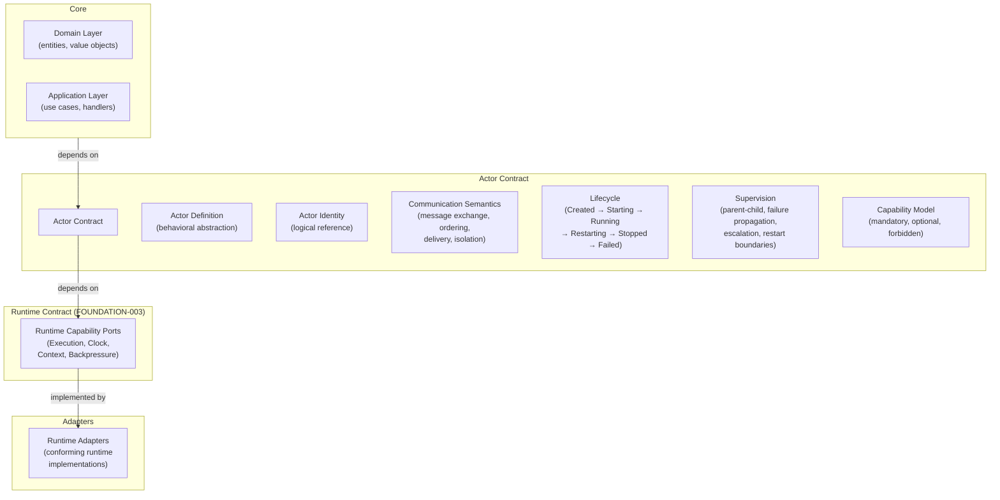
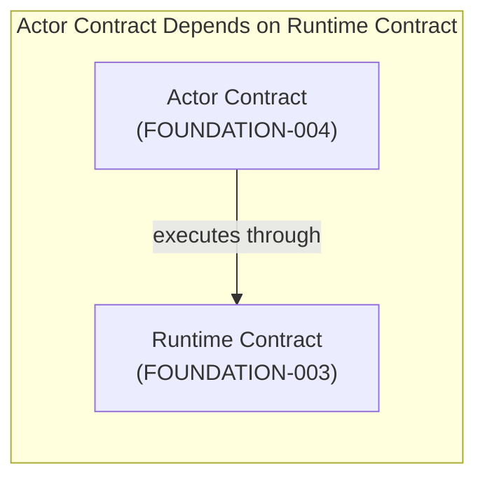
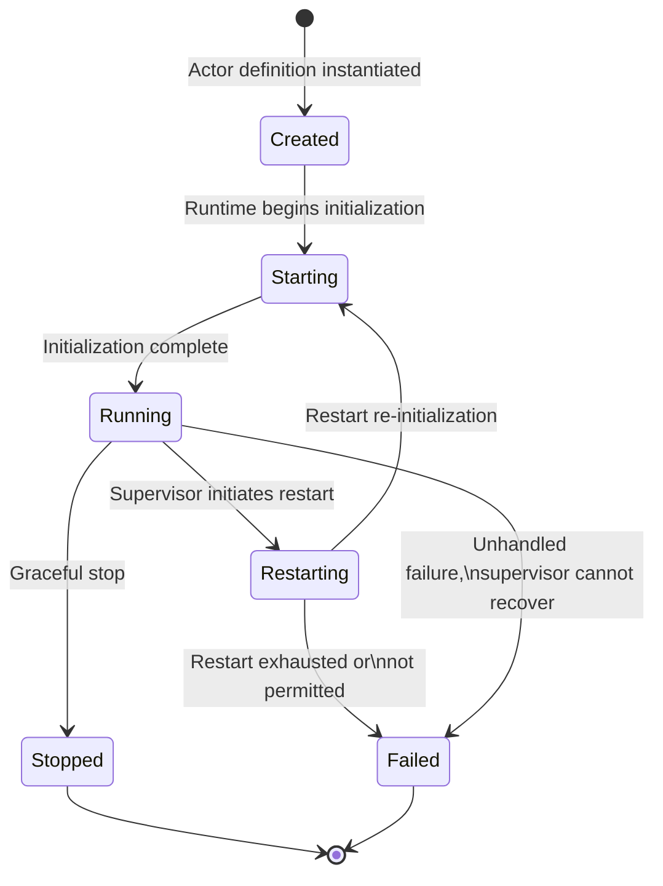
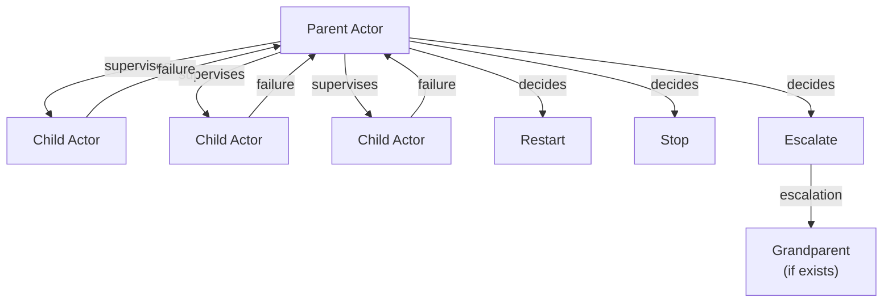

# Design: Actor Model

## Context

ego-rs is a backend platform framework. Its constitutional core MUST remain runtime-neutral and implementation-independent while supporting CQRS, Event Sourcing, workflow orchestration, distributed execution, service composition, and deterministic replay — all without coupling to any concrete actor runtime. Currently, ego-rs has no canonical actor model contract. Application and domain logic may implicitly depend on concrete actor framework semantics, specific execution engines, or ad-hoc messaging patterns. The platform requires actors as a behavioral abstraction, but the constitutional boundary between actor contracts and runtime execution (FOUNDATION-003) has not been defined. Prior foundation specs established hexagonal architecture (FOUNDATION-001), canonical contracts (FOUNDATION-002), and runtime abstraction (FOUNDATION-003). The actor model must build on the runtime contract as a consumer of its capability ports while remaining runtime-independent by constitution.

## Goals / Non-Goals

**Goals:**
- Define the canonical Actor Model as a constitutional, runtime-agnostic abstraction for ego-rs
- Define what an actor is: a behavioral abstraction with defined responsibilities, invariants, isolation guarantees, and boundaries
- Define actor identity and addressing: logical actor references with location transparency by contract
- Define communication semantics: actor-to-actor message exchange, ordering guarantees, delivery expectations, isolation semantics, visibility rules, and determinism guarantees
- Define the message model: immutability expectations, canonical message boundaries, serialization neutrality, message ownership, invalid message handling
- Define actor lifecycle states with deterministic transitions: Created, Starting, Running, Restarting, Stopped, Failed
- Define the supervision model: parent-child boundaries, failure propagation, escalation semantics, restart boundaries, supervision invariants
- Define concurrency semantics: actor isolation, single logical execution boundary, ordering expectations, visibility guarantees — all runtime-neutral
- Define the actor capability model: mandatory, optional, and forbidden capabilities with clear justification
- Define the failure model: fail-closed on all ambiguous states, invalid message behavior, actor failure propagation, supervision failure visibility, deterministic error behavior
- Define the Determinism Axiom as a constitutional invariant
- Define actor non-responsibilities: what an actor MUST NOT do
- Define the testing contract: deterministic tests, mock-only validation, no real runtime requirement, replayability, reproducibility, 95%+ coverage
- Define hexagonal boundaries: Core depends only on Actor Contract, Actor Contract depends only on Runtime Contract
- Define governance: constitutional invariants, forbidden patterns, violation criteria, capability inflation protection

**Non-Goals:**
- Concrete actor runtime implementation (any specific engine)
- Mailbox implementation
- Queue implementation
- Scheduling implementation
- Actor runtime engine
- Transport implementation
- Execution primitives or concurrency control internals
- Thread model or executor model
- Distributed clustering or actor remoting
- Persistence or durable state
- Observability implementation
- Framework APIs or SDK design
- Language syntax or Rust traits
- Actor discovery or registry infrastructure
- Any concrete runtime adapter implementation

## Decisions

### Decision 1: Actor defined as a behavioral abstraction, not an implementation construct

The actor SHALL be defined by what it does — its semantic contract — not by its internal structure. The actor abstraction SHALL specify behavior, communication, lifecycle, supervision participation, and identity. Execution realization is a runtime adapter concern.

**Rationale:** Defining the actor as a behavioral abstraction preserves runtime independence. Any entity that satisfies the behavioral contract is an actor, regardless of how it is executed. This prevents coupling to any specific actor framework's programming model.

**Alternatives considered:**
- *Actor as a trait/interface* — rejected because it would bind the abstraction to language-specific constructs and limit portability across future implementations.
- *Actor as a process/thread* — rejected because it couples the abstraction to a specific execution model.

### Decision 2: Actor identity is location-transparent by contract

Actor identity SHALL be a logical reference with no inherent location semantics. The core MUST NOT distinguish between local, remote, embedded, simulated, or distributed actors at the identity level. Location resolution is a runtime adapter concern.

**Rationale:** Location transparency enables actors to be moved, remoted, simulated, or tested without changing actor code. The core actor contract defines identity semantics; the runtime adapter resolves identity to concrete delivery.

**Alternatives considered:**
- *Identity includes location* — rejected because it breaks location transparency, prevents transparent remoting, and couples actor code to deployment topology.
- *Identity as opaque handle only* — accepted with the addition of logical addressing to support supervision and lifecycle semantics.

### Decision 3: Communication defined as semantic contract, not transport

Actor-to-actor communication SHALL be defined by observable semantics: ordering, delivery, isolation, visibility, and determinism. Concrete delivery realization is a runtime adapter concern and MUST NOT affect actor contract semantics.

**Rationale:** Separating communication semantics from delivery realization preserves runtime neutrality. Any runtime adapter that satisfies the semantic contract is conformant, regardless of its delivery mechanics.

**Alternatives considered:**
- *Communication defined as delivery contract* — rejected because it couples the abstraction to a specific delivery mechanism.
- *Communication defined as protocol* — rejected because it couples to transport assumptions.

### Decision 4: Lifecycle defined as deterministic state machine

The actor lifecycle SHALL be defined by a set of states and valid transitions. Every state transition SHALL have a deterministic trigger and outcome. Lifecycle execution is delegated to the runtime adapter through the Runtime Contract (FOUNDATION-003).

**Rationale:** A deterministic state machine ensures fail-closed behavior and enables formal verification of lifecycle compliance. Runtime adapters implement the execution of transitions without modifying their definition.

**Alternatives considered:**
- *Lifecycle as hook callbacks* — rejected because it couples lifecycle to a specific programming model and makes formal verification harder.

### Decision 5: Supervision defined as parent-child contract

Supervision SHALL be defined by a parent-child relationship with defined failure propagation and escalation semantics. Supervision strategies (restart, stop, escalate) are semantic policies within the contract. The implementation of supervision — how failures are detected, how restarts are scheduled — is a runtime adapter concern.

**Rationale:** Defining supervision as a parent-child contract with semantic policies preserves runtime independence while providing clear failure semantics. Runtime adapters execute supervision behavior according to the contract without modifying supervision semantics.

**Alternatives considered:**
- *Supervision as runtime-managed tree* — rejected because it couples to a specific supervision topology model and makes the contract framework-specific.
- *Supervision as application-implemented mechanics* — rejected because it couples supervision behavior to application code rather than contract semantics.

### Decision 6: Concurrency semantics are isolation-based, not thread-based

Actor concurrency SHALL be defined in terms of isolation: one actor processes one message at a time within a single logical execution boundary. The physical execution — whether on a thread, a coroutine, or an event loop — is a runtime adapter concern.

**Rationale:** Isolation-based concurrency semantics preserve determinism and runtime neutrality. The core contract defines what isolation means; the runtime adapter decides how to achieve it.

**Alternatives considered:**
- *Concurrency as thread-per-actor* — rejected because it assumes a specific execution model and prevents lightweight actor implementations.
- *Concurrency as async task* — rejected because it assumes an async execution model.

### Decision 7: Determinism Axiom is constitutional

The Determinism Axiom SHALL be a constitutional invariant: given identical actor state, message sequence, logical time, runtime capabilities, and context, the observable outcome MUST be identical. Observable outcome includes state transitions, lifecycle transitions, messages emitted, supervision outcomes, and failure outcomes.

**Rationale:** A constitutional determinism axiom is the foundation of testability, replayability, and formal reasoning about actor behavior. Without it, actor behavior cannot be verified deterministically.

**Alternatives considered:**
- *Determinism as best-effort* — rejected because it prevents deterministic testing and formal verification, violating the project constitution's deterministic-first requirement.

### Decision 8: Tokio-first, never Tokio-bound

Tokio SHALL be the first runtime adapter for the actor model. The actor contract MUST NOT be designed around Tokio's execution model. Tokio-specific constructs, types, or semantics MUST NOT appear in the actor contract. The contract MUST remain implementable by runtimes with fundamentally different execution models.

**Rationale:** Consistent with FOUNDATION-003's Tokio-first, never Tokio-bound principle. The actor contract must not constrain future runtime implementations.

**Alternatives considered:**
- *Tokio-native actor contract* — rejected because it would couple the actor model to Tokio's async model and prevent non-async runtime implementations.

### Decision 9: Message model is immutable, ownership-explicit, and serialization-neutral

Messages SHALL be treated as immutable by convention at the contract level. Ownership semantics SHALL be explicit: a message is owned by exactly one actor at a time. The contract SHALL NOT assume any specific serialization format. Serialization is a runtime adapter concern when crossing location boundaries.

**Rationale:** Immutability prevents accidental state mutation across actor boundaries. Explicit ownership prevents shared-state races. Serialization neutrality preserves location transparency and allows transport-optimized serialization.

**Alternatives considered:**
- *Mutable messages with copy semantics* — rejected because it introduces performance ambiguity and breaks isolation guarantees.
- *Serialization-aware messages* — rejected because it couples the message model to transport concerns.

## Architecture Overview

## Actor Lifecycle

## Supervision Model

## Hexagonal Boundaries

| Layer | Role | Boundary rule | Acceptance criteria |
|---|---|---|---|
| **Core** | Domain entities, application use cases, actor definitions | Depends on actor contract only | Core code does not reference concrete actor framework implementations |
| **Actor Contract** | Actor behavioral abstraction, identity, communication semantics, lifecycle, supervision, capability model | Depends on Runtime Contract (FOUNDATION-003) only | Actor contract references only runtime capability ports, never concrete runtime adapters |
| **Runtime Contract** | Runtime capability ports (Execution, Clock, Context, Backpressure) | Defined by FOUNDATION-003 | Runtime ports contain no actor-specific semantics |
| **Adapters** | Concrete runtime implementations | Satisfies actor execution requirements through Runtime Contract compliance | Adapters satisfy all constitutional contracts without modifying core or actor contract |

## Risks / Trade-offs

- **[Abstraction risk] Actor contract may be too abstract for practical implementation** → Mitigation: Runtime adapter validation SHALL ensure the contract remains implementable across heterogeneous execution models.
- **[Complexity risk] Supervision model may require runtime-specific behavior** → Mitigation: Supervision is defined as semantic policies (restart, stop, escalate). Runtime adapters map these to their native supervision mechanics.
- **[Migration risk] Existing actor-based code must be refactored** → Mitigation: Migration can be incremental. Adapters wrap existing actor patterns behind the contract first, then core code is updated.
- **[Testing risk] Determinism axiom places strong requirements on runtime adapters** → Mitigation: Conforming runtime adapters SHALL demonstrate determinism compliance through the testing contract defined in this specification.
- **[Over-abstraction risk] Designing for hypothetical runtimes bloats the contract** → Mitigation: The contract is driven by documented non-goals. Capabilities require constitutional necessity.
- **[Validation risk] FOUNDATION-004 invariants require external validation** → Mitigation: FOUNDATION-008 Examples Constitution SHALL validate these invariants through canonical examples.
