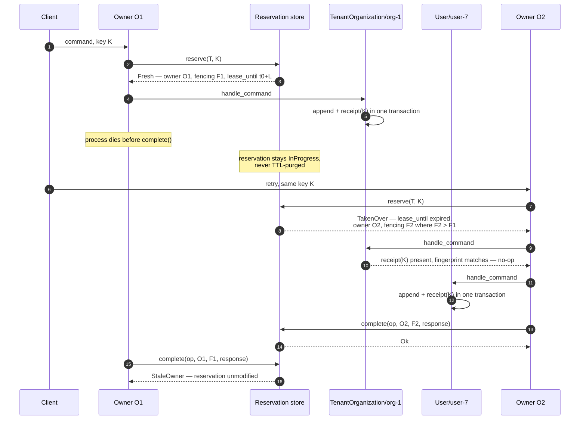

# Design: PROD-012 — End-to-End Idempotent Command Processing

> **Inputs**: `decisions.md` (D1–D9, binding), `proposal.md` (approved),
> `specs/` (8 spec files). D1–D7 and D9 are settled — this document decides
> **how**, never **what**. It resolves the three items in proposal §12 plus the
> seven implementation questions the orchestrator raised, as AD-1 … AD-10.

## Technical Approach

A mandatory client-supplied `OperationKey` is extracted per transport through
one shared contract, carried on the transport-neutral `ServiceContext`, and
reserved under a fenced lease at a new code-generation slot inside the existing
`#[service]` wrapper — after the `#[authorize]` and `#[tenant_scoped]` guards,
before the first `EntityRuntime` call. Each aggregate the operation reaches
records a permanent receipt confirmed through a caller-driven unit of work
returned by the `EventStore` port, so append and receipt commit in one
transaction — including the zero-event case. Recovery is re-execution: receipts
make the second pass a no-op wherever the first pass already landed.

The campaign runs as two dependency-ordered blocks (D8) inside **one** change,
**one** spec set, **one** identifier.

---

## Block Structure (D8)

```
Block A — persistence foundations           Block B — end-to-end idempotency
─────────────────────────────────           ────────────────────────────────
A1 integration-tests crate                  B1 OperationKey + carriage
     │                                      B2 reservation port + in-memory
     ▼                                           │
A2 aggregate_type real column               B3 Postgres reservation store
     │                                      B4 EventStore unit of work
     ▼                                           │
A3 events effective uniqueness              B5 operation_receipts
                                                 │
A4 common Clock  (independent)              B6 #[idempotent] wiring — closes the bug
                                                 │
                                            B7 retention, purge, observability
```

| Edge | From | To | Reason |
|---|---|---|---|
| within A | A1 | A2 | Schema change needs a real-Postgres test home first |
| within A | A2 | A3 | The unique index names `aggregate_type` |
| cross | A1 | B3, B4 | First slices that genuinely need testcontainers |
| cross | A2 | B5 | Receipts key on `aggregate_type` |
| cross | A3 | B5 | Receipt uniqueness reuses the AD-1 pattern, proven on `events` first |
| cross | A4 | B2, B3 | Deterministic lease/expiry/takeover tests need the injected `Clock` |
| within B | B1, B2, B3, B5 | B6 | Wiring needs key, store, and receipts |
| within B | B4 | B5 | Receipts are confirmed through the UoW |
| within B | B3, B6 | B7 | Nothing depends on retention; it lands last |

**Merge gate**: no Block B slice merges before A1, A2, A3 have merged, except
**B1 and B2**, which touch no schema and no real Postgres and may proceed in
parallel with Block A.

---

## Architecture Decisions

### AD-1 — Effective uniqueness under the NULL-tenant systemwide mode

**Decision**: two **partial unique indexes** per identity table, plus a declared
minimum of **PostgreSQL 14**.

```sql
CREATE UNIQUE INDEX ux_events_identity_tenant ON events
  (tenant_id, aggregate_type, aggregate_id, version) WHERE tenant_id IS NOT NULL;
CREATE UNIQUE INDEX ux_events_identity_systemwide ON events
  (aggregate_type, aggregate_id, version)            WHERE tenant_id IS NULL;
```

**Criteria**: (a) enforce under `resolve_tenant(None) → Ok(None)`, which
CORE-008A D1 blesses; (b) never introduce a magic value into a domain that
deliberately models absence as `None`; (c) minimise the version floor imposed on
adopters — ego-rs is a framework, not an application, and its adopters bring
their own Postgres; (d) close the stated downside by test, not by discipline.

**Runner-up**: `NULLS NOT DISTINCT`. It is one index and states the intent
directly, but it hard-couples the correctness guarantee to PG15+. Partial
indexes have existed since PG 7.2, so the floor becomes a support-lifecycle
decision rather than a feature dependency. Rejected outright: a sentinel tenant
value — every read path must translate it and a missed translation is a silent
cross-tenant bug, which is exactly the disclosure vector the
`Cross-Tenant Replay Is Prohibited` requirement forbids.

**Consequence**: two indexes per identity table (`events`,
`operation_receipts`, `operation_reservations`) — six total. A schema
assertion in `crates/integration-tests/` enumerates the expected index set and
fails when a table has one half of a pair. The declared floor is **PG 14**,
recorded in `README.md` and in the integration-test container image; the floor
is driven by PG 13 having reached EOL in Nov 2025, **not** by this feature.

### AD-2 — The new `EventStore` contract

**Decision**: the port becomes **async** and returns an opaque, caller-driven
**unit-of-work handle**.

```rust
#[async_trait]
pub trait EventStore<E: DomainEvent>: Send + Sync {
    async fn begin(&self) -> Result<Box<dyn EventStoreUnitOfWork<E>>, PersistenceError>;
    async fn load(&self, id: &StreamId) -> Result<Vec<StoredEvent<E>>, PersistenceError>;
    async fn list_aggregate_ids(&self, tenant: Option<&str>) -> Result<Vec<StreamId>, PersistenceError>;
    fn stream_version_offset(&self, id: &StreamId) -> u64 { 0 }
}

#[async_trait]
pub trait EventStoreUnitOfWork<E: DomainEvent>: Send {
    async fn append(&mut self, id: &StreamId, expected_version: i64,
                    events: Vec<StoredEvent<E>>) -> Result<i64, PersistenceError>;
    async fn confirm_receipt(&mut self, receipt: &OperationReceipt) -> Result<(), PersistenceError>;
    async fn commit(self: Box<Self>) -> Result<(), PersistenceError>;
    // Dropping without commit rolls back.
}
```

**Criteria**: (a) the receipt must join the append transaction; (b) no `sqlx`
type may appear in `crates/domain`; (c) the store must stay usable behind
`Arc<dyn EventStore<E>>`; (d) CORE-030's outbox must be able to join the same
transaction later without a second contract break.

**Runner-up**: the closure form `append_with(|uow| …)`. It keeps the same
boundary, but on a trait with an async body the higher-ranked lifetime of a
`FnOnce(&mut Uow) -> BoxFuture<'_, _>` is the hard part the proposal already
flagged, and it buys nothing the handle does not. Rejected: `append_in_tx(&mut
sqlx::Transaction, …)` — a hexagonal violation the workspace does not otherwise
tolerate. Rejected: widening `append` with a receipt parameter — it hardcodes
exactly one co-transactional concern and CORE-030 would need the same surgery
again.

**Async: yes.** Three reasons. The transaction now spans multiple
caller-issued calls, so `event_store.rs:76–129`'s internal `block_on` can no
longer hide the lifecycle. `block_on` on a Tokio worker thread inside
`EntityActor` is already a latent starvation hazard, and holding an open
transaction across it would widen the window. `async_trait` is already a
workspace dependency and `Interceptor` already uses it
(`crates/service-sdk/src/interceptor/chain.rs:23`).

**Consequence**: both implementors change; `append(&mut self, …)` becomes
`&self`, removing the exclusive-borrow requirement. `EventStore` is no longer
callable from a synchronous context — acceptable, because its only real caller
is the async actor. The unreachable `23505` handling in `append` becomes
reachable once A3 lands, and is mapped to `PersistenceError::Conflict`.

### AD-3 — Physical home of the receipt index

**Decision**: a **dedicated `operation_receipts` table**, written only through
`EventStoreUnitOfWork::confirm_receipt`.

**Criteria**: must cover zero-event successes; must carry the fingerprint (D5);
must be permanently retained under a lifecycle distinct from `events`.

**Runner-up**: columns on `events` plus a partial unique index. One write and
atomic by construction, but it can only exist where an event exists — and the
`Zero-event success still writes a receipt` scenario is normative, so this is
disqualified, not merely inconvenient. Rejected: metadata on `events` plus a
derived index table — two structures to keep consistent, rebuild cost grows with
the stream, and the derived table still needs its own uniqueness anyway.

**Consequence**: two writes per append instead of one, in the same transaction.
`operation_key` **also** lands in `StoredEvent` metadata (the `event-store`
spec's metadata requirement) — the two are not redundant: the table is the
authoritative lookup index, the metadata is the correlation breadcrumb CORE-030
will consume. Uniqueness on `(tenant_id, aggregate_type, aggregate_id,
operation_key)` uses the AD-1 partial-index pair.

### AD-3b — Two recorded answers, two scopes, two owners

**Decision**: an operation records **two** different things, in two tables, under
two different owners. They were conflated in an earlier revision of this
document, which is what made the commit boundary look contradictory.

| Register | Scope | Content | Owner |
|---|---|---|---|
| `operation_receipts` | one aggregate | `AggregateOutcome` — the durable result of the transition addressed at that aggregate | the actor, inside the same unit of work as its events |
| `operation_reservations` | the whole service operation | `StoredServiceResponse` — the final response, possibly composed from several aggregates | slot 3, via `complete()`, after the handler returns |

`RegisterUserImpl::register` is the case that proves they cannot be one thing:
it commands `tenant_organization`, then the user aggregate, and only then
composes `RegisterOutput`. The service response does not exist inside any single
actor turn, and it depends on more than one. So no serialiser sent into the
actor can produce it, and no single unit of work can contain it.

**The atomicity that is claimed is local, and only local:**

```
one aggregate's events + that aggregate's receipt   = one unit of work   ✔
several aggregates' events + the service response   = one transaction    ✘ never claimed
```

A multi-aggregate operation is not distributed-atomic and does not pretend to
be. The receipt stops each aggregate's transition from repeating; the
reservation stops the whole operation from repeating once it completed.

**Naming is part of the decision.** `AggregateOutcome` and
`StoredServiceResponse` are deliberately unmistakable for one another. The two
may share a byte representation; they share neither semantics nor ownership, and
a name that blurs that is how the two scopes were merged in the first place.

### AD-3c — What an `AggregateOutcome` contains

**Decision**: the receipt records **evidence that a transition was confirmed**.
It is not, and must not be presented as, material sufficient to rebuild the
original `CommandResult`.

An earlier revision of this section claimed it was. That claim was wrong, and it
was wrong in four independent ways, each verified against the code rather than
argued:

1. **A version range does not survive compaction.** `EventStore::load` returns
   the physical stream and the logical version is `index + stream_version_offset`
   (`persistence.rs:299-324`). A snapshot that compacts the stream moves what a
   given `version_from` addresses.
2. **Continuity cannot be verified through this API.** `load` returns
   `Vec<StoredEvent<E>>` with no versions attached — the version is *inferred*
   from the index, so enumeration always yields a contiguous sequence whether or
   not the table has a gap. A real gap is undetectable from here.
3. **The state at `version_to` cannot be rebuilt.** `apply_events` moves forward
   from the current state, and no API stops replay at a chosen version.
4. **`NoEvents` cannot identify its moment, and adding a version does not fix
   it.** On a fresh aggregate the observed version is `0`, and the state at
   version `0` lives in no event at all — it is the entity's initial state,
   which only the implementation knows. That is precisely the case the receipt
   was introduced for.

```rust
enum AggregateOutcome {
    /// The inclusive version range this command appended.
    Events { version_from: EventVersion, version_to: EventVersion },
    /// A success that appended nothing — the case the receipt exists for.
    NoEvents,
}
```

**Also rejected: returning the aggregate's *current* state as the replayed
result.** It would avoid reconstruction entirely and break idempotency
silently. If `K` left the aggregate at version 10 and later commands took it to
14, a retry of `K` answering with version 14 makes one operation key produce two
different logical results. A completed operation hides this behind the
reservation; a **partially failed multi-aggregate** operation does not — and
that is exactly when the receipt is consulted.

**Rejected: serialising `CommandResult<E, S>`.** Its `new_state` is redundant —
on a hit the original events are already committed, so the actor's current state
*is* `new_state`, and storing a copy stores something that can fall out of step
with the source that rebuilds it. Its `events` are redundant for the same
reason, and copying them would additionally impose a `Serialize` bound on every
domain event in the workspace to record what the stream already holds.

What is genuinely unrecoverable is only which variant occurred and which slice
of the stream it produced. Two integers and a discriminant encode that, with no
application type in the encoding — which is what makes it stable across releases.

**Range conventions, stated rather than inferred:**

- `version_from` and `version_to` are **inclusive**.
- `version_from <= version_to` always holds.
- `NoEvents` is the *only* representation of an empty range. An empty `Events`
  range is not a valid encoding, so the two can never both describe nothing.
- If the recorded range cannot be recovered **in full**, the hit fails as an
  internal error. It must never degrade into re-executing the command: the
  receipt says the transition already happened, and running it again because its
  record is unreadable would duplicate exactly what the receipt exists to
  prevent.

### AD-3d — `EffectsAcceptanceFailed` is not a confirmable outcome

**Decision**: `CommandResult::EffectsAcceptanceFailed` is never recorded in a
receipt.

It describes a **post-commit incident of one execution**, not the durable result
of the command. The commit already succeeded and was never rolled back — that is
why the variant exists instead of an `Err`. Recording it would require reopening
a transaction after the unit of work closed, which is precisely the split B5
exists to prevent, and would merge the two scopes AD-3b just separated.

The sequence is therefore:

1. the unit of work commits events + `AggregateOutcome::Events`, atomically;
2. effect acceptance is attempted **after** that commit;
3. if it fails, *this* execution returns `EffectsAcceptanceFailed`;
4. the receipt is not modified and no second transaction is opened;
5. a retry with the same key and fingerprint returns the durable outcome;
6. the retry does **not** reproduce `EffectsAcceptanceFailed` and does **not**
   re-attempt acceptance.

**Deliberate consequence, stated so it is not discovered as a bug:** a retry
loses the warning. That is accepted. Recovering a failed effect belongs to the
effect delivery and observability mechanism — outbox, its own retry,
reconciliation — and never to re-executing a command whose events are already
durable.

### AD-3e — A receipt hit replays; it does not re-run the pipeline

**Decision**: a hit returns an explicit control result that carries **no state
and no reconstructed history**:

```rust
CommandResult::Replayed { outcome: AggregateOutcome }
```

It asserts exactly one thing, and deliberately nothing more:

> This aggregate's transition was already confirmed. It must not run again and
> must not produce effects again.

It does **not** promise the original result, the original state, or the original
events. AD-3c establishes that none of those is recoverable from what a receipt
holds.

**What a caller must do with it.** Treat it as recovery of a partial execution,
explicitly. If the workflow needs data to continue, it reads current state
through an explicit query, or through a durable value the command itself
recorded — never from a replay pretending to be history. The service
operation's exact response belongs to `operation_reservations`; if the
operation never completed, there is no honest way to conjure that response back
out of per-aggregate receipts, and this design does not pretend otherwise.

**If a handler genuinely requires the first attempt's exact result to continue**,
that is a *new requirement*, not a gap to paper over. It would call for
persisting a command-specific `AggregateReplayValue`. It must not be met by
imposing `Serialize` on every state and event in the workspace, and it must
never be met by quietly returning current state.

Rebuilding a plain `CommandResult::Events` on a hit would be wrong in a way that
is easy to miss: those events would be indistinguishable from freshly produced
ones, and would feed post-commit effect acceptance a second time — dispatching
side effects the first execution already dispatched. The receipt would then have
prevented the state transition while permitting the duplicate it was there to
stop.

So a hit:

- does **not** invoke `handle_command`;
- does **not** persist events;
- does **not** re-enter effect acceptance.

The route must be visible in the type, not left to a caller's discipline —
either an internal `ReplayedEvents` variant or equivalent internal metadata that
translates to what the caller expects while bypassing the post-commit pipeline.

### AD-3f — Where the fingerprint is computed, and what "canonical" means

**Decision**: the fingerprint is computed **in slot 3, over the operation's
already-deserialised typed arguments**, before `on_request` and before the
handler.

The order is therefore:

```
deserialise → authorize → tenant → canonicalise the typed input → fingerprint
           → reserve → on_request → handler
```

**Why this needed deciding rather than defaulting.** "Canonical input" was
ambiguous between two readings that fail in opposite directions. Computed over
raw transport bytes, two requests that differ only in JSON key order or
whitespace produce different fingerprints, and a legitimate retry is refused as
a *permanent* conflict — worse than having no idempotency, because it rejects
valid work irreversibly. Computed after the handler's own normalisation, the
fingerprint cannot exist before the work it is meant to guard.

**What canonical means here, stated so it is not re-litigated:**

- **Not** raw transport bytes. Not JSON, not HTTP, not field order, whitespace,
  or original formatting.
- The canonical form of the **typed parameters**, as deserialised.
- The operation's **semantic input only**.
- **Excluding** `operation_key`, owner, lease, trace and correlation ids, and
  every other piece of context metadata. Those describe *this attempt*, not
  *this request*; folding them in would make every retry a different request.
- The handler's internal transformations do not participate. **The handler does
  not retroactively define the command's idempotent identity.** A normalisation
  that genuinely changes semantic identity must happen before slot 3, or be made
  an explicit part of the generated canonicalisation.

**The property this buys, and the one B6.4 must test:** two syntactically
different requests that deserialise to the same typed values produce the same
fingerprint; two different typed values produce different fingerprints. That is
what makes a retry recognisable across transports without making it recognisable
across *different* requests.

### AD-3g — The reservation lives in the runtime; the macro only places the call

**Decision**: slot 3 emits a single `?`-terminated call to a **public runtime
method**. The reservation and every outcome branch live in `service-sdk`, not in
generated code.

```
macro    → is the operation marked; canonicalise the typed arguments; compute
           the fingerprint (AD-3f); place the call in slot 3
runtime  → reach the store, call reserve(...), interpret Fresh / TakenOver /
           Succeeded / Conflict / InProgress, return a dispatch-oriented result
handler  → reached only when that result authorises continuing
```

**Rejected: emitting the store access and the branching inline.** The five-way
outcome interpretation is real logic, and in the macro it becomes text expanded
into every operation of every service — one copy per operation, none of them the
source of truth, and none directly testable except through a fixture service.
In the runtime it is tested exhaustively where it lives.

It also mirrors `enforce_tenant`, which is `pub` for exactly this reason, and it
follows the rule already fixed for the context bridge: shared dispatch
behaviour belongs to the path every transport shares.

**Two boundaries this decision draws, both deliberate:**

- **The method exposes a capability, not infrastructure.** It must not return
  the store's own outcome type. A dispatch-oriented result — a permit, or an
  error the operation returns — keeps *how each outcome is translated* private,
  so changing that translation is not a breaking change for every generated
  caller. `operation_reservation_store()` stays `pub(crate)`; its
  `expect(dead_code, reason = "called by #[idempotent] dispatch, landing in B6")`
  annotation is made obsolete by this decision and must be updated when B6.4
  lands, not left describing a call that will never happen.
- **The runtime does not serialise arguments or decide what the fingerprint
  covers.** That is the generated code's job under AD-3f. The runtime receives
  the tenant, the key and the fingerprint already definitive.

**The structural guarantee is preserved.** A single `?` at the slot means any
blocking outcome returns before `on_request` and before the handler — the same
control-flow property B6.3 fixed for the guards, rather than a rule the next
author has to remember.

### AD-3h — Six reservation outcomes, and only two of them dispatch

**Decision**: `ReservationOutcome` has **six** variants, not the five this
document and `tasks.md` previously described. Two of them continue; four stop.

| Outcome | Dispatch |
|---|---|
| `Fresh(lease)` | continue |
| `TakenOver(lease)` | continue, under the new fencing token |
| `OwnedInProgress(lease)` | **stop** — operation-in-progress response |
| `OtherInProgress` | **stop** — contention response |
| `Succeeded(response)` | replay the stored response, unexecuted |
| `Conflict` | refuse: same key, different fingerprint |

**The decision that needed making: `OwnedInProgress` does not continue.**

It is tempting, because the variant exists precisely to say "this is the same
caller". But **fencing proves ownership, not exclusion between two executions of
the same owner.** Observing the same owner cannot distinguish a legitimate
recovery from a concurrent retry, or from the previous execution still running
and merely slow. Keeping the same fencing token does not separate them either.

Nor does B5's receipt make it safe. That gate protects work that was
**confirmed**; an operation that died midway may already have reached an
external effect, and nothing durable records that. Re-entering it is exactly the
duplicate the whole capability exists to prevent.

**Recovery therefore happens by waiting, not by re-entering.** While the lease
holds, nobody re-executes. Once it expires, `reserve` answers `TakenOver` with a
strictly greater fencing token and the new execution is protected from the
previous owner. If the earlier work had been confirmed, B5 returns its receipt
rather than repeating it.

**`OwnedInProgress` stays.** Self-contention and external contention are worth
telling apart for metrics, diagnostics, lease renewal and any future explicit
recovery. They differ in what they *mean*, not in what dispatch does with them —
and collapsing them in the enum would destroy information the runtime should be
reporting. Both block.

### AD-3i — What the runtime needs before it can reserve anything

**Decision**: `ReserveRequest` demands an `owner_id` and a `lease_until` that
`RuntimeInner` does not currently hold. Three pieces are added, each with
externally observable behaviour under failure, so each is decided here rather
than by whatever the implementation happens to do.

The four travel together as one value, not as four fields:

```rust
pub struct ReservationConfig {
    store: Arc<dyn OperationReservationStore>,
    clock: Arc<dyn Clock>,
    owner_id: OwnerId,
    lease_duration: Duration,
}

RuntimeInner { reservation: Option<ReservationConfig>, .. }
```

**No `Option` inside the struct — the optionality lives outside it.** That
leaves exactly two representable states: reservations disabled, or a complete
and valid configuration. Four independent fields would allow sixteen
combinations, thirteen of them incoherent — a store with no clock cannot compute
a `lease_until`, an owner with no store means nothing. The type refuses them
instead of the runtime checking for them.

It also gives `lease_duration > 0` a single place to be validated, at
construction, rather than in `build()` where a later caller could bypass it.

The grouping is not cosmetic. `RuntimeInner::new_with_logger` already takes 13
positional parameters, several of them `Option<Arc<dyn …>>`; adding three more
would make sixteen, where transposing two arguments compiles cleanly and fails
at runtime. Folding the existing `idempotency_reservation_store` in brings it to
eleven.

```
.with_reservation_clock(clock)
.with_reservation_owner_id(owner_id)      // for tests; normally left to build()
.with_reservation_lease_duration(duration)
```

**`OwnerId` — a UUID minted once in `build()`, unique per runtime instance.**
Stable for that instance's whole life, different after a restart. A retry inside
the same runtime therefore observes `OwnedInProgress`; another replica, or the
same process after a restart, observes `OtherInProgress` until the lease expires
and then `TakenOver`.

Uniqueness per instance must be guaranteed. Note what sharing an owner would
*not* do: it would not let two replicas unblock each other, because AD-3h blocks
`OwnedInProgress` too. What it would destroy is the variant's diagnostic
meaning — self-contention and external contention would become
indistinguishable — and it would compromise lease renewal, which must only ever
renew a lease this instance actually holds.

Injecting the owner is supported because `OwnedInProgress`, `OtherInProgress`
and `TakenOver` cannot otherwise be exercised deterministically. Production
should neither share it across instances nor persist it across restarts.

**`Clock` — `Arc<dyn Clock>`, injectable, real clock by default.** `lease_until`
is computed from that clock and nothing else, so expiry is testable without wall
time. This is exactly what A4 generalised the clock out of auth for.

**Lease duration — configurable, validated as strictly greater than zero,
default 30 seconds.** The default is an operational policy, not a guarantee.

**Operational contract, stated because the lease alone does not prevent
overlap:** the configured lease must exceed the maximum expected duration of an
execution. When it expires, another owner can take over — while the original may
still be running. Until renewal/heartbeat exists, a lease shorter than a
legitimate operation is a correctness problem, not a tuning preference.

### AD-4 — The shared extraction contract (D9)

**Decision**: `OperationKeyCarrier`, in `crates/service-sdk/src/idempotency/extraction.rs`.

```rust
pub trait OperationKeyCarrier {
    /// The raw, unvalidated key as this transport carried it, if present.
    fn raw_operation_key(&self) -> Option<&str>;
    /// Stable diagnostic name, e.g. "http:Idempotency-Key". Never user input.
    fn carrier_name(&self) -> &'static str;
}

/// The single place validation and missing-key policy live.
pub fn resolve_operation_key(
    carrier: &dyn OperationKeyCarrier,
    mode: IdempotencyEnforcementMode,
) -> Result<Option<OperationKey>, OperationKeyRejection>;
```

**Criteria**: one definition of a valid key; one definition of the missing-key
policy; adapters contribute a location, never a rule; no adapter may make the
core see a protocol.

**Crate choice**: `crates/service-sdk`, **not** `crates/domain` and **not**
`crates/transport`. The missing-key policy depends on
`IdempotencyEnforcementMode`, which is deployment configuration — and
`TenantEnforcementMode` already lives at `crates/service-sdk/src/runtime/
tenant.rs:143`. `crates/transport` declares itself axum-only, so a contract
there could not be implemented by a gRPC adapter without dragging in axum. The
`OperationKey` **type** stays in `crates/domain` per D7; only the **policy**
lives in the SDK.

**HTTP adapter**: `crates/transport/src/idempotency.rs`, beside `security.rs`
and `propagation.rs`. A newtype over `&HeaderMap` implements the trait by
reading `Idempotency-Key`; the rejection maps to a status through the existing
`crates/transport/src/error.rs`. gRPC would implement it over
`tonic::metadata::MetadataMap`, Kafka over record headers, GraphQL over an
extension map — each adding only an impl in its own crate, touching neither
`service-sdk` nor `domain`.

**Runner-up**: an extraction trait in `crates/domain`. Rejected because it
would drag `IdempotencyEnforcementMode` — a runtime-configuration type — into
the domain crate and split it from its `TenantEnforcementMode` sibling.

**Consequence**: divergence is structurally impossible — `OperationKey::parse`
is the only constructor and `resolve_operation_key` is the only policy entry
point. A table-driven conformance test, `assert_carrier_conformance(&carrier)`,
ships in `crates/testkit` so each adapter proves the same behaviour. Explicit
non-goal honoured: `OperationKeyCarrier` reads one string and has no request,
response, or lifecycle — it is not a `Transport` trait.

### AD-5 — The reservation mechanism at the D2 position

**Decision**: a new **inert marker attribute `#[idempotent]`** in
`crates/service-sdk-macros`, with the reservation code emitted by the existing
`#[service]` generator at a new **slot 3** — after the `#[authorize]` (slot 1)
and `#[tenant_scoped]` (slot 2) guards, before `on_request`.

**Decisive criterion** — the existing interceptor chain cannot do this.
`Interceptor::on_request` is `async fn(&self, &ServiceContext) -> Result<(),
ServiceError>` (`chain.rs:33`): it takes the context **immutably** and returns
**unit**. It can veto a call, but it cannot return the stored response on a
replay and cannot attach a lease handle to the context. Replay-with-the-original-
response is normative (`http-transport` spec). Widening `Interceptor` to a typed
short-circuit would make the trait generic over every operation's return type
and change every existing implementor — a far larger blast radius than a marker.

**Runner-up**: an explicit `ctx.reserve_operation(…)` call inside each handler.
Rejected on the D1 criterion: it is per-handler discipline, and per-handler
discipline is precisely the failure mode `UserEntity` already demonstrates
(proposal §1). A forgotten call is silently unguarded — fail-open.

**Why a marker and not a self-contained macro**: `#[authorize]` and
`#[tenant_scoped]` are already inert markers
(`crates/service-sdk-macros/src/lib.rs:808,824`) that the `#[service]` generator
reads and orders. Making `#[idempotent]` a marker means the D2 position is a
property of the **code generator**, not of the order a developer happens to
write attributes. Like its siblings it is a compile error outside `#[service]`
and a compile error without `#[operation]` (mirroring the existing check at
`lib.rs:528`), so a misapplied marker can never be silently inert — the same
fail-loud reasoning CORE-008A recorded for `#[tenant_scoped]`.

**Consequence**: slot 3 reserves, and on `Succeeded` returns the stored response
without invoking the handler. `enforce_tenant(&mut ctx_param)` runs at slot 2,
so the `CanonicalTenant` is already on the context when slot 3 namespaces the
key — D2 satisfied by construction. **Residual gap**: the macro cannot tell a
mutating operation from a read-only one, so marker completeness stays a
developer responsibility. Mitigated by a reference-app test that enumerates
every mutating operation and asserts it carries the marker (see Risks).

### AD-6 — Capability, not registry

**Decision**: a single capability port `OperationReservationStore` with a
**single fail-closed registration** on `RuntimeBuilder`. No keyed registry.

**Evaluating the proposal's argument** rather than inheriting it: the proposal
argues that CORE-019 needed a registry because `effect_type` varies per effect
and reservation has no equivalent axis. That is correct, but the stronger
reason is different. A keyed registry is warranted when *resolution* must pick
an owner at call time from request data. The only candidate index here is
`CanonicalTenant` — and per-tenant reservation stores would be actively
harmful: the fail-closed guarantee would then depend on registry completeness,
so a tenant with no registered store would be **silently unguarded**. That is
exactly the fail-open shape D1 rejects. The "one entry today" argument would
weaken over time; the fail-closed-reachability argument does not.

**Counterfactual check**: if PROD-009 later shards reservations, that is
sharding *inside one implementation*, not a registry — the conclusion survives.

**Runner-up**: a keyed registry mirroring `ExecutorRegistry`
(`crates/runtime/src/effects/registry.rs:28`). Rejected on the reachability
argument above.

**Consequence**: `RuntimeBuilder::with_operation_reservation_store(…)`;
`build()` fails when the enforcing mode resolves and no store is registered
(consistent with CORE-019 §10 and `resolve_tenant`'s posture). The **receipt
store is not an independently registered port** — it is `confirm_receipt` on
the AD-2 UoW, because a separately registered store could not join the append
transaction. This coupling is stated, not hidden; CORE-019 hit the same wall and
shipped `InMemoryEffectStore` as a composite.

### AD-7 — Crate and module placement

| Type | Home | Why |
|---|---|---|
| `OperationKey`, `OperationFingerprint` | `crates/domain/src/operation/key.rs` | D7: common domain crate, sibling of `idempotency.rs`, not under HTTP or runtime. A sibling `operation/` module names the concept without merging into `IdempotencyKey`'s type family |
| `OperationReceipt` | `crates/domain/src/operation/receipt.rs` | Persistence record confirmed by the UoW; must be visible to `domain::persistence` |
| `OperationReservationStore`, `OperationReservation`, `ReservationOutcome`, `Lease`, `FencingToken`, `ReservationError::StaleOwner` | `crates/domain/src/operation/reservation.rs` | A port reachable from `service-sdk` (caller) and `persistence` (implementor); `crates/domain` is their only common dependency |
| `EventStore`, `EventStoreUnitOfWork`, `StreamId` | `crates/domain/src/persistence/` | Beside the trait being replaced |
| `Clock`, `SystemClock` | `crates/domain/src/time/clock.rs` | AD-8 |
| `IdempotencyEnforcementMode`, `RetentionPolicy` | `crates/service-sdk/src/runtime/idempotency.rs` | Deployment policy, mirroring `runtime/tenant.rs:143` |
| `OperationKeyCarrier`, `resolve_operation_key`, `OperationKeyRejection` | `crates/service-sdk/src/idempotency/extraction.rs` | AD-4 |
| `ServiceContext::operation_key()` | `crates/service-sdk/src/context/mod.rs` | Transport-neutral seam (D9) |
| `#[idempotent]` marker + slot-3 codegen | `crates/service-sdk-macros/src/lib.rs` | AD-5 |
| HTTP carrier impl | `crates/transport/src/idempotency.rs` | Beside `security.rs` / `propagation.rs` |
| Postgres reservation store, receipt writes, migrations | `crates/persistence/src/postgres/` | Durable backend |
| `InMemoryOperationReservationStore`, `TestClock`, `assert_carrier_conformance` | `crates/testkit` | `testkit` spec requires the double against the identical port |
| Real-Postgres tests | `crates/integration-tests/` | `skills/testing` Rule 3 — testcontainers only |

`IdempotencyKey` and `crates/runtime/src/effects/` are untouched except for the
AD-8 clock injection. No `From<OperationKey>` exists anywhere (D7), asserted by
a compile-fail test.

### AD-8 — Clock generalization

**Decision**: move the trait to `crates/domain/src/time/clock.rs`;
`crates/domain/src/auth/clock.rs` becomes `pub use crate::time::clock::{Clock,
SystemClock};`.

**Criteria**: existing JWT call sites must keep compiling, and the move must be a
zero-behaviour-change slice.

**Runner-up**: a hard move with call-site updates across `auth`. Rejected —
it inflates a 150–250 line slice with unrelated churn and mixes a rename into a
capability change. A `#[deprecated]` re-export was also rejected: it would emit
warnings at every existing use site in a workspace that treats warnings as
errors. The re-export is documented as the compatibility path; removing it is a
follow-up, not this change.

**Correction — do not inject a clock into `EffectDedupStore`.** An earlier version
of this decision instructed exactly that, on the premise that
`crates/runtime/src/effects/store.rs:58` was a direct wall-clock read inside the
store. It is not, and the instruction was withdrawn after the code was inspected:

- That `Utc::now()` is inside `Timestamp::now()`, a free constructor on
  `Timestamp`, not inside any `EffectDedupStore` method.
- The trait's three methods — `reserve`, `commit_success`, `release` — neither take
  nor read time.
- `EffectStateStore`'s time-aware methods already receive time as a parameter:
  `claim_due(now, limit)`, `recover_in_flight(now)`, `mark_retryable(.., next_at)`.
  Time is injected per call already.
- Every `Timestamp::now()` in that file sits below the `#[cfg(test)]` boundary at
  line 677, so none of them is a production read.

Injecting there produces a field no code reads plus a test asserting that a getter
returns what the constructor was handed — unfalsifiable by construction. It was
implemented, reviewed, and reverted. Do not reintroduce it, and do not require the
dedup store and the reservation store to observe one shared injected clock: the
dedup store observes no clock at all.

**Where the real wall-clock reads are.** `EffectRunner` reads the wall clock in
production at `crates/runtime/src/effects/runner.rs:546` and `:1017`. Making those
injectable is genuine work, is not required by the reservation store, and is
tracked as its own follow-up unit rather than folded into this move — that file
runs to roughly three thousand lines and the concern is effect retry, not
idempotency.

**What the reservation store does.** It receives the common `Clock` this decision
makes available, and that is the whole dependency: nothing needs to be shared with
the effects subsystem.

### AD-11 — What purge guarantees, and what it deliberately does not

**Decision**: `purge_completed_before(cutoff, batch)` guarantees exactly four things, and
row *selection within a batch* is not one of them.

Guaranteed:

1. **Eligibility** — only a `Completed` reservation whose `completed_at` is *strictly*
   earlier than `cutoff`. A reservation completed at exactly `cutoff` survives.
2. **Never `InProgress`** — regardless of age. Only lease expiry and takeover resolve one
   of those (D5).
3. **Limit** — at most `batch` rows are removed by one call.
4. **Count** — the return value is exactly the number of rows the call removed.

Not guaranteed: **which** eligible rows a call chooses when more are eligible than `batch`
admits. A caller may not depend on any order.

**Why leaving it unspecified is safe.** Against a fixed `cutoff`, successive calls drain the
whole eligible set regardless of how each batch chooses — every call removes rows and none
adds any, so the eligible set strictly shrinks until it is empty. Ordering would only bound
*how long* an individual old row waits, and nothing in this change depends on that bound.

**Why not specify oldest-first anyway.** It would cost an `ORDER BY completed_at` in the
durable query and a sorted iteration in the in-memory store, and — more importantly — it
would become a promise callers could build on. A guarantee that exists only because it was
cheap to add is one that later has to be preserved when it stops being cheap.

An implementation **may** choose a deterministic order when its query needs one
operationally: PostgreSQL's row-claiming pattern (B7.4) will likely want one to keep
concurrent workers from contending on the same rows. That is an implementation's own
business. The contract must not let a caller observe it, which is why the shared
conformance harness asserts count, non-eligible preservation, and eventual drainage through
successive calls — never identities.

### AD-9 — Migration ordering and reversibility

The repository already ships migrations `001`–`006`
(`crates/persistence/src/postgres/migrations/`), so this change starts at `007`.

| # | Migration | Reverse |
|---|---|---|
| 007 | `add_aggregate_type_to_events` — add nullable column, operator backfill, rewrite `aggregate_id` to the bare id, `SET NOT NULL` | **Exact** (see below) |
| 008 | `events_stream_identity_unique` — the AD-1 partial pair | `DROP INDEX` |
| 009 | `create_operation_receipts` + AD-1 pair | `DROP TABLE` (receipts lost) |
| 010 | `create_operation_reservations` + AD-1 pair | `DROP TABLE` |

Ordering is forced: 008 and 009 both name `aggregate_type`, so 007 must land
first. 010 is keyed `(tenant_id, operation_key)` and is independent of 007 —
the file number pins one order for linearity, not for correctness.

**Stated plainly.** The forward step is **not derivable from data alone**.
`EntityTriple::aggregate_id()` returns `format!("{}-{}", entity_type,
entity_id)` (`scheduler.rs:30`), and hyphen-joining is not injective:
`("user-account", "7")` and `("user", "account-7")` both yield
`"user-account-7"`. There is no total inverse. Therefore 007 ships as two
steps: a SQL step that adds the nullable column, and a **runbook step** — an
offline backfill tool that takes the deployment's registered entity-type list,
verifies by longest-prefix match that no stored `aggregate_id` is ambiguous
under that list, and **aborts naming the ambiguous rows** rather than guessing.
`SET NOT NULL` and migration 008 run only after the backfill succeeds.

**The reverse step, by contrast, is exact and total**: once the columns exist,
`UPDATE events SET aggregate_id = aggregate_type || '-' || aggregate_id` rejoins
precisely what was split, then the column drops. So a revert is safe and
lossless; what cannot be re-derived is the *forward* decision, which requires
re-running the operator step. Cost, stated: the slice gates the chain — nothing
after A2 lands until A2 is verified in a real environment.

### AD-10 — Observability

**Decision**: three spans, everything else a span event plus a counter, on the
existing CORE-012A / PROD-003 OTLP surface.

| Span | Parent | Why a span |
|---|---|---|
| `idempotency.reserve` | request-boundary span (`TracingInterceptor`) | A durable write with its own latency and failure mode |
| `idempotency.takeover` | request-boundary span | A distinct causal unit with a different owner |
| `idempotency.purge_batch` | root | Background worker; there is no request span |

| Signal | Kind | Attributes |
|---|---|---|
| `idempotency.key.rejected` | counter | `reason` = `missing` \| `invalid`, `carrier` |
| `idempotency.reservation.outcome` | counter | `outcome` = `fresh` \| `taken_over` \| `owned_in_progress` \| `other_in_progress` \| `succeeded` \| `conflict` |
| `idempotency.lease.event` | counter | `event` = `acquired` \| `renewed` \| `expired` \| `taken_over` |
| `idempotency.lease.stale_owner` | counter | `operation` = `renew` \| `complete` \| `abandon` |
| `idempotency.receipt.outcome` | counter | `outcome` = `confirmed` \| `already_applied` \| `conflict`, `aggregate_type` |
| `idempotency.purge.rows` | counter | — |
| `idempotency.purge.batch_duration` | histogram | — |
| `idempotency.purge.oldest_completed_age` | gauge | — |

**Redaction**: `operation_key` is client-supplied and may carry business
identifiers. It is **never emitted raw**. Spans carry
`idempotency.operation_key_hash` — the first 16 hex chars of SHA-256 — following
CORE-019 §12. Because that value is unbounded, it is a **span attribute only,
never a metric attribute**; `aggregate_type` is bounded by the registered entity
set and is safe as a metric attribute. Stored responses are never logged, never
emitted as attributes, and never included in error messages.

---

## Data Flow — Happy Path

```
HTTP request (Idempotency-Key: K)
  │
  ├─ crates/transport/src/idempotency.rs
  │     HeaderCarrier(&HeaderMap) : OperationKeyCarrier
  │     resolve_operation_key(carrier, mode) → OperationKey(K)
  │        missing / invalid ⇒ rejection response; handler never invoked
  │
  ├─ ServiceContext { …, operation_key: Some(K) }        ← transport-neutral seam
  │
  ├─ #[service]-generated wrapper
  │     slot 1  #[authorize]       — deny ⇒ return; no reservation is created
  │     slot 2  #[tenant_scoped]   — enforce_tenant(&mut ctx) ⇒ CanonicalTenant T
  │     slot 3  #[idempotent]      — store.reserve(T, K, fingerprint, owner O,
  │                                     lease_until = clock.now() + lease)
  │                Fresh / TakenOver ⇒ continue
  │                Succeeded         ⇒ return stored response; handler never runs
  │                Conflict          ⇒ permanent conflict
  │                *InProgress       ⇒ blocked (see AD-3h: owned and other both stop)
  │     on_request → handler body
  │
  ├─ EntityRuntime → EntityActor::execute_command(CommandContext{ operation_key: K })
  │     receipt lookup (T, aggregate_type, aggregate_id, K)
  │        hit + same fingerprint  ⇒ no-op, return recorded outcome
  │        hit + other fingerprint ⇒ permanent conflict, handle_command not invoked
  │        miss                    ⇒ handle_command
  │     uow = event_store.begin()
  │        uow.append(StreamId{T, type, id}, expected_version, events)   ← may be empty
  │        uow.confirm_receipt(OperationReceipt{ …, K, fingerprint, outcome })
  │        uow.commit()          ◄── ONE transaction, zero-event case included
  │
  └─ slot 3 epilogue: store.complete(op_id, O, fencing_token, response)
                       conditional update; stale ⇒ StaleOwner, response discarded
```

## Data Flow — Lease-Expiry Recovery

```
t0  owner O1, fencing F1: reserve(T, K) ⇒ Fresh, lease_until = t0 + L
t1  TenantOrganization/org-1: append + receipt(K) committed in one tx
t2  process dies. Reservation stays InProgress — never TTL-purged (D5).
t3  retry with the same K arrives at owner O2
      reserve() observes InProgress with lease_until < clock.now()
      ⇒ atomic takeover: owner_id := O2, fencing_token := F2 (F2 > F1),
                          lease_until := clock.now() + L
      ⇒ ReservationOutcome::TakenOver
t4  O2 re-executes the same operation:
      TenantOrganization/org-1 → receipt(K, F) present, fingerprint matches ⇒ no-op
      User/user-7              → no receipt ⇒ handle_command ⇒ append + receipt, one tx
t5  O2 complete(op, O2, F2, response) ⇒ Ok
t5' O1 revives and calls complete(op, O1, F1, …) ⇒ StaleOwner; reservation unmodified
```

Exactly one `UserRegistered`. No atomicity is claimed between t4's two writes —
proposal §9 is normative.

The same flow as a sequence, showing which participant holds the lease at each
step and where the revived original owner is rejected:



Note that steps 12 and 13 are where the guarantee is actually earned: the
re-execution is safe only because `Org` already holds a receipt for `K`. Without
it the retry would emit a second event, which is precisely what the receipt table
exists to prevent.

---

## Interfaces

```rust
// crates/domain/src/operation/reservation.rs
#[async_trait]
pub trait OperationReservationStore: Send + Sync {
    async fn reserve(&self, req: ReserveRequest) -> Result<ReservationOutcome, ReservationError>;
    async fn renew(&self, fence: &OwnerFence, until: DateTime<Utc>) -> Result<(), ReservationError>;
    async fn complete(&self, fence: &OwnerFence, response: StoredResponse) -> Result<(), ReservationError>;
    async fn abandon(&self, fence: &OwnerFence) -> Result<(), ReservationError>;
    async fn purge_completed_before(&self, cutoff: DateTime<Utc>, batch: usize) -> Result<u64, ReservationError>;
}

/// Every mutating call carries the full triple — D6 requires verification,
/// not merely storage, of the fencing token.
pub struct OwnerFence { pub operation_id: OperationId, pub owner_id: OwnerId, pub fencing_token: FencingToken }

pub enum ReservationOutcome { Fresh(Lease), TakenOver(Lease), OwnedInProgress(Lease),
                              OtherInProgress, Succeeded(StoredResponse), Conflict }

pub enum ReservationError { StaleOwner, Backend(String) }
```

`ReservationOutcome` deliberately extends `DedupOutcome`'s five-way shape with
`TakenOver`: takeover must be independently observable for AD-10 and for the
recovery assertion in proposal §17.

---

## Testing Strategy

| Layer | What | Where |
|---|---|---|
| Unit | `OperationKey` validation; no-`From` compile-fail; `resolve_operation_key` policy table; `ReservationOutcome` transitions against `TestClock`; slot-3 ordering via macro expansion | `#[cfg(test)]` in-crate |
| Unit | In-memory reservation store: lease expiry, takeover, `StaleOwner`, fingerprint conflict — all deterministic under `TestClock` | `crates/testkit` + in-crate |
| Integration | Macro codegen; `assert_carrier_conformance` for the HTTP carrier | `crates/<crate>/tests/` |
| Integration (real PG) | Both partial-index pairs reject duplicates including `tenant_id IS NULL`; append + receipt atomicity; zero-event receipt; concurrent takeover; two concurrent purge workers; cross-tenant non-replay; characterization of today's `append` before A2 | `crates/integration-tests/` — testcontainers only |
| E2E | Retried `POST /register` yields one `UserRegistered` and one welcome email; kill-after-org-command recovery | `examples/reference-app/tests/` |

Strict TDD: every RED test above is written before its production change.
`crates/integration-tests/` activates the `PENDING [INFRA-CRATE]` block in
`skills/testing` and needs a `foundation-integrity` layer-map entry.

## Security

| Rule | Applied |
|---|---|
| No SQL injection | Every reservation/receipt query binds `tenant_id`, `operation_key`, `fencing_token` as `$N`. No interpolation anywhere, including migrations |
| Tenant isolation | The uniqueness namespace is `CanonicalTenant` from `TenantResolver::resolve`, never the raw hint (D2, CORE-008A) |
| Cross-tenant replay | Tenant is part of the identity by construction; AD-1's partial pair keeps the systemwide scope a distinct namespace rather than a wildcard. A cross-tenant replay test is a success criterion |
| Untrusted boundary input | `OperationKey` is a validated, length-bounded newtype; hashed in telemetry (AD-10); never concatenated into SQL |

## Threat Matrix

**N/A** — this design introduces no shell command, subprocess, git repository
selection, commit/push state handling, PR automation, or executable-file
classification. The only new boundary is an in-process HTTP header reaching a
parameterised SQL lookup, covered by the Security table above rather than by the
routing/shell matrix.

## Migration / Rollout

Per AD-9. Kill switch: setting `IdempotencyEnforcementMode` to its bounded
compatibility variant disables enforcement at runtime with no code revert
(proposal §15). Blocks A3/A4 and B1–B7 revert as code; A2 reverts by exact
rejoin; B5's `operation_receipts` rows become harmless orphans on revert.

## Open Questions

- [ ] **Renewal cadence and owner.** Slot 3 owns the lease; whether a
      long-running operation renews from a spawned task or the lease is simply
      sized above the operation timeout is unresolved. Default assumption:
      lease length is configuration, no background renewal in this change.
- [ ] **Readiness gating.** The service-sdk spec pins *startup* fail-closed but
      is silent on readiness. Proposed: startup only — a runtime that started
      has a store by construction.
- [ ] **Purge worker ownership.** Runtime-owned under CORE-017 ordering
      (assumed here) versus operator-scheduled. Affects B7 only.

## Risks

| Risk | Mitigation |
|---|---|
| `#[idempotent]` marker omitted on a mutating operation (fail-open, AD-5) | Reference-app test enumerating mutating operations and asserting the marker; the transport-level extractor is mandatory on mutable routes independently |
| A2's operator backfill aborts on genuinely ambiguous production data | The pre-flight names the ambiguous rows and refuses; resolution is a manual data decision, not an automated guess |
| AD-2's async conversion ripples further than B4 | A1's characterization tests pin current `append` behaviour before the contract changes |
| PG 14 floor is newly declared and may surprise an adopter | AD-1 needs nothing beyond PG 7.2; the floor is lifecycle-driven and documented in `README.md` |
| Six partial indexes drift out of pairs | Schema assertion in `crates/integration-tests/` enumerates the expected set |
