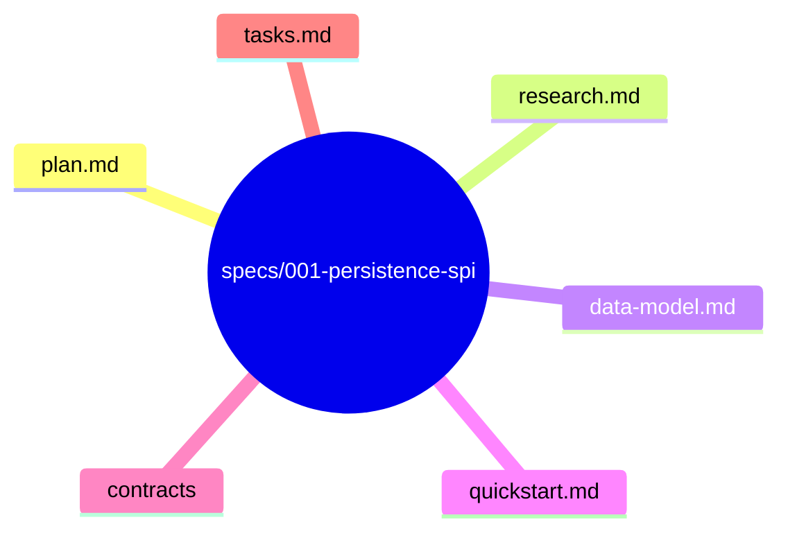
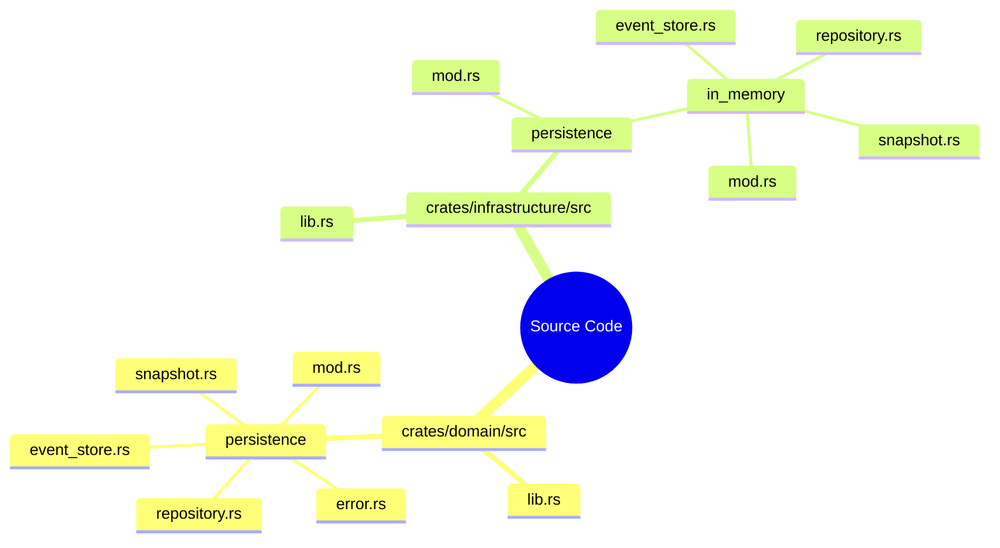

# Design: Persistence SPI

**Branch**: `003-persistence-spi` | **Date**: 2026-06-03 | **Spec**: [spec.md](spec.md)

**Input**: Feature specification from `specs/001-persistence-spi/spec.md`

## Summary

Define the persistence SPI as domain-owned contracts (`EventStore`, `Repository`, `Snapshot`, `PersistenceError` traits/types) in `ego-domain`. Concrete implementations (InMemory, PostgreSQL) live in `ego-infrastructure`. Multi-tenancy is optional — `tenant_id` is `Option<&str>` — enabling both single-tenant and multi-tenant modes. The SPI is runtime-neutral (no async, no Tokio in trait signatures).

## Technical Context

**Language/Version**: Rust (latest stable, edition 2021)

**Primary Dependencies**: `serde_json`, `chrono` (existing in `ego-domain`)

**Storage**: InMemory (testing/reference), PostgreSQL (production)

**Testing**: `cargo test` — contract tests + unit tests for each backend

**Target Platform**: Linux server, macOS (development)

**Project Type**: Library (multi-crate Rust workspace)

**Performance Goals**: Not specified at SPI level — performance is a backend implementation concern

**Constraints**: Runtime-neutral domain traits (no async), no database-specific types in SPI, infrastructure-owned migrations

**Scale/Scope**: Multi-crate workspace with domain, infrastructure, application, persistence crate layers

## Constitution Check

*GATE: Must pass before Phase 0 research. Re-check after Phase 1 design.*

**Result**: PASS — No violations detected.
- §C (Spec Scope): Single capability — SPI contracts only. Backend implementations are deferred to separate specs per Out of Scope.
- §E (Architecture Freeze): Technology choices (crate names, frameworks) are in this design document, not spec.md — compliant.
- §A (Anti Over-Engineering): Two-backend strategy justified by spec requirement for production + reference implementations. No speculative abstractions.
- §D (Minimal Artifacts): Contracts/ and data-model.md pre-date constitution v2.0.0. Acceptable as legacy; future specs should inline.

## Project Structure

### Documentation (this feature)

### Source Code (repository root)

**Structure Decision**: Multi-crate Rust workspace mirrors existing project layout. SPI traits live in `ego-domain`; implementations in `ego-infrastructure`, separated by backend. PostgreSQL backend and migration infrastructure are deferred to future specs.

## Complexity Tracking

No constitution violations detected. N/A.
