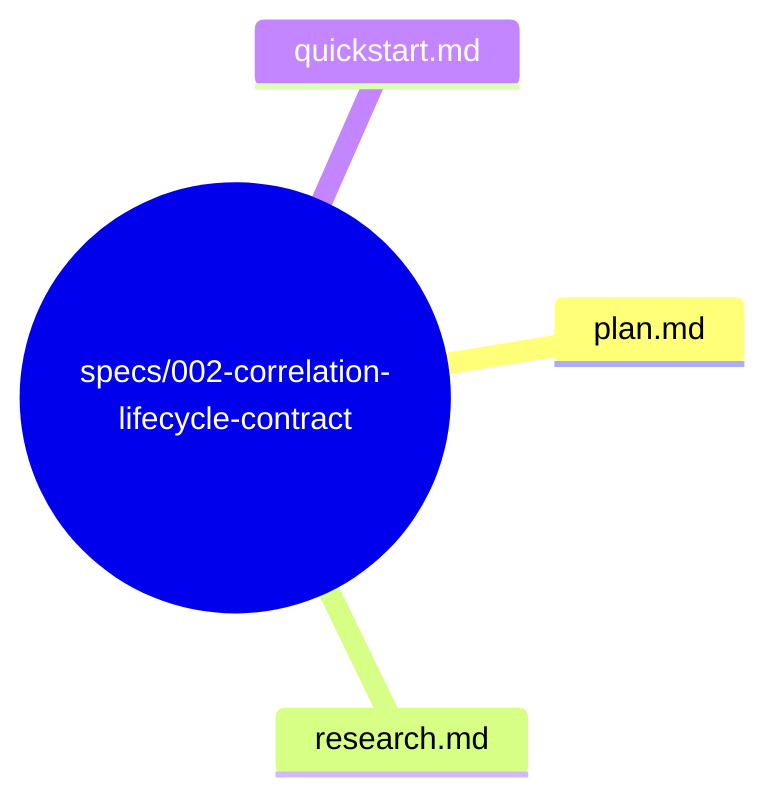
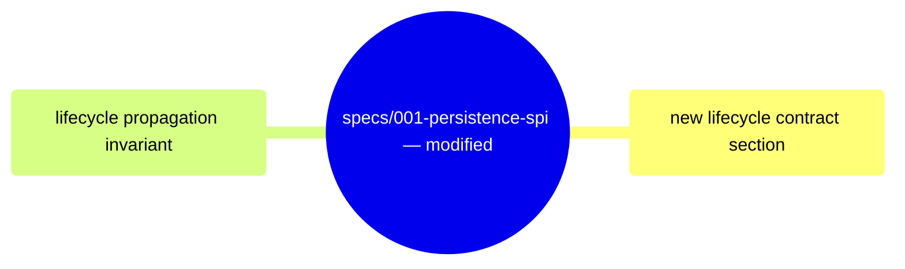

# Design: Correlation Lifecycle Contract

**Branch**: `002-correlation-lifecycle-contract` | **Date**: 2026-06-03 | **Spec**: [spec.md](spec.md)

**Input**: Feature specification from `specs/002-correlation-lifecycle-contract/spec.md`

## Summary

Define the correlation lifecycle contract as behavioral requirements for correlation_id across all layers. correlation_id is created in CommandContext, propagated to EventStore via StoredEvent envelope, MUST survive retries (bound to command identity), and MUST NOT be regenerated downstream. This spec adds explicit lifecycle contract invariants to the existing Persistence SPI (spec 001) and cross-references the Correlation Scope Boundary (spec 004) and Correlation Semantic Boundary (spec 005).

## Technical Context

**Language/Version**: Rust (latest stable, edition 2021) — no code changes to existing traits

**Primary Dependencies**: None — behavioral contract documentation amendment

**Testing**: Existing contract tests already verify correlation_id preservation. No new tests required — the lifecycle contract documents existing behavior.

**Target Platform**: N/A — documentation/clarification

**Project Type**: Library (multi-crate Rust workspace)

**Performance Goals**: N/A

**Constraints**: Must not add new trait methods, types, or parameters. Must not change runtime behavior. Must align with Correlation Scope Boundary (004) and Correlation Semantic Boundary (005).

**Scale/Scope**: Behavioral contract documentation for correlation_id lifecycle. Amends spec 001.

## Constitution Check

*GATE: Must pass before Phase 0 research. Re-check after Phase 1 design.*

**Result**: PASS — No violations detected.
- §C (Spec Scope): Single capability — correlation lifecycle contract. Deferred concerns (CommandContext implementation) are marked Out of Scope.
- §E (Architecture Freeze): Technology choices are not applicable — documentation-only.
- §A (Anti Over-Engineering): Documents existing behavior; no speculative abstractions.
- §H (Modify Before Duplicate): Extends spec 001 contract documentation; no new document categories.

## Project Structure

### Documentation (this feature)

### Modified Documents (existing spec 001)

**Design Decision**: Adding lifecycle contract as a new section in spec 001's Contract Invariants rather than a standalone document keeps all correlation_id behavioral rules in one place.

## Complexity Tracking

No constitution violations detected. N/A.
