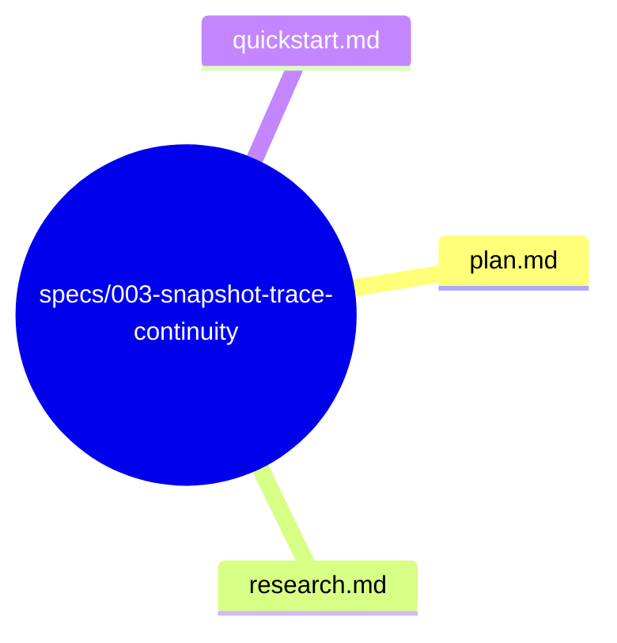
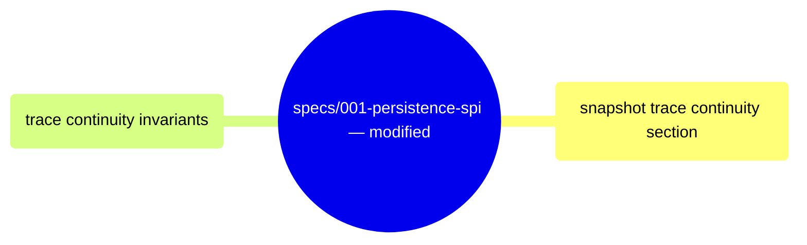

# Design: Snapshot Trace Continuity

**Branch**: `003-snapshot-trace-continuity` | **Date**: 2026-06-03 | **Spec**: [spec.md](spec.md)

**Input**: Feature specification from `specs/003-snapshot-trace-continuity/spec.md`

## Summary

Define the Snapshot contract's relationship to correlation_id traceability. Snapshots are a performance optimization (payload + version) and MAY omit correlation_id. Trace continuity across snapshot boundaries is maintained by replaying delta events from the EventStore, which preserve original correlation_ids. This spec amends the Snapshot contract (spec 001) with explicit invariants about trace continuity.

## Technical Context

**Language/Version**: Rust (latest stable, edition 2021)

**Primary Dependencies**: None — behavioral contract documentation amendment

**Testing**: Existing Snapshot contract tests pass. No new tests required — the behavioral contract documents existing behavior.

**Target Platform**: N/A — documentation/clarification

**Project Type**: Library (multi-crate Rust workspace)

**Performance Goals**: N/A

**Constraints**: Must not change existing Snapshot trait signature. Must not add correlation_id to Snapshot data model. Must align with Correlation Scope Boundary (004) — correlation_id is Event-only.

**Scale/Scope**: Single-capability amendment to Snapshot contract. Defines trace continuity guarantee across snapshot boundaries.

## Constitution Check

*GATE: Must pass before Phase 0 research. Re-check after Phase 1 design.*

**Result**: PASS — No violations detected.
- §C (Spec Scope): Single capability — snapshot trace continuity. No scope creep into snapshot creation strategy.
- §E (Architecture Freeze): Technology choices not applicable.
- §A (Anti Over-Engineering): Documents existing behavior; no speculative abstractions.
- §H (Modify Before Duplicate): Amends existing Snapshot contract documentation.

## Project Structure

### Documentation (this feature)

### Modified Documents (existing spec 001)

**Design Decision**: Adding trace continuity invariants to the Snapshot contract rather than creating a separate contract keeps all snapshot behavioral rules in one place.

## Complexity Tracking

No constitution violations detected. N/A.
