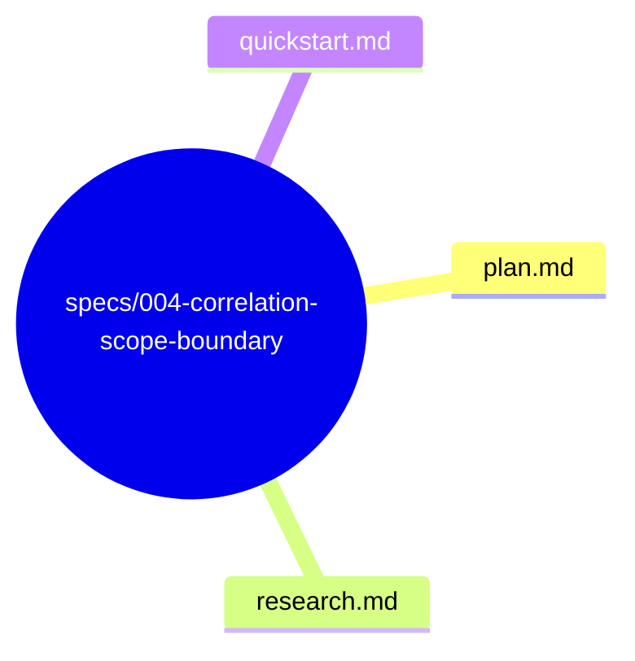
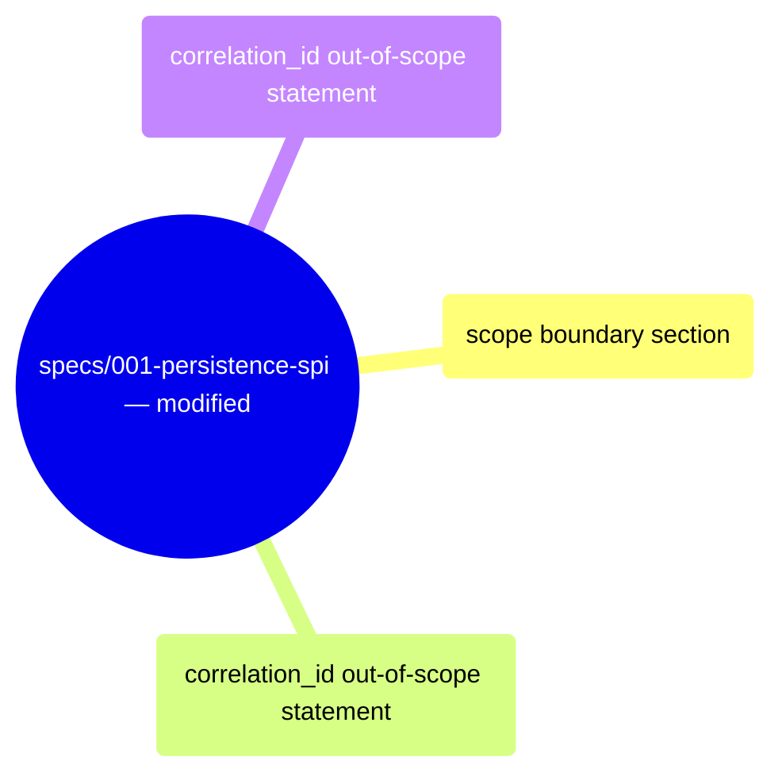

# Design: Correlation Scope Boundary

**Branch**: `004-correlation-scope-boundary` | **Date**: 2026-06-03 | **Spec**: [spec.md](spec.md)

**Input**: Feature specification from `specs/004-correlation-scope-boundary/spec.md`

## Summary

Define the explicit ownership boundary for correlation_id across persistence contracts. correlation_id is an EventStore-only concept — NOT a Repository concern, NOT a Snapshot concern. This spec adds explicit "out of scope" documentation to Repository and Snapshot contracts, preventing dual persistence semantics where developers might expect correlation_id on non-event persistence operations.

## Technical Context

**Language/Version**: Rust (latest stable, edition 2021) — no code changes

**Primary Dependencies**: None — documentation clarification

**Testing**: No new tests — existing tests already verify Repository and Snapshot operate without correlation_id

**Target Platform**: N/A — documentation/clarification

**Project Type**: Library (multi-crate Rust workspace)

**Performance Goals**: N/A

**Constraints**: Must not add correlation_id to Repository or Snapshot trait signatures. Must align with Correlation Lifecycle Contract (002) — correlation_id lifecycle is EventStore-scoped.

**Scale/Scope**: Single-capability clarification. Defines which contracts own correlation_id and which do not.

## Constitution Check

*GATE: Must pass before Phase 0 research. Re-check after Phase 1 design.*

**Result**: PASS — No violations detected.
- §C (Spec Scope): Single capability — scope boundary documentation. No scope creep.
- §E (Architecture Freeze): Technology choices not applicable.
- §A (Anti Over-Engineering): Documents existing boundary; no speculative abstractions.
- §H (Modify Before Duplicate): Amends existing Repository and Snapshot contract documentation.

## Project Structure

### Documentation (this feature)

### Modified Documents (existing spec 001)

**Design Decision**: Adding "correlation_id is not a concern" statements to Repository and Snapshot contracts rather than creating a separate scope document keeps each contract's scope self-contained.

## Complexity Tracking

No constitution violations detected. N/A.
