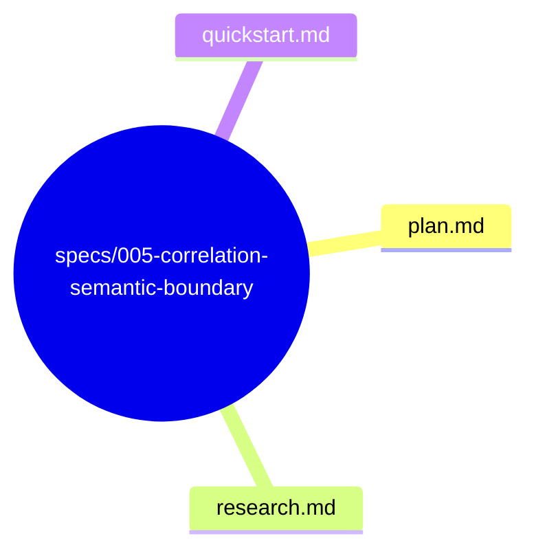
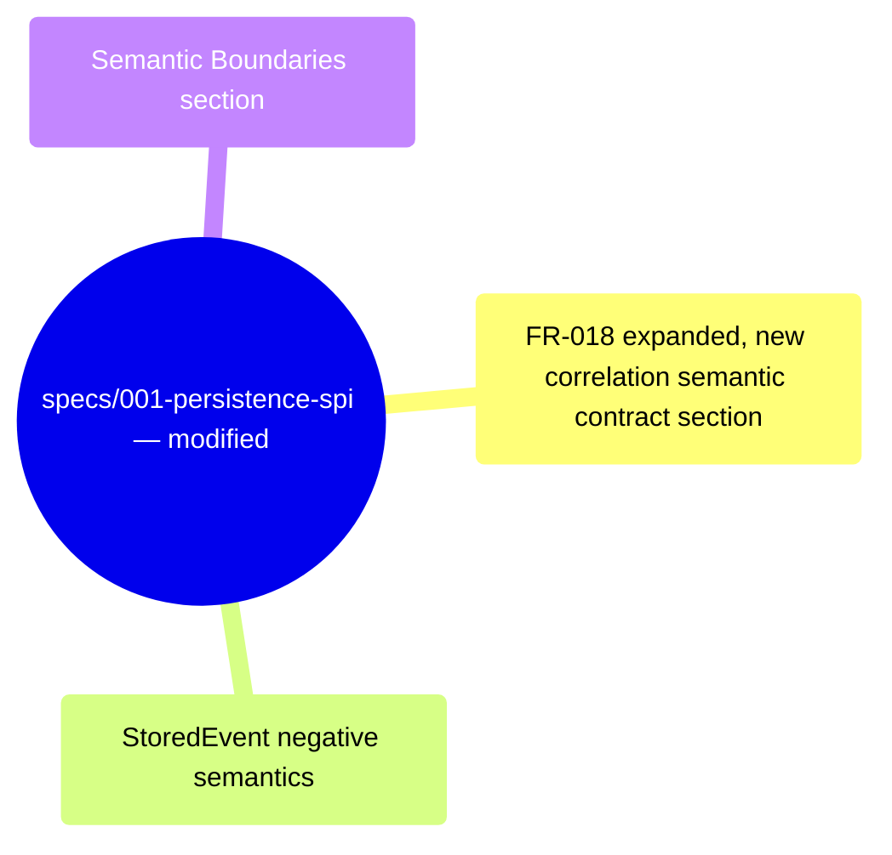

# Design: Correlation Semantic Boundary

**Branch**: `005-correlation-semantic-boundary` | **Date**: 2026-06-03 | **Spec**: [spec.md](spec.md)

**Input**: Feature specification from `specs/005-correlation-semantic-boundary/spec.md`

## Summary

This feature adds explicit "what correlation_id is NOT" negative semantics to the existing Persistence SPI contract documentation (spec 001). No code changes, new traits, or types. The four boundaries are: NOT a security token, NOT required for persistence correctness, NOT used for ordering, NOT used for deduplication. These boundaries are documented in `specs/001-persistence-spi/spec.md`, `contracts/event-store.md`, and `data-model.md`.

## Technical Context

**Language/Version**: Rust (latest stable, edition 2021) — no code changes

**Primary Dependencies**: None — documentation-only amendment

**Testing**: No new tests — existing contract tests already verify correlation_id behavior that is consistent with these boundaries

**Target Platform**: N/A — documentation change

**Project Type**: Library (multi-crate Rust workspace)

**Performance Goals**: N/A — documentation change

**Constraints**: Must not change existing trait signatures, data structures, or runtime behavior. Must not introduce ambiguity about what correlation_id is vs is not.

**Scale/Scope**: Single-capability amendment to existing Persistence SPI spec 001. Documentation only.

## Constitution Check

*GATE: Must pass before Phase 0 research. Re-check after Phase 1 design.*

**Result**: PASS — No violations detected.
- §C (Spec Scope): Single capability — adding explicit negative semantic boundaries to correlation_id. No scope creep.
- §E (Architecture Freeze): Technology choices are not applicable — documentation-only change.
- §A (Anti Over-Engineering): Documentation updates are the minimal necessary to satisfy the spec. No abstraction or speculative code.
- §D (Minimal Artifacts): Only plan.md and tasks.md are new artifacts. Existing spec.md, data-model.md, and contracts/event-store.md are modified in-place — no new artifact categories.
- §H (Modify Before Duplicate): Existing documentation is modified, not duplicated.

## Project Structure

### Documentation (this feature)

### Modified Documents (existing spec 001)

**Design Decision**: Modifying existing documentation rather than creating separate files keeps the correlation_id contract in one place. Following §C (Design Preferences) — patch over rewrite, avoid duplication.

## Complexity Tracking

No constitution violations detected. N/A.
